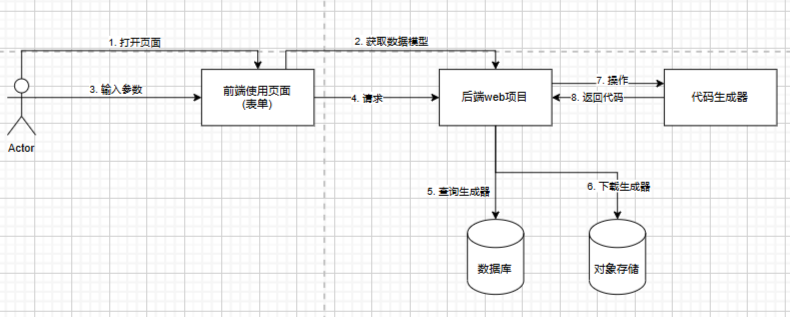

## 在线代码生成器使用流程图

### 业务流程

1) 用户打开某个生成器的使用页面，从后端请求需要用户填写的数据类型
2) 用户填写表单并提交，向后端发送请求
3) 后端从数据库中查询生成器信息，得到生成器产物的文件路径
4) 后端从对象存储中下载生成器产物到本地
5) 后端操作代码生成器，输入用户填写的数据，得到生成的代码
6) 后端将生成的代码返回给用户，前端下载

### 问题分析

分析上述流程，我们要思考几个问题

1. 生成器使用页面需要展示哪些表单项？数据模型信息从哪里来
2. web后端怎么操作代码生成器文件生成代码

#### 1.数据模型从哪来

第一个问题很简单，最原始的数据模型肯定是由用户创建生成器时填写的，所以我们需要 完善创建生成器页面 的"模型配置"表单。有了模型配置，生成器使用页面就可以渲染出对应的表单项，供用户填写

#### 2. 如何操作生成器

对于第二个问题，我们要先思考: 之前是怎么生成代码的

答案是: 通过执行脚本文件、传入指定的参数、交互式输入，最终得到生成的代码

那现在，让web后端执行生成器的脚本不就可以了吗，之前已经讲过，在java后端项目中，使用 `Process` 类就能执行脚本了

但是之前执行生成器时，只能通过交互式输入、后者拼接命令的方式给生成器程序传递参数，而前端传递给后端的用户参数都通常是 JSON对象格式，如果要转换就比较复杂了

那我们不仿让代码生成器支持一种新的使用方式: 通过读取 `JSON 文件 获取数据模型，并生成代码`

> 问: 为什么不执行传`JSON `数据而是读取`JSON`文件呢?
>
> 答: `JSON` 结构可能很复杂，还有换行，放在控制台可能会有问题

这样一来，web后端项目就可以将用户输入的数据模型值 JSON 保存为本地文件，然后将文件路径作为输入参数去执行生成器脚本了。相比于将每个生成器都改造为 web项目 提供接口，这种方式成本更低，也更合理

