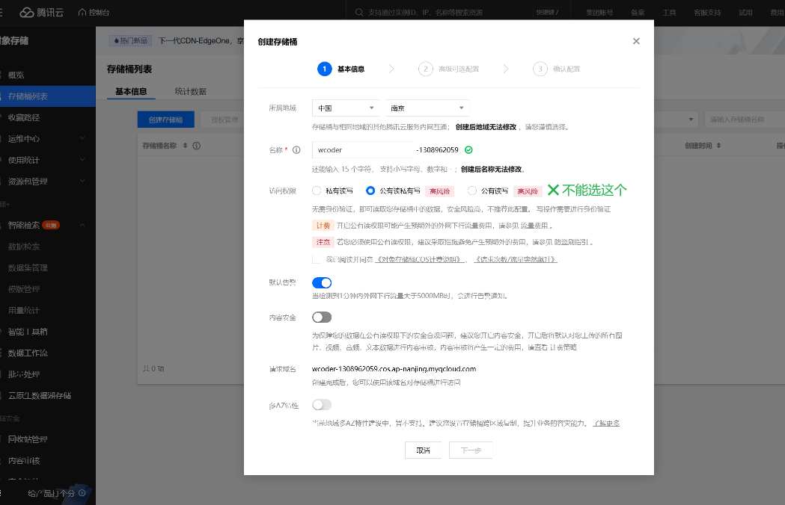

## COS 使用

### 使用文档:

https://cloud.tencent.com/document/product/436/65935

### 去官网进行开启`COS存储桶`





## 


## 


### ✨注意事项: 

`application-local.yml` 这里用于设置你的腾讯云cos的秘钥信息(✨✨✨并且这个文件一定不要让git进行托管，因为一旦上传到github，就会被人恶意使用)

```yml
# 对象存储
# todo 需替换配置
cos:
  client:
    accessKey: xxx
    secretKey: xxx
    region: xxx
    bucket: xxx
```


### save-as插件 【用于保存文件】

```bash
pnpm i file-saver
pnpm i --save-dev @types/file-saver 
```


### 详情: 

https://github.com/wjp527/wcode-generator/commit/eb7f418c396a5c6a291da75198e454d89a9619ca#diff-ecda2b6a3f107808df181f2b10d996bf34219aad9f75a5b344b2b249c13e3cdf


