# 代码生成器共享平台源码

`第一阶段: 本地代码生成器`

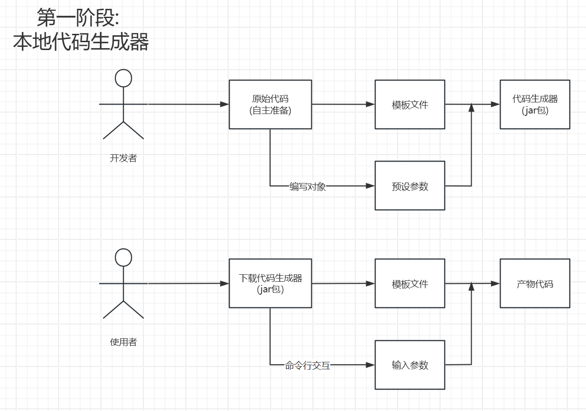


`第二阶段: 代码生成器`

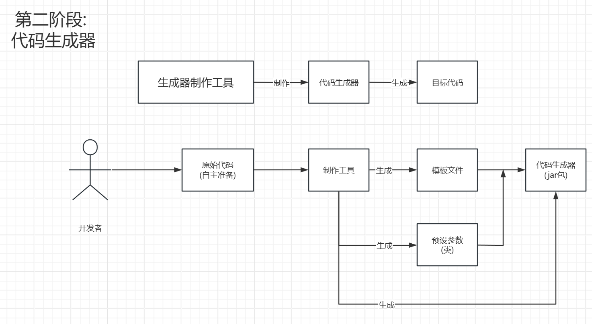

## 1. 代码生成

### 创建本地代码生成项目

1. 创建项目


2. 安装依赖

```xml
<dependencies>
    <!-- https://doc.hutool.cn/ -->
    <dependency>
        <groupId>cn.hutool</groupId>
        <artifactId>hutool-all</artifactId>
        <version>5.8.16</version>
    </dependency>
    <!-- https://mvnrepository.com/artifact/org.apache.commons/commons-collections4 -->
    <dependency>
        <groupId>org.apache.commons</groupId>
        <artifactId>commons-collections4</artifactId>
        <version>4.4</version>
    </dependency>
    <!-- https://projectlombok.org/ -->
    <dependency>
        <groupId>org.projectlombok</groupId>
        <artifactId>lombok</artifactId>
        <version>1.18.30</version>
        <scope>provided</scope>
    </dependency>
    <dependency>
        <groupId>junit</groupId>
        <artifactId>junit</artifactId>
        <version>4.13.2</version>
        <scope>test</scope>
    </dependency>
</dependencies>

```


#### 1. 实现流程

##### 实现步骤

1. 生成 `静态` 文件，通过 `Main` 方法运行
2. 生成 `动态` 文件，通过 `Main` 方法运行
3. `同时` 生成静态和动态文件，通过 `Main` 方法运行，得到完整代码生成
4. 开发命令行工具，接收用户的输入并生成完整代码
5. 将工具封装为 `jar包` 和 `脚本`，供用户使用


#### 2. 静态文件生成

使用的是 `Hutool` 工具类

```java
public class StaticGenerator {
    public static void main(String[] args) {
        // 生成最外层的项目根目录: D:\fullStack\wcode-generator
        String projectPath = System.getProperty("user.dir");

        // 输入路径: D:\fullStack\wcode-generator\wcode-generator-demo-projects\acm-template
        // File.separator: 文件分隔符，在不同系统中可能不同，比如在Windows系统中是"\"，在Linux系统中是"/"
        String inputPath = projectPath + File.separator + "wcode-generator-demo-projects" + File.separator + "acm-template";

        // 输出路径
        String outputPath = projectPath;

        // 复制
        copyFilesHuttol(inputPath, outputPath);
    }

    /**
     * 使用hutool复制文件
     * @param inputPath
     * @param outputPath
     */
    public static void copyFilesHuttol(String inputPath, String outputPath) {
        FileUtil.copy(inputPath, outputPath, true);
    }
}

```


#### 3. 动态文件生成思路

实现了静态文件生成（复制目录）后，我们思考下如何对 `某个` 基础文件 进行 `定制`，根据用户的输入参数动态生成文件

明确动态生成需求

对于 ACM示例模版项目，我们可以怎么定制生成呢?

让我们先明确几个动态生成的需求

1. 在代码开头增加作者 `@Author` 注释 (`增加`代码)
2. 修改程序输出的信息提示 (`替换`代码)
3. 将循环读取输入 改为 单次读取 (`可选`代码)

```java
package com.yupi.acm;

import java.util.Scanner;

/**
 * ACM 输入模板（多数之和）
 * @author yupi（1. 增加作者注释）
 */
public class MainTemplate {
    public static void main(String[] args) {
        Scanner scanner = new Scanner(System.in);

    // 2. 可选是否循环
//        while (scanner.hasNext()) {
            // 读取输入元素个数
            int n = scanner.nextInt();

            // 读取数组
            int[] arr = new int[n];
            for (int i = 0; i < n; i++) {
                arr[i] = scanner.nextInt();
            }

            // 处理问题逻辑，根据需要进行输出
            // 示例：计算数组元素的和
            int sum = 0;
            for (int num : arr) {
                sum += num;
            }

            // 3. 输出信息可以修改
            System.out.println("求和结果: " + sum);
//        }

        scanner.close();
    }
}


```


`动态生成的核心原理`

最经典的实现方式就是: 提前 基于基础文件 `"挖坑"` ，编写 `模版文件`，然后将用户输入的 `参数` “填坑”，替换到模版文件中，从而生成完整代码

举个例子，用户输入参数:

```java
author = yupi
```

模版文件代码:

```java
/**
 * ACM 输入模板（多数之和）
 * @author ${author}
 */
```

将参数注入到模版文件中:

```java
/**
 * ACM 输入模板（多数之和）
 * @author yupi
 */
```

不过推荐使用 `模版引擎` 来实现 `模版编写和动态内容生成`


#### 4. FreeMarker 模版引擎入门

官方文档: https://freemarker.apache.org/docs/index.html

中文文档: http://freemarker.foofun.cn/toc.html

FreeMarker 教程网: http://www.freemarker.net/#1

引入依赖【Maven项目】

```xml
<!-- https://freemarker.apache.org/index.html -->
<dependency>
    <groupId>org.freemarker</groupId>
    <artifactId>freemarker</artifactId>
    <version>2.3.32</version>
</dependency>

```

Springboot项目用下面这个

```xml
<dependency>
  <groupId>org.springframework.boot</groupId>
  <artifactId>spring-boot-starter-freemarker</artifactId>
</dependency>

```


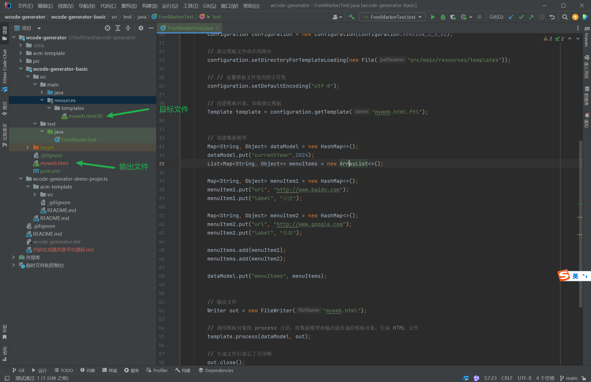

示例代码:

```java

public class FreeMarkerTest {

    @Test
    public void test() throws IOException, TemplateException {
        // new 出 Configuration 对象，参数为 FreeMarker 版本号
        Configuration configuration = new Configuration(Configuration.VERSION_2_3_32);

        // 指定模板文件所在的路径
        configuration.setDirectoryForTemplateLoading(new File("src/main/resources/templates"));

        // // 设置模板文件使用的字符集
        configuration.setDefaultEncoding("utf-8");

        // 创建模板对象，加载指定模板
        // myweb.html.ftl: 要进行动态生成的文件
        Template template = configuration.getTemplate("myweb.html.ftl");


        // 创建数据模型
        Map<String, Object> dataModel = new HashMap<>();
        dataModel.put("currentYear",2024);
        List<Map<String, Object>> menuItems = new ArrayList<>();

        Map<String, Object> menuItem1 = new HashMap<>();
        menuItem1.put("url", "http://www.baidu.com");
        menuItem1.put("label", "百度");

        Map<String, Object> menuItem2 = new HashMap<>();
        menuItem2.put("url", "http://www.google.com");
        menuItem2.put("label", "谷歌");

        menuItems.add(menuItem1);
        menuItems.add(menuItem2);

        dataModel.put("menuItems", menuItems);


        // 输出文件
        Writer out = new FileWriter("myweb.html");

        // 调用模板对象的 process 方法，将数据模型和输出流传递给模板对象，生成 HTML 文件
        template.process(dataModel, out);

        // 生成文件后别忘了关闭哦
        out.close();
    }
}
```


#### 5. 动态文件生成实现

学习了 `FreeMarker` 模版引擎后，让我们进行实战

核心步骤: 

1. 定义数据模型
2. 编写动态模版
3. 组合生成
4. 完善优化


##### 1. 定义数据模型

```java
/**
 * 静态模版配置
 */
@Data
public class MainTemplateConfig {

    /**
     * 让我们先明确几个动态生成的需求
     *
     * 1. 在代码开头增加作者 `@Author` 注释 (`增加`代码)
     * 2. 修改程序输出的信息提示 (`替换`代码)
     * 3. 将循环读取输入 改为 单次读取 (`可选`代码)
     */

    /**
     * 作者名称
     */
    private String author = "wjp";

    /**
     * 输出信息
     */
    private String outputText = "sum = ";


    /**
     * 是否循环(开关)
     */
    private Boolean loop;

}

```


##### 2. 编写动态模版

`MainTemplate.java.ftl`

```java
package com.yupi.acm;

import java.util.Scanner;

/**
* ACM 输入模板（多数之和）
* @author ${author}
*/
public class MainTemplate {
    public static void main(String[] args) {
        Scanner scanner = new Scanner(System.in);

        <#if loop>
            while (scanner.hasNext()) {
        </#if>
                // 读取输入元素个数
                int n = scanner.nextInt();

                // 读取数组
                int[] arr = new int[n];
                for (int i = 0; i < n; i++) {
                    arr[i] = scanner.nextInt();
                }

                // 处理问题逻辑，根据需要进行输出
                // 示例：计算数组元素的和
                int sum = 0;
                for (int num : arr) {
                    sum += num;
                }

                System.out.println(" ${outputText}" + sum);
        <#if loop>
            }
        </#if>

        scanner.close();
    }
}

```


##### 3. 组合生成

`DynamicGenerator.java`

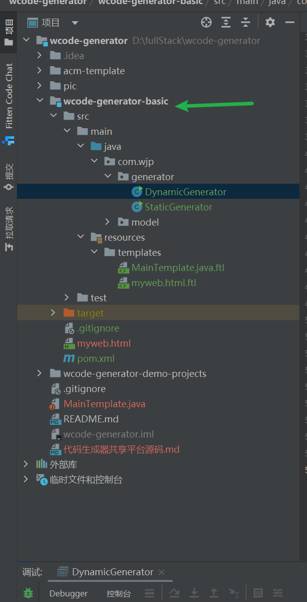

```java

public class DynamicGenerator {
    public static void main(String[] args) throws IOException, TemplateException {
        // new 出 Configuration 对象，参数为 FreeMarker 版本号
        Configuration configuration = new Configuration(Configuration.VERSION_2_3_32);

        // 这里是项目根目录: D:\fullStack\wcode-generator,而我们需要进入的是 wcode-generator-basic 这个项目里
        String projectPath = System.getProperty("user.dir") + File.separator + "wcode-generator-basic"+ File.separator;
        System.out.println(projectPath);
        // 最终的输出路径: D:\fullStack\wcode-generator\wcode-generator-basic\src\main\resources\templates
        File file = new File(projectPath, "src/main/resources/templates");
        System.out.println("file = " + file);
        // 指定模板文件所在的路径
        configuration.setDirectoryForTemplateLoading(file);

        // // 设置模板文件使用的字符集
        configuration.setDefaultEncoding("utf-8");

        // 设置数字格式化
        configuration.setNumberFormat("0.######");  // now it will print 1000000

        // 创建模板对象，加载指定模板
        Template template = configuration.getTemplate("MainTemplate.java.ftl");


        // 创建数据模型

        MainTemplateConfig mainTemplateConfig = new MainTemplateConfig();
//        mainTemplateConfig.setAuthor("wjp");
//        mainTemplateConfig.setOutputText("sum");
        mainTemplateConfig.setLoop(true);


        // 输出文件
        Writer out = new FileWriter("MainTemplate.java");

        // 调用模板对象的 process 方法，将数据模型和输出流传递给模板对象，生成 HTML 文件
        template.process(mainTemplateConfig, out);

        // 生成文件后别忘了关闭哦
        out.close();


    }
}

```


##### 4. 完善优化

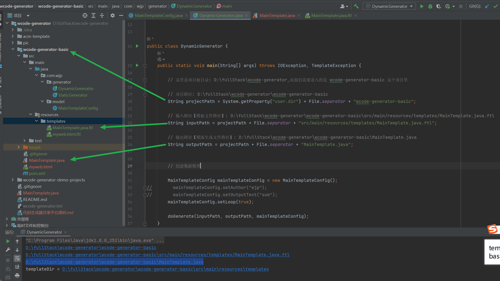

```java

public class DynamicGenerator {
    public static void main(String[] args) throws IOException, TemplateException {

        // 这里是项目根目录: D:\fullStack\wcode-generator,而我们需要进入的是 wcode-generator-basic 这个项目里

        // 项目路径: D:\fullStack\wcode-generator\wcode-generator-basic
        String projectPath = System.getProperty("user.dir") + File.separator + "wcode-generator-basic";

        // 输入路径【模板文件路径】: D:\fullStack\wcode-generator\wcode-generator-basic\src/main/resources/templates/MainTemplate.java.ftl
        String inputPath = projectPath + File.separator + "src/main/resources/templates/MainTemplate.java.ftl";

        // 输出路径【模版生成文件路径】: D:\fullStack\wcode-generator\wcode-generator-basic\MainTemplate.java
        String outputPath = projectPath + File.separator + "MainTemplate.java";


        // 创建数据模型

        MainTemplateConfig mainTemplateConfig = new MainTemplateConfig();
//        mainTemplateConfig.setAuthor("wjp");
//        mainTemplateConfig.setOutputText("sum");
        mainTemplateConfig.setLoop(true);

        doGenerate(inputPath, outputPath, mainTemplateConfig);
    }

    public static void doGenerate(String inputPath, String outputPath, Object model) throws IOException, TemplateException {
        // new 出 Configuration 对象，参数为 FreeMarker 版本号
        Configuration configuration = new Configuration(Configuration.VERSION_2_3_32);
        // 获取实际文件的父目录
        File templateDir = new File(inputPath).getParentFile();
        System.out.println("templateDir = " + templateDir);
        // ✨指定模板文件所在的路径
        configuration.setDirectoryForTemplateLoading(templateDir);

        // 设置模板文件使用的字符集
        configuration.setDefaultEncoding("utf-8");

        // 设置数字格式化
        configuration.setNumberFormat("0.######");  // now it will print 1000000

        // 创建模板对象，加载指定模板
        String templateName = new File(inputPath).getName();
        // 从指定的模板目录加载一个模板文件
        // templateName: 要加载的模版名
        Template template = configuration.getTemplate(templateName);


        // 输出文件
        Writer out = new FileWriter(outputPath);

        // 调用模板对象的 process 方法，将数据模型和输出流传递给模板对象，生成 HTML 文件
        template.process(model, out);

        // 生成文件后别忘了关闭哦
        out.close();


    }
}

```


#### 6. 动静结合模板生成

多项目打开

```java
public class MainGenerator {
    public static void main(String[] args) throws TemplateException, IOException {
        // 1. 生成静态文件
        // 生成最外层的项目根目录: D:\fullStack\wcode-generator
        String projectPath = System.getProperty("user.dir");

        // 输入路径【静态模板文件路径】: D:\fullStack\wcode-generator\wcode-generator-demo-projects\acm-template
        // File.separator: 文件分隔符，在不同系统中可能不同，比如在Windows系统中是"\"，在Linux系统中是"/"
        String inputPath = projectPath + File.separator + "wcode-generator-demo-projects" + File.separator + "acm-template";

        // 输出路径【静态模版生成文件路径】
        String outputPath = projectPath;

        // 复制
        StaticGenerator.copyFilesHuttol(inputPath, outputPath);

        // 2. 生成动态文件
        // 这里是项目根目录: D:\fullStack\wcode-generator,而我们需要进入的是 wcode-generator-basic 这个项目里
        // 输入路径【动态模板文件路径】: D:\fullStack\wcode-generator\wcode-generator-basic\src/main/resources/templates/MainTemplate.java.ftl
        String dynamicIinputPath = projectPath + File.separator + "wcode-generator-basic" + File.separator + "src/main/resources/templates/MainTemplate.java.ftl";

        // 输出路径【动态模版生成文件路径】: D:\fullStack\wcode-generator\wcode-generator-basic\MainTemplate.java
        String dynamicOutputPath = projectPath + File.separator +"acm-template/src/com/yupi/acm/MainTemplate.java";


        // 创建数据模型

        MainTemplateConfig mainTemplateConfig = new MainTemplateConfig();
        mainTemplateConfig.setAuthor("wjp11");
        mainTemplateConfig.setOutputText("sum11");
        mainTemplateConfig.setLoop(true);

        DynamicGenerator.doGenerate(dynamicIinputPath, dynamicOutputPath, mainTemplateConfig);
    }
}

```

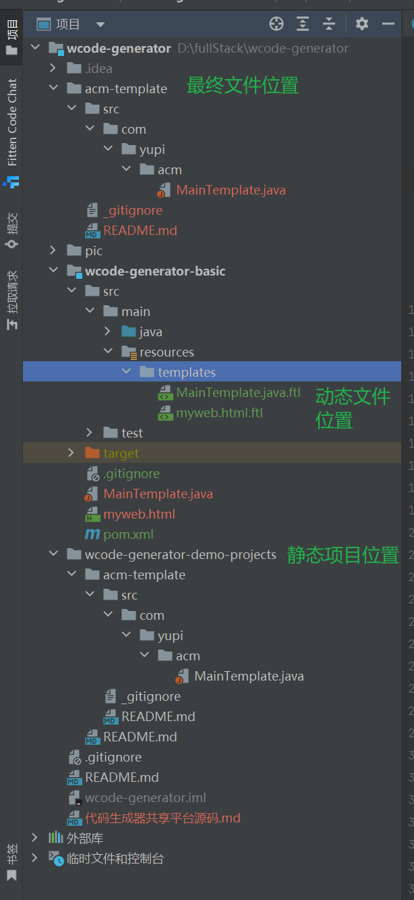


独立项目打开

```java
public class MainGenerator {
    public static void main(String[] args) throws TemplateException, IOException {
        // 1. 生成静态文件
        // 生成最外层的项目根目录: D:\fullStack\wcode-generator
        String projectPath = System.getProperty("user.dir");

        File parentFile = new File(projectPath).getParentFile();

        // 输入路径【静态模板文件路径】: D:\fullStack\wcode-generator\wcode-generator-demo-projects\acm-template
        // File.separator: 文件分隔符，在不同系统中可能不同，比如在Windows系统中是"\"，在Linux系统中是"/"

        String inputPath = new File(parentFile, "wcode-generator-demo-projects/acm-template").getAbsolutePath();
        // 输出路径【静态模版生成文件路径】
        String outputPath = projectPath;

        // 复制
        StaticGenerator.copyFilesHuttol(inputPath, outputPath);

        // 2. 生成动态文件
        // 这里是项目根目录: D:\fullStack\wcode-generator,而我们需要进入的是 wcode-generator-basic 这个项目里
        // 输入路径【动态模板文件路径】: D:\fullStack\wcode-generator\wcode-generator-basic\src/main/resources/templates/MainTemplate.java.ftl
        String dynamicInputPath = projectPath + File.separator + "src/main/resources/templates/MainTemplate.java.ftl";

        // 输出路径【动态模版生成文件路径】: D:\fullStack\wcode-generator\wcode-generator-basic\MainTemplate.java
        String dynamicOutputPath = projectPath + File.separator +"acm-template/src/com/yupi/acm/MainTemplate.java";


        // 创建数据模型

        MainTemplateConfig mainTemplateConfig = new MainTemplateConfig();
        mainTemplateConfig.setAuthor("wjp11");
        mainTemplateConfig.setOutputText("sum11");
        mainTemplateConfig.setLoop(true);

        DynamicGenerator.doGenerate(dynamicInputPath, dynamicOutputPath, mainTemplateConfig);
    }
}

```

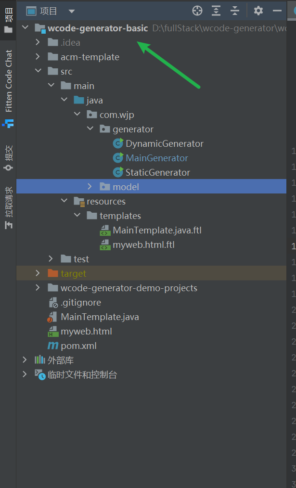

## 2. 命令行开发

重点:

- `Java` 命令行开发方案
- `Picocli` 命令行框架学习
- `命令模式` 讲解
- `Picocli` 命令行代码生成器开发


### 一、Java 命令行开发方案

#### 什么是命令行程序?

就是通过 终端狂口接收用户输入的 `纯文本` 命令，并执行相应的任务


#### 命令的结构

- command: 命令类型，具体要做的事
- option: 选项，用于改变命令的行为
- parameter: 参数，传递给命令行工具的值

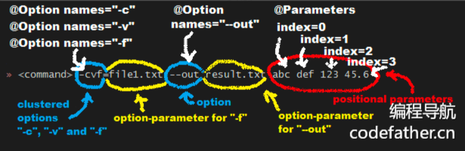


#### 为什么要开发命令行?

优点:

- 不依赖特定的程序界面，非常轻量
- 通常可以直接在操作系统自带的终端环境中运行
- 可以和用户交互、给用户输入引导和帮助手册
- 内置一些快捷操作(比如查看历史命令、上下切换命令)

还有一个最大的优点: 简单直接，比如复制粘贴别人写好的命令就能够执行，不需要在网页上进行点来点去


#### 实现方案:

##### 使用第三方库 ( Picocli )

> 专门用于开发命令行工具的框架

✨ Picocli (https://picocli.info/s) 优点: Github 的Start数多，持续更新，支持颜色高亮，自动补全，子命令，帮助手册，最推荐


### 二、 Picocli  命令行框架入门

官方文档: https://picocli.info/

快速入门: https://picocli.info/quick-guide.html

#### 入门

依赖

```xml
<!-- https://picocli.info -->
<dependency>
    <groupId>info.picocli</groupId>
    <artifactId>picocli</artifactId>
    <version>4.7.5</version>
</dependency>
```


代码: 

```java
// 命令行参数解析
// 实现一个ASCIIArt命令行工具，可以将输入的文字转换为ASCII art。

// 实现步骤：
// 1. 定义一个类，继承Runnable接口，并添加@Command注解，指定命令名称、版本、帮助信息等。
@Command(name = "ASCIIArt", version = "ASCIIArt 1.0", mixinStandardHelpOptions = true)
public class ASCIIArt implements Runnable {
    // 2. 在类中添加@Option注解，指定选项名称、描述、默认值等。
    @Option(names = { "-s", "--font-size" }, description = "Font size") 
    int fontSize = 19;

    // 3. 在类中添加@Parameters注解，指定参数名称、描述、默认值等。
    @Parameters(paramLabel = "<word>", defaultValue = "Hello, picocli", 
               description = "Words to be translated into ASCII art.")
    private String[] words = { "Hello,", "picocli" };

    // 4. 实现run()方法，在方法中实现业务逻辑。
    @Override
    public void run() {
        // 自己实现业务逻辑
        System.out.println("fontSize = " + fontSize);
        System.out.println("words = " + String.join(",", words));
    }

    public static void main(String[] args) {
        // 5. 在main()方法中，创建CommandLine对象，并调用execute()方法，传入命令行参数。
        int exitCode = new CommandLine(new ASCIIArt()).execute(args);
        // 6. 调用System.exit()方法，退出程序。
        System.exit(exitCode); 
    }
}

```


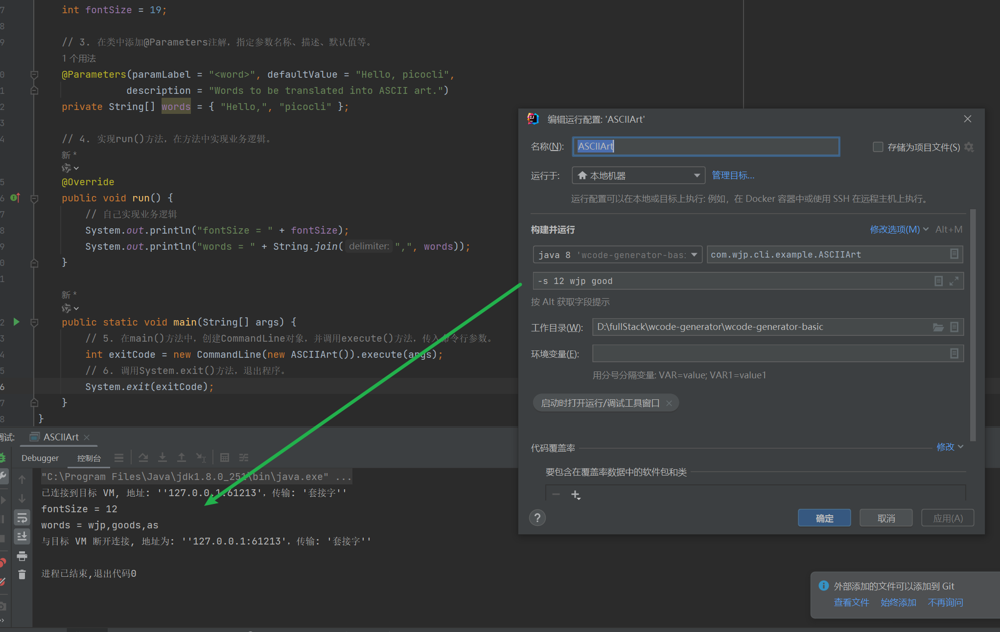

通过这个入门 Demo，我们可以简单总结一个命令的开发流程:

1. 创建命令
2. 设置选项和参数
3. 编写命令执行的业务逻辑

4. 通过 `CommandLine` 对象接受输入并执行命令


#### 实用功能

##### 1. 帮助手册

通过给类添加的 `@Command` 注解参数 `mixinStandardHelpOptions` 设置为 `true` 来开启

```java
@Command(name = "ASCIIArt", version = "ASCIIArt 1.0", mixinStandardHelpOptions = true)
```

然后将主程序的输入参数设置为 `--help` 就能打印出命令的帮助手册信息了，如下图: 

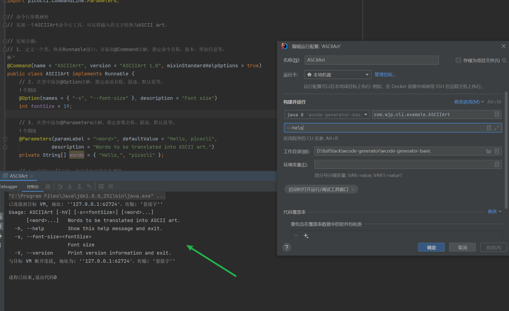


##### 2. 命令解析

`Picocli`最核心的能力就是命令解析，能够从一句完整的命令中解析`选项`和`参数`，并填充到对象的属性中

`Picocli`使用注解的方式实心命令解析，不需要自己编写代码，整个类看起来非常清晰

最核心的2个注解:

- `@Command`: 注解用于 `解析选项`
- `@Parameters`: 注解用于解析参数


示例代码如下:

```java
// 2. 在类中添加@Option注解，指定选项名称、描述、默认值等。
@Option(names = { "-s", "--font-size" }, description = "Font size")
int fontSize = 19;

// 3. 在类中添加@Parameters注解，指定参数名称、描述、默认值等。
@Parameters(paramLabel = "<word>", defaultValue = "Hello, picocli", 
            description = "Words to be translated into ASCII art.")
private String[] words = { "Hello,", "picocli" };
```

可以给这些注解指定参数，比较常用的参数有:

1. `@Option` 注解的 `names` 参数: 指定选项英文名称
2. `description` 参数: 指定描述的信息，从而生成的帮助手册和提示信息更清晰
3. `@Parameters` 注解的 `paramLabel` 参数: 参数标签，作用类似于描述信息
4. `@Parameters` 注解的 `description` 参数: 默认值，参考文档: https://picocli.info/#_default_values
5. `required` 参数: 要求必填，参考文档: https://picocli.info/#_required_arguments

示例代码:

```java
class RequiredOption {
    @Option(names = "-a", required = true)
    String author;
}
```

命令解析天然支持 `多值选项`，只需要把对象属性的类型设置为 数组类型 即可，比如:

```java
@Option(names = "-option")
int[] values;
```

参考文档: https://picocli.info/#_multiple_values

更多写法: https://picocli.info/quick-guide.html#_options_and_parameters


##### 3. 交互式输入

###### 1. 基本能力

交互式输入 的一个典型应用场景就是: 用户要登录时，引导 他 输入密码

官方文档: https://picocli.info/#_interactive_password_options

```java
import picocli.CommandLine;
import picocli.CommandLine.Option;

import java.util.concurrent.Callable;

// 解释代码
// 1. 定义一个类 Login，实现 Callable 接口
public class Login implements Callable<Integer> {
    // 2. 定义两个选项：user 和 password
    @Option(names = {"-u", "--user"}, description = "User name")
    String user;

    // interactive: 交互式输入(true: 交互式输入，false: 非交互式输入)
    @Option(names = {"-p", "--password"}, description = "Passphrase", interactive = true)
    String password;

    // 3. 实现 call 方法，打印 password 值
    public Integer call() throws Exception {
        System.out.println("password = " + password);
        return 0;
    }

    // 5. 运行 main 方法，打印输出
    public static void main(String[] args) {
        // 4. 定义 main 方法，创建 CommandLine 对象，调用 execute 方法，传入参数
        new CommandLine(new Login()).execute("-u", "user123", "-p");
    }
}

```

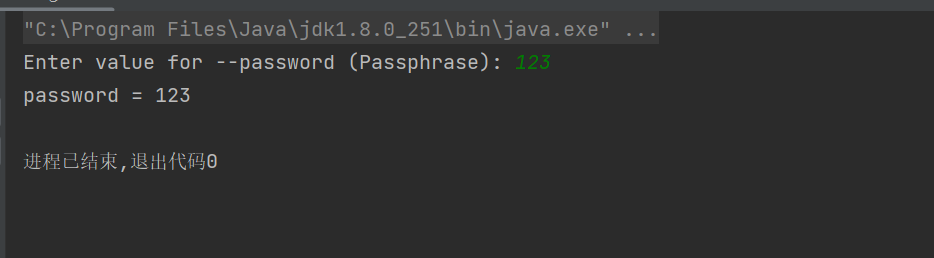


###### 2. 多个选项交互式

`Picocli` 支持在一个命令中制定多个交互式输入的选项，会按照顺序提示用户并接受输入

在上述代码中 在增加 一个 `checkPassword` 选项，同样开启交互式输入，代码如下:

```java
// 解释代码
// 1. 定义一个类 Login，实现 Callable 接口
public class Login implements Callable<Integer> {
    // 2. 定义两个选项：user 和 password
    @Option(names = {"-u", "--user"}, description = "User name")
    String user;

    // interactive: 交互式输入(true: 交互式输入，false: 非交互式输入)
    @Option(names = {"-p", "--password"}, description = "Passphrase", interactive = true)
    String password;

    @Option(names = {"-cp", "--checkPassword"}, description = "Check Password", interactive = true)
    String checkPassword;

    // 3. 实现 call 方法，打印 password 值
    public Integer call() throws Exception {
        System.out.println("password = " + password);
        System.out.println("checkPassword = " + checkPassword);
        return 0;
    }

    // 5. 运行 main 方法，打印输出
    public static void main(String[] args) {
        // 4. 定义 main 方法，创建 CommandLine 对象，调用 execute 方法，传入参数
        new CommandLine(new Login()).execute("-u", "user123", "-p");
    }
}

```

但是运行之后，只有输入密码，没有确认密码

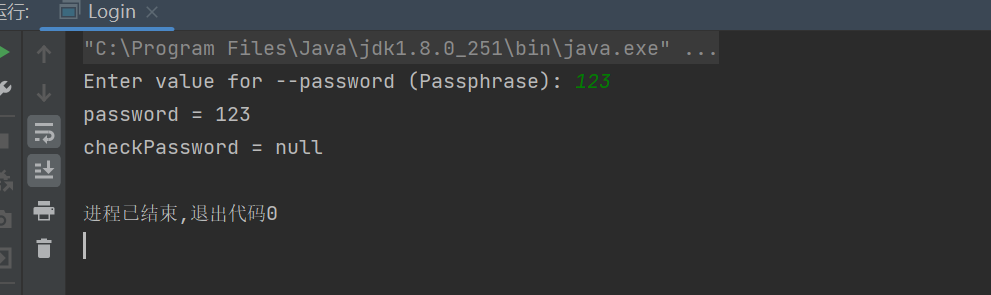

这是由于 `Picocli` 框架的规则，用户必须在命令中制定需要的交互输入的选项(比如 -p)，才会引导用户输入

所以我们要修改下代码: 

```java
public static void main(String[] args) {
    new CommandLine(new Login()).execute("-u", "user123", "-p", "-cp");
}
```

再次执行就可以了


根据实际使用情况，又可以将交互式输入分为 2中情况

- 可交互式: 用户可以直接在整行命令中输入参数，而不用给用户提示信息
- 强制交互式: 用户必须获得提示并输入某个选项，不允许不填写


###### 3. 可选交互式

默认情况下，是无法直接在命令中给交互式选项指定任何参数的，只能通过 交互式输入，比如命令中包含 `-p xxx` 会报错

> 可选交互式文档: https://picocli.info/#_optionally_interactive

测试: 

```java
// 4. 定义 main 方法，创建 CommandLine 对象，调用 execute 方法，传入参数
new CommandLine(new Login()).execute("-u", "user123", "-p", "xxx", "-cp");
```

执行效果如下图，出现了 `参数不匹配` 的报错 

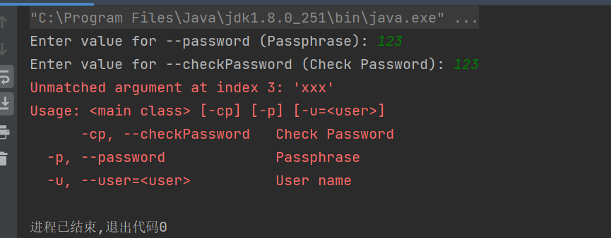


官方提供了可选交互式的解决方案，通过调整 `@Option` 注解中的 `arity` 属性 来制定每个选项可接受的参数个数，就能解决这个问题

> 官方介绍: https://picocli.info/#_arity

示例代码如下:

```java
// interactive: 交互式输入(true: 交互式输入，false: 非交互式输入)
// arity: 0..1 表示参数可以有 0 个或 1 个
@Option(names = {"-p" ,"--password"},arity = "0..1", description = "Passphrase", interactive = true)
String password;
```

然后可以直接在完整命令中给交互式选项设置值

```java
// 5. 运行 main 方法，打印输出
public static void main(String[] args) {
    // 4. 定义 main 方法，创建 CommandLine 对象，调用 execute 方法，传入参数
    // 因为上面设置了arity ，所以这个"xxx"就是默认值
    new CommandLine(new Login()).execute("-u", "user123", "-p", "xxx", "-cp");
}
```

执行结果如图，不再提示让用户输入 `password` 选项，而是直接读取了命令中的值

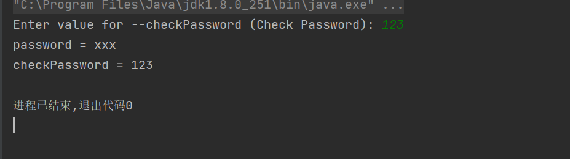

推荐给所有的交互式输入都增加 `arity` 参数 (一般是 `arity = "0..1"`)，这样用户既可以在完整命令中直接给选项填充参数，也可以选择交互式输入

```java

// 解释代码
// 1. 定义一个类 Login，实现 Callable 接口
public class Login implements Callable<Integer> {
    // 2. 定义两个选项：user 和 password
    @Option(names = {"-u", "--user"}, description = "User name")
    String user;

    // interactive: 交互式输入(true: 交互式输入，false: 非交互式输入)
    // arity: 0..1 表示参数可以有 0 个或 1 个
    @Option(names = {"-p" ,"--password"},arity = "0..1", description = "Passphrase", interactive = true)
    String password;

    @Option(names = {"-cp", "--checkPassword"}, arity = "0..1",description = "Check Password", interactive = true)
    String checkPassword;

    // 3. 实现 call 方法，打印 password 值
    public Integer call() throws Exception {
        System.out.println("password = " + password);
        System.out.println("checkPassword = " + checkPassword);
        return 0;
    }

    // 5. 运行 main 方法，打印输出
    public static void main(String[] args) {
        // 4. 定义 main 方法，创建 CommandLine 对象，调用 execute 方法，传入参数
        new CommandLine(new Login()).execute("-u", "user123", "-p", "xxx", "-cp","123");
    }
}
```

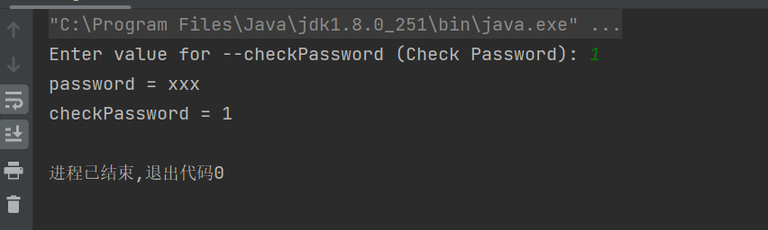


这里 `"-cp"` 没有设置默认值，你正好 `arity = "0..1"`，那么你就需要进行手动输入数据

```java
   new CommandLine(new Login()).execute("-u", "user123", "-p", "xxx", "-cp");
```


###### 4. 子命令

子命令是指令中又包含一组命令，相当于命令的分组嵌套，适用于功能较多，较为复杂的命令行程序，比如 `git` 、`docker` 命令等

官方文档: https://picocli.info/#_subcommands

在 `Picocli` 中，提供了两种设置子命令的方式

1. 声明式

   通过 `@Command` 注解的 `subcommands` 属性来给命令添加子命令，有点深更直观清晰

   示例代码:

   ```java
   @Command(subcommands = {
       GitStatus.class,
       GitCommit.class,
       GitAdd.class,
       GitBranch.class,
       GitCheckout.class,
       GitClone.class,
       GitDiff.class,
       GitMerge.class,
       GitPush.class,
       GitRebase.class,
       GitTag.class
   })
   public class Git { /* ... */ }
   ```

   

2. 编程式

   在创建 `CommandLine` 对象时，调用 `addSubcommand` 方法来绑定子命令，有点更灵活

   示例代码:

   ```java
   CommandLine commandLine = new CommandLine(new Git())
           .addSubcommand("status",   new GitStatus())
           .addSubcommand("commit",   new GitCommit())
           .addSubcommand("add",      new GitAdd())
           .addSubcommand("branch",   new GitBranch())
           .addSubcommand("checkout", new GitCheckout())
           .addSubcommand("clone",    new GitClone())
           .addSubcommand("diff",     new GitDiff())
           .addSubcommand("merge",    new GitMerge())
           .addSubcommand("push",     new GitPush())
           .addSubcommand("rebase",   new GitRebase())
           .addSubcommand("tag",      new GitTag());
   
   ```

   

   

实践:

```java
package com.yupi.cli.example;

import picocli.CommandLine;
import picocli.CommandLine.Command;

@Command(name = "main", mixinStandardHelpOptions = true)
public class SubCommandExample implements Runnable {

    @Override
    public void run() {
        System.out.println("执行主命令");
    }

    @Command(name = "add", description = "增加", mixinStandardHelpOptions = true)
    static class AddCommand implements Runnable {
        public void run() {
            System.out.println("执行增加命令");
        }
    }

    @Command(name = "delete", description = "删除", mixinStandardHelpOptions = true)
    static class DeleteCommand implements Runnable {
        public void run() {
            System.out.println("执行删除命令");
        }
    }

    @Command(name = "query", description = "查询", mixinStandardHelpOptions = true)
    static class QueryCommand implements Runnable {
        public void run() {
            System.out.println("执行查询命令");
        }
    }

    public static void main(String[] args) {
        // 执行主命令
        String[] myArgs = new String[] { };
        // 查看主命令的帮助手册
//        String[] myArgs = new String[] { "--help" };
        // 执行增加命令
//        String[] myArgs = new String[] { "add" };
        // 执行增加命令的帮助手册
//        String[] myArgs = new String[] { "add", "--help" };
        // 执行不存在的命令，会报错
//        String[] myArgs = new String[] { "update" };
        int exitCode = new CommandLine(new SubCommandExample())
                .addSubcommand(new AddCommand())
                .addSubcommand(new DeleteCommand())
                .addSubcommand(new QueryCommand())
                .execute(myArgs);
        System.exit(exitCode);
    }
}

```


基于第一种方法实现:

子命令: 

```java
import picocli.CommandLine;

@CommandLine.Command(name = "add", description = "增加", mixinStandardHelpOptions = true)
public class AddCommand implements Runnable {
    @Override
    public void run() {
        System.out.println("执行增加命令");
    }
}

```

主方法:

```java
@Command(name = "main", mixinStandardHelpOptions = true, subcommands = {AddCommand.class, DeleteCommand.class, QueryCommand.class})
public class SubCommandExample implements Runnable {

    @Override
    public void run() {
        System.out.println("执行主命令");
    }


    public static void main(String[] args) {
        // 执行主命令
//        String[] myArgs = new String[] { };
        // 查看主命令的帮助手册
//        String[] myArgs = new String[]{"--help"};
        // 执行增加命令
//        String[] myArgs = new String[] { "add" };
        // 执行增加命令的帮助手册
        String[] myArgs = new String[] { "add", "--help" };
        // 执行不存在的命令，会报错
//        String[] myArgs = new String[] { "update" };
        int exitCode = new CommandLine(new SubCommandExample()).execute(myArgs);
        System.exit(exitCode);
    }
}
```

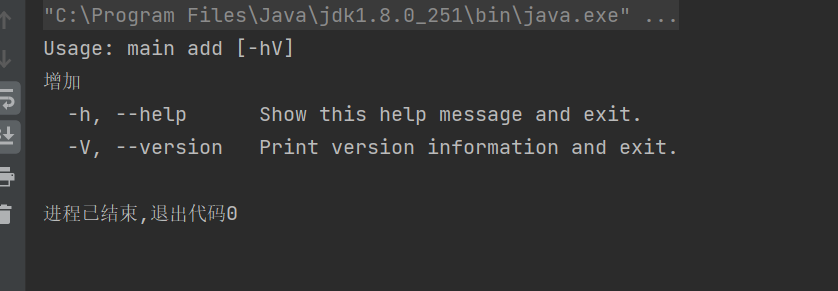


##### 4. 其他功能

- 参数分组: https://picocli.info/#_argument_groups
- 错误处理: https://picocli.info/#_handling_errors
- 颜色高亮: https://picocli.info/#_handling_errors


##### 5. Picocli学习资源

https://blog.csdn.net/it_freshman/article/details/125458116


### ✨命令模式

命令模式: 调用者和执行者中间有一个层，而这个层就是用来解耦他们之间的关系，并且通过中间层提供的方法来执行 执行者。

- 通过解耦，两部分不直接联系，而是通过中间“桥梁”进行交互，这样只要修改“桥梁”即可。

- 通过将 请求的发送者(客户端) 和 接收者(执行请求的对象) 进行 `解耦`，提供了更大的灵活性和可维护性

策略模式: 封装不同的算法/策略/行为，使得他们可以呼唤

举个例子:

我们在生活中都用过电视机， `我们` 就相当于 `客户端`，要奥做电视进行换台，而 `电视` 就是执行请求的对象，要根据我们的操作来换台。但是我们一般不会直接在电视的屏幕上通过按键来换台，而是用一个 `遥控器`，通过点击遥控器上的 `操作按钮` 来控制电视

这样我们就相当于把我们和电视机 进行解耦。哪怕遥控器丢了，再换一个遥控器就好了，而且现在手机都能作为万能的电视遥控器，我们可以同时遥控多个品牌的设备，不用关心设置的具体品牌型号，提供了更大的方便


命令模式5大要素:

- **请求者（Invoker）/ 调用者**：请求某个操作的对象。

  - ✨`请求者(遥控器)` 和 `接收器(设备)` 进行`解耦`的。遥控器`不需要关心设备如何操作`，只需要调用命令对象的execute方法，而不需要知道具体细节的实现，这个实现还是交给 命令对象 来的。

    ✨✨✨简单来说：它和不使用命令模式的一个最大区别就是: 命令模式下: 如果你还想再新增功能的时候，那么你只需要增加 `命令对象【子功能】`，然后在通过请求方【遥控器】通过点击不同的按键，然后将命令对象【按键】装到 请求方【遥控器】上就可以了，就能够给实现对应的功能。更加的通用且灵活

- **命令接口**: 设置一个标准的 `execute`方法，它自己并需要执行任何操作，只是提供一个统一的接口，具体的操作实现留给 `实现` 该`接口的命令类` 来完成，

- **命令对象（Command）**：封装请求（行为）及其参数的对象，通常实现一个统一的接口。

- **接收者（Receiver）**：实际执行具体操作的对象。

- **客户端（Client）**：创建命令对象，并将其与接收者关联。

例子:

```bash
假设有一个遥控器，它可以控制多种家电设备（如空调、电视、音响等）。每种设备都有开关操作。你可以使用命令模式，创建一个命令接口，然后分别为每个设备实现不同的命令类（如 AirConditionerOnCommand、TVOnCommand 等），然后把这些命令传递给遥控器（Invoker）。遥控器并不知道设备的具体实现，它只关心命令的执行。这样遥控器和设备之间就解耦了
请求者是遥控器，命令对象是按键，接收者是电器，客户端是我
```


应用场景:

- 系统需要统一处理多种复杂的操作，比如 操作排队、记录操作历史、撤消重做等
- 系统需要持续增加新的命令、或者处理复杂的组合命令（子命令），使用设计模式可以实现解耦

❓ 哪里用到了 `命令模式`

在我的项目中，遵循 `Picocli` 框架的规范，将每个子命令都定义为单独的命令类，比如 `GenerateCommand` 代码生成命令，`ListCommand` 列举摸文件列表命令、`ConfigCommand`查看生成数据配置命令，每个命令可独立扩展、互不影响。在`命令执行器类 CommandExecutor `中提供集中的命令调用方法，使用 `Picocli` 的API绑定上述子命令，框架会根据用户实际输入的命令进行解析，并执行对应的子命令


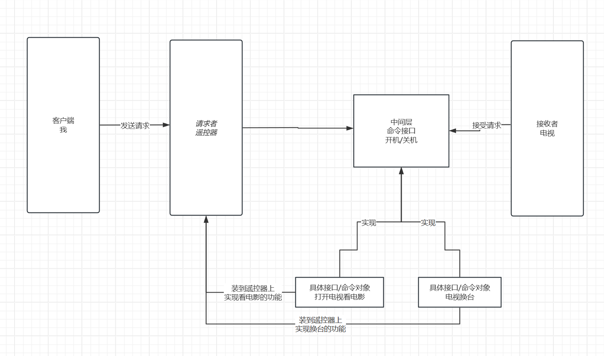

代码实现:

`命令模式: 命令接口`

```java
/**
 * 命令模式: 命令接口
 */
public interface Command {
    void execute();
}

```

`命令模式 - 接收者【可以理解为电器】-设备类`

```java
/**
 * 命令模式 - 接收者【可以理解为电器】-设备类
 */
public class Device {
    private String name;

    public Device(String name) {
        this.name = name;
    }
    public void turnOn() {
        System.out.println(name + "设备打开");
    }

    public void turnOff() {
        System.out.println(name + "设备关闭");
    }
}

```

`命令模式：命令对象【遥控器上的按键】`

```java
/**
 * 命令模式：关闭设备命令【遥控器上的按键】
 */
public class TurnOffCommand implements Command {
    // 创建一个对象
    private Device device;

    /**
     * 构造函数 - 关闭设备之前，必须要与该设备进行绑定，这样才能执行关闭设备操作
     * @param device
     */
    public TurnOffCommand(Device device) {
        this.device = device;
    }

    /**
     * 执行关闭设备操作
     */
    @Override
    public void execute() {
        device.turnOff();
    }
}

```

```java
/**
 * 命令模式：打开设备命令【遥控器上的按键】
 */
public class TurnOnCommand implements Command {
    // 创建一个对象
    private Device device;

    /**
     * 构造函数 - 关闭设备之前，必须要与该设备进行绑定，这样才能执行关闭设备操作
     * @param device
     */
    public TurnOnCommand(Device device) {
        this.device = device;
    }

    /**
     * 执行关闭设备操作
     */
    @Override
    public void execute() {
        device.turnOn();
    }
}

```

`命令模式 - 请求者 - 遥控器`

```java
/**
 * 命令模式 - 请求者 - 遥控器
 */
public class RemoteControl {
    // 创建遥控器对象
    private Command command;

    // 设置按键的命令【它可以接受一个命令对象】
    public void setCommand(Command command) {
        this.command = command;
    }

    // 按下按键
    public void pressButton() {
        command.execute();
    }
}
```


`客户端`

```java
public class Client {
    public static void main(String[] args) {
        // 创建接收者对象
        Device tv = new Device("TV");
        Device stereo = new Device("Stereo");

        // 创建具体命令对象，可以绑定不同设备
        TurnOnCommand turnOn = new TurnOnCommand(tv);
        TurnOffCommand turnOff = new TurnOffCommand(stereo);

        // 创建 调用者/请求者【遥控器】
        RemoteControl remote = new RemoteControl();

        // 因为TurnOnCommand、TurnOffCommand是Command接口的实现类，所以可以作为参数传入
        // 执行命令【设置不同功能的按键】
        remote.setCommand(turnOn);
        remote.pressButton();

        remote.setCommand(turnOff);
        remote.pressButton();

    }
}
```


### Picocli命令行代码生成器开发

首先明确需求，这个命令行支持3中子命令

- generate: 生成文件
- list: 查看要生成的原始文件列表信息
- config: 查看允许用户传入的动态参数信息

为了简化使用，要求能够支持 通过`完整命令` 和 `交互式输入` 的方式来设置动态参数

开发的6个步骤

1. 创建命令执行器 (主命令)
2. 分别实现每种子命令
3. 提供项目的全局调用入口
4. 构建程序 jar包
5. 测试使用
6. 简化使用 (封装脚本)


#### 1. 创建命令执行器

在 `com.wjp.cli.command` 包中新建3个命令类，和需求对应:

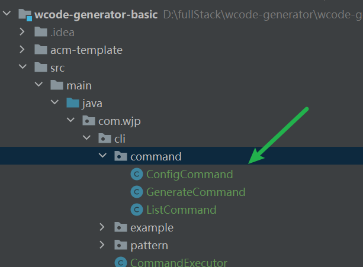

在 `com.wjp.cli` 包下创建命令执行器， `CommandExecutor` 类，负责`绑定所有子命令` ,并且提供执行命令的方法

完整代码:

```java
import picocli.CommandLine;
import picocli.CommandLine.Command;

/**
 * 命令行执行器【详单与遥控器，实际执行子命令 - 命令对象】
 */
// 命令对象
// 注解 @Command 定义命令对象，name 为命令名，mixinStandardHelpOptions 为是否混合标准帮助选项
@Command(name = "wcode", mixinStandardHelpOptions = true)
public class CommandExecutor implements Runnable {

    // 命令行对象
    private final CommandLine commandLine;

    // 静态代码块，初始化命令对象

    {
        // 注册子命令
        commandLine = new CommandLine(this)
                .addSubcommand(new GenerateCommand())
                .addSubcommand(new ConfigCommand())
                .addSubcommand(new LinkageError());
    }

    /**
     * 执行命令
     */
    @Override
    public void run() {
        // 不输入子命令时，最好给个友好提示
        System.out.println("请输入具体命令，或者输入 --help 查看命令提示");
    }

    /**
     * 执行命令
     * @param args
     * @return
     */
    public Integer doExecute(String[] args) {
        return commandLine.execute(args);
    }
}

```


#### 2.子命令实现

##### `generate` 子命令

这是代码生成器的核心命令，作用是 `接受参数并生成代码`

实现步骤:

1. 定义参数选项，和之前动态生成代码定义的数据模型 `MainTemplateConfig` 属性保持一致即可，使用 `Picocli` 提供的注解来交互式获取参数信息(`interactive = true`)，并且对用户显示输入信息 (`echo = true`)
2. 使用 `BeanUtil.copyProperties` 快速通过命令将接收到的属性复制给 `MainTemplateConfig` 配置对象
3. 调用提前开发好的 `MainGenerator` 代码生成类快速生成代码

完整代码:

```java
import freemarker.template.TemplateException;
import picocli.CommandLine;

import java.io.IOException;
import java.util.concurrent.Callable;

@CommandLine.Command(name = "generate", mixinStandardHelpOptions = true)
// 交互式输入就 Callable
// 非交互式输入就 Runnable
public class GenerateCommand implements Callable {

    /**
     * @CommandLine.Option参数介绍 name: 参数名，如-l，--loop
     * description: 参数描述
     * arity: 参数的个数 0..1 表示0个或1个
     * interactive: 是否交互式输入，如密码输入
     * echo: 是否输出输入内容，如密码输入
     */
    @CommandLine.Option(names = {"-l", "--loop"}, description = "是否循环", arity = "0..1", interactive = true,echo = true)
    private boolean loop;

    @CommandLine.Option(names = {"-a", "--author"}, description = "作者信息", arity = "0..1", interactive = true,echo = true)
    private String author;

    @CommandLine.Option(names = {"o", "--outputText"}, description = "输出文本", arity = "0..1", interactive = true,echo = true)
    private String outputText;

    @Override
    public Integer call() throws TemplateException, IOException {
        MainTemplateConfig mainTemplateConfig = new MainTemplateConfig();
        // 将 命令行参数 赋值给 mainTemplateConfig
        BeanUtil.copyProperties(this, mainTemplateConfig);
        // 生成代码
        MainGenerator.doGenerate(mainTemplateConfig);
        return 0;
    }
}
```


##### `list` 子命令

list 是一个辅助命令，作用是 `遍历输出所有要生成的文件列表`

此处由于我们要生成的项目文件都封装在了 `acm-template` 目录下，所以直接用 `Hutool` 库提供的 `FileUtil.loopFiles(inputPath)` 方法来遍历该目录下的所有文件即可

完整代码: 

```java

import cn.hutool.core.io.FileUtil;
import picocli.CommandLine;

import java.io.File;
import java.util.List;

@CommandLine.Command(name = "list", mixinStandardHelpOptions = true)
// 交互式输入就 Callable
// 非交互式输入就 Runnable
public class ListCommand implements Runnable{

    @Override
    public void run() {
        // 获取项目根目录: D:\fullStack\wcode-generator\wcode-generator-basic
        String projectPath = System.getProperty("user.dir");

        // 获取整个项目的根目录 就是 D:\fullStack\wcode-generator
        File parentFile = new File(projectPath).getParentFile();

        // 输入路径
        String inputPath = new File(parentFile, "wcode-generator-demo-projects/acm-template").getAbsolutePath();

        // 获取所有文件
        List<File> files = FileUtil.loopFiles(inputPath);
        for (File file : files) {
            System.out.println(file);
        }
    }
}

```


##### `config` 子命令

config 是一个辅助命令，作用是 `输出允许用户输入的动态参数的信息`(也就是本项目 `MainTemplateConfig` 类的字段信息)

可以使用 `Hutool` 反射工具类

```java
Field[] fields = ReflectUtil.getFields(MainTemplateConfig.class);
```

完整代码:

```java
import picocli.CommandLine;

import java.lang.reflect.Field;

/**
 * 配置子命令
 */
// 交互式输入就 Callable
// 非交互式输入就 Runnable
@CommandLine.Command(name = "config", description = "查看配置信息")
public class ConfigCommand implements Runnable{
    @Override
    public void run() {
        // 获取 MainTemplateConfig.class 类的所有字段
        Field[] fields = ReflectUtil.getFields(MainTemplateConfig.class);
        for (Field field : fields) {
            System.out.println("字段名称" + field.getName());
            System.out.println("字段类型" + field.getType());
        }
    }
}

```


#### 3. 全局调用入口

在项目的根包 `com.wjp` 下创建 `Main`类,作为整个代码生成器项目的全局调用入口。作用是 `接受用户的参数、创建命令执行器并调用执行`

```java
public class Main {

    public static void main(String[] args) {
        CommandExecutor commandExecutor = new CommandExecutor();
        commandExecutor.doExecute(args);
    }
}
```

测试代码:

```java
public class Main {

    public static void main(String[] args) {
        // 根据用户输入的参数，调用对应的命令执行器
        args = new String[]{"generate", "-l", "-a", "-o"};
        // 动态获取用户输入参数的参数类型
//        args = new String[]{"config"};
        // 获取用户的文件列表
//        args = new String[]{"list"};
        CommandExecutor commandExecutor = new CommandExecutor();
        commandExecutor.doExecute(args);
    }
}

```


`generate` 子命令

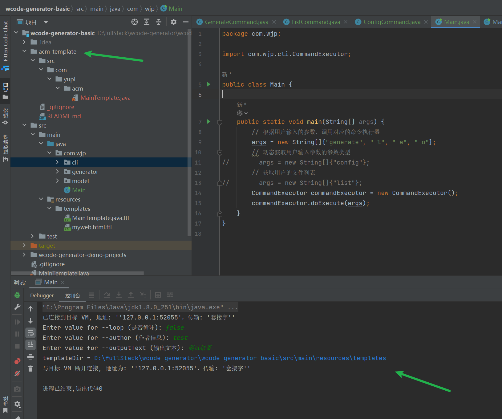

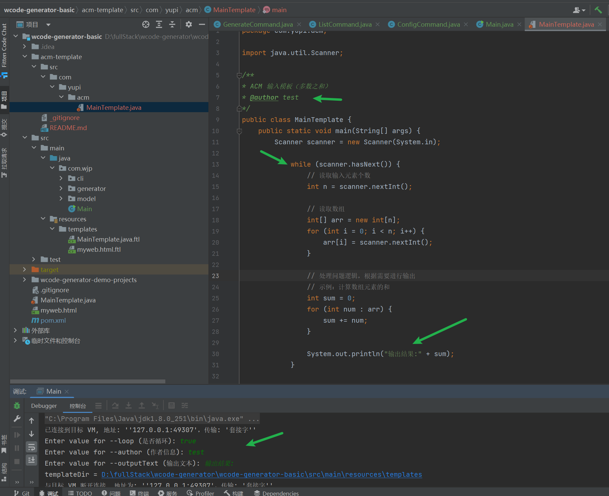


`config` 子命令

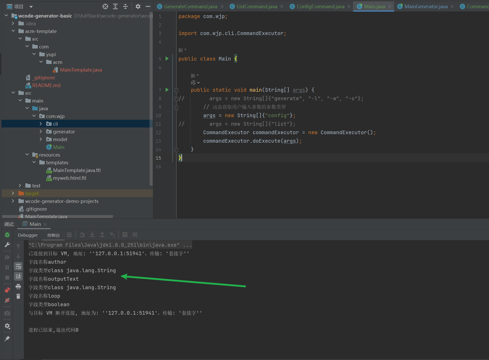


`list`子命令

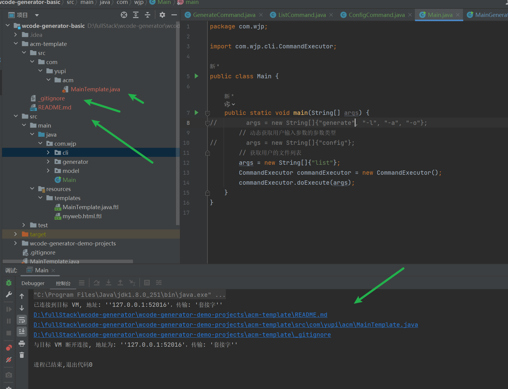


#### 4. jar包构建

`引入依赖`

```xml

    <build>
        <plugins>
            <plugin>
                <groupId>org.apache.maven.plugins</groupId>
                <artifactId>maven-assembly-plugin</artifactId>
                <version>3.3.0</version> <!-- 或者选择一个稳定版本 -->
                <configuration>
                    <descriptorRefs>
                        <descriptorRef>jar-with-dependencies</descriptorRef>
                    </descriptorRefs>
                    <archive>
                        <manifest>
                            <mainClass>com.wjp.Main</mainClass> <!-- ✨替换为你的主类的完整类名 -->
                        </manifest>
                    </archive>
                </configuration>
                <executions>
                    <execution>
                        <phase>package</phase>
                        <goals>
                            <goal>single</goal> <!-- 确保使用 assembly 作为 goal -->
                        </goals>
                    </execution>
                </executions>
            </plugin>
        </plugins>
    </build>
```


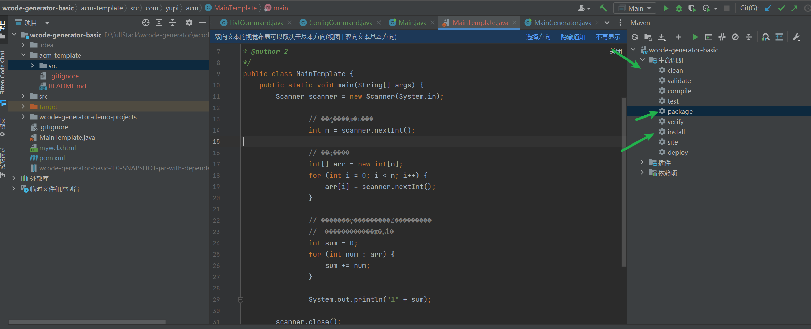


#### 5. 测试使用

如果jar包在target目录下的话，那么它会找不到目标文件，因为它会以target为路径，进行查找

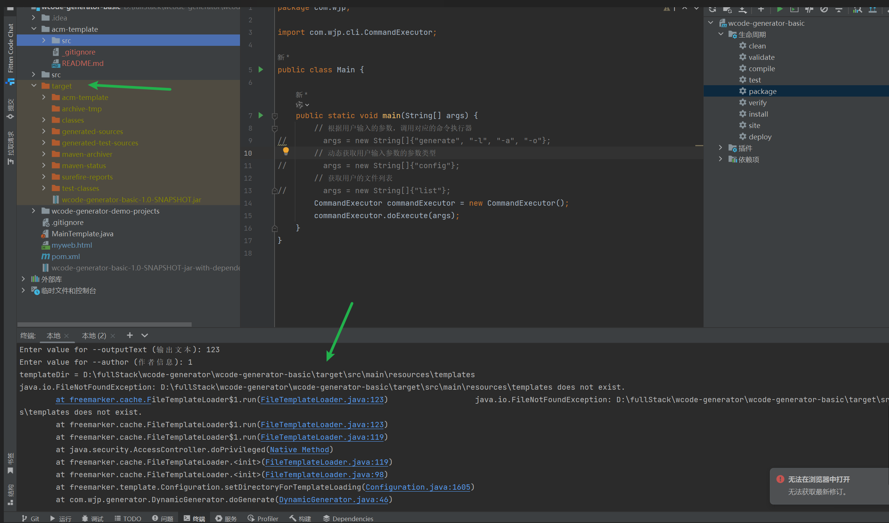


解决的办法就是把 jar包 挪到项目根目录下

命令:

```java
java -jar wcode-generator-basic-1.0-SNAPSHOT-jar-with-dependencies.jar generate -l -o -a
```


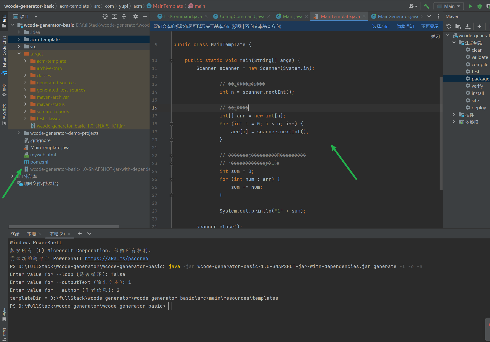


#### 6. 封装脚本

```bash
#!/bin/bash

# 设置 Java 的文件编码为 UTF-8，确保 Java 程序能够正确处理中文
java -Dfile.encoding=UTF-8 -jar target/wcode-generator-basic-1.0-SNAPSHOT-jar-with-dependencies.jar "$@"
```


## 3. 制作工具开发


`开发代码生成器制作工具`


重点:

1. 代码生成器制作工具实现思路
2. `元信息` 定义
3. 制作工具开发


### 一、代码生成器制作工具规划

#### 明确需求和业务

本项目 分为 3大阶段，简单回顾:

本阶段(第二阶段)的目标是做 一个本`地的代码生成器制作工具`，能够快速将一个项目制作为 `可以动态定制部分内容` 的代码生成器。并且以一个Spring Boot 初始化项目模板(Maven项目)为例，演示如何根据自己的需求动态生成Java后端初始化项目

相比于第一阶段`完全人工开发本地代码生成器`，本阶段完成后，我们可以直接使用`代码生成器制作工具`来生成`模版文件`，`数据模型` 和 `代码生成器jar包`，能够大大提高代码生成器的制作效率

一定要理清 `代码生成器` 和 `目标代码的`关系


#### 实现思路:

想要实现上述功能，其实很复杂，需要考虑很多:

1. 工具应该提供哪些能力？怎么`提高代码生成器的制作效率`?
2. 如何`动态生成命令行工具`? 如何`动态打 jar`?
3. 如何`动态生成模版文件`？怎么从原始文件中`抽取参数`? 有哪些`类型的参数`?

对于我们第二阶段要做的代码生成器，可以按照一下的思路进行实现

1. 开发基础的代码生成制作工具

移除第一阶段ACM模版生成器项目，能在已有项目模板的基础上，通过读取 `人工配置` 跑通代码生成器的核心制作流程(不用再代码中找出路径，改路径了)，生成代码生成器

2. 配置文件增强

以实现 `Spring Boot` 初始化项目模版生成器的生成为目标，给配置文件增加更多参数，可以更灵活地制作更复杂的代码生成器

3. 工具能力增强

给代码生成器制作工具增加更多能力，可以帮助开发者`自动生成` / `更新配置文件`、`FTL动态模版文件`等, 进一步提高制作效率


### 二、核心设计

#### 需求分析

一个举出的代码生成器制作工具，应该具有哪些功能呢？

想要回答这个问题，我们要回顾一下第一阶段，我们是如何纯人工开发一个代码生成器的，大概经过了这些步骤:

1. 基于一个要生成的项目，手动挖坑，制作FTL动态模版文件
2. 编写数据模型文件
3. 编写Picocli 命令类
4. 编写代码生成文件 Generator (文件路径还是硬编码"写死"的)
5. 手动执行 Maven 命令 打 `jar包`
6. 自己封装快捷执行脚本


#### 元信息定义

这里我们给配置文件取一个好听的名 ——`元信息`，元信息 一般是用来描述项目的数据，比如项目的名称、作者等

为什么需要元信息文件？本质上是把项目中 `硬编码(写死的)内容` 转为可以 `灵活替换的配置`

比如第一阶段项目 `MainGenerator`类中的动态文件路径，就是在代码中写死的

如何设计元信息呢？

其实和设计数据库表是非常类似的，都要根据实际的业务需求，设置合适的存储结构、字段名和类别

##### 元信息的存储结构

我们选用 JSON格式 来存储元信息，理由是常用、通用、结构清晰、便于理解

将元信息 定义为  `mate.json`，之后放在制作工具项目的 `resources` 目录下

###### 元信息的字段配置

应该包含哪些？

1. 记录代码生成器的基本信息

   比如项目名称、作者、版本号等

2. 记录生成的文件信息

   比如输入文件路径、输出路径、文件类别(目录或文件)、生成类别(静态或动态)等

3. 记录数据模型信息

   比如参数的名称、描述、类型、默认值等

###### 示例配置信息

以 `acm-template-pro` 项目为例:

```json
{
  "name": "acm-template-pro-generator",
  "description": "ACM 示例模板生成器",
  "basePackage": "com.yupi",
  "version": "1.0",
  "author": "yupi",
  "createTime": "2023-11-22",
  "fileConfig": {
    "inputRootPath": "/Users/yupi/Code/yuzi-generator/yuzi-generator-demo-projects/acm-template-pro",
    "outputRootPath": "generated",
    "type": "dir",
    "files": [
      {
        "inputPath": "src/com/yupi/acm/MainTemplate.java.ftl",
        "outputPath": "src/com/yupi/acm/MainTemplate.java",
        "type": "file",
        "generateType": "dynamic"
      },
      {
        "inputPath": ".gitignore",
        "outputPath": ".gitignore",
        "type": "file",
        "generateType": "static"
      },
      {
        "inputPath": "README.md",
        "outputPath": "README.md",
        "type": "file",
        "generateType": "static"
      }
    ]
  },
  "modelConfig": {
    "models": [
      {
        "fieldName": "loop",
        "type": "boolean",
        "description": "是否生成循环",
        "defaultValue": false,
        "abbr": "l"
      },
      {
        "fieldName": "author",
        "type": "String",
        "description": "作者注释",
        "defaultValue": "yupi",
        "abbr": "a"
      },
      {
        "fieldName": "outputText",
        "type": "String",
        "description": "输出信息",
        "defaultValue": "sum = ",
        "abbr": "o"
      }
    ]
  }
}

```


### 三、代码生成器制作工具开发

开发顺序遵循上面需求分析中提到的代码生成器制作步骤，分为

1. 项目初始化
2. 读取元信息
3. 生成数据模型文件
4. 生成 Picocli 命令类
5. 生成代码生成文件
6. 程序构建 jar包
7. 程序封装脚本
8. 测试验证


