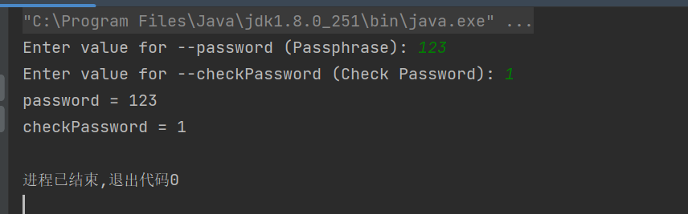
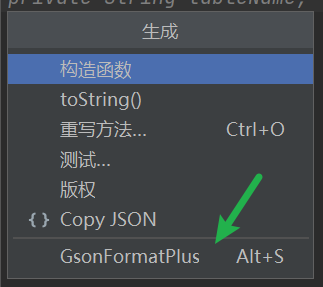

# 代码生成器共享平台源码

`第一阶段: 本地代码生成器`


`第二阶段: 代码生成器`


## 1. 代码生成

### 创建本地代码生成项目

1. 创建项目


2. 安装依赖

```xml
<dependencies>
    <!-- https://doc.hutool.cn/ -->
    <dependency>
        <groupId>cn.hutool</groupId>
        <artifactId>hutool-all</artifactId>
        <version>5.8.16</version>
    </dependency>
    <!-- https://mvnrepository.com/artifact/org.apache.commons/commons-collections4 -->
    <dependency>
        <groupId>org.apache.commons</groupId>
        <artifactId>commons-collections4</artifactId>
        <version>4.4</version>
    </dependency>
    <!-- https://projectlombok.org/ -->
    <dependency>
        <groupId>org.projectlombok</groupId>
        <artifactId>lombok</artifactId>
        <version>1.18.30</version>
        <scope>provided</scope>
    </dependency>
    <dependency>
        <groupId>junit</groupId>
        <artifactId>junit</artifactId>
        <version>4.13.2</version>
        <scope>test</scope>
    </dependency>
</dependencies>

```


#### 1. 实现流程

##### 实现步骤

1. 生成 `静态` 文件，通过 `Main` 方法运行
2. 生成 `动态` 文件，通过 `Main` 方法运行
3. `同时` 生成静态和动态文件，通过 `Main` 方法运行，得到完整代码生成
4. 开发命令行工具，接收用户的输入并生成完整代码
5. 将工具封装为 `jar包` 和 `脚本`，供用户使用


#### 2. 静态文件生成

使用的是 `Hutool` 工具类

```java
public class StaticGenerator {
    public static void main(String[] args) {
        // 生成最外层的项目根目录: D:\fullStack\wcode-generator
        String projectPath = System.getProperty("user.dir");

        // 输入路径: D:\fullStack\wcode-generator\wcode-generator-demo-projects\acm-template
        // File.separator: 文件分隔符，在不同系统中可能不同，比如在Windows系统中是"\"，在Linux系统中是"/"
        String inputPath = projectPath + File.separator + "wcode-generator-demo-projects" + File.separator + "acm-template";

        // 输出路径
        String outputPath = projectPath;

        // 复制
        copyFilesHuttol(inputPath, outputPath);
    }

    /**
     * 使用hutool复制文件
     * @param inputPath
     * @param outputPath
     */
    public static void copyFilesHuttol(String inputPath, String outputPath) {
        FileUtil.copy(inputPath, outputPath, true);
    }
}

```


#### 3. 动态文件生成思路

实现了静态文件生成（复制目录）后，我们思考下如何对 `某个` 基础文件 进行 `定制`，根据用户的输入参数动态生成文件

明确动态生成需求

对于 ACM示例模版项目，我们可以怎么定制生成呢?

让我们先明确几个动态生成的需求

1. 在代码开头增加作者 `@Author` 注释 (`增加`代码)
2. 修改程序输出的信息提示 (`替换`代码)
3. 将循环读取输入 改为 单次读取 (`可选`代码)

```java
package com.yupi.acm;

import java.util.Scanner;

/**
 * ACM 输入模板（多数之和）
 * @author yupi（1. 增加作者注释）
 */
public class MainTemplate {
    public static void main(String[] args) {
        Scanner scanner = new Scanner(System.in);

    // 2. 可选是否循环
//        while (scanner.hasNext()) {
            // 读取输入元素个数
            int n = scanner.nextInt();

            // 读取数组
            int[] arr = new int[n];
            for (int i = 0; i < n; i++) {
                arr[i] = scanner.nextInt();
            }

            // 处理问题逻辑，根据需要进行输出
            // 示例：计算数组元素的和
            int sum = 0;
            for (int num : arr) {
                sum += num;
            }

            // 3. 输出信息可以修改
            System.out.println("求和结果: " + sum);
//        }

        scanner.close();
    }
}


```


`动态生成的核心原理`

最经典的实现方式就是: 提前 基于基础文件 `"挖坑"` ，编写 `模版文件`，然后将用户输入的 `参数` “填坑”，替换到模版文件中，从而生成完整代码

举个例子，用户输入参数:

```java
author = yupi
```

模版文件代码:

```java
/**
 * ACM 输入模板（多数之和）
 * @author ${author}
 */
```

将参数注入到模版文件中:

```java
/**
 * ACM 输入模板（多数之和）
 * @author yupi
 */
```

不过推荐使用 `模版引擎` 来实现 `模版编写和动态内容生成`


#### 4. FreeMarker 模版引擎入门

官方文档: https://freemarker.apache.org/docs/index.html

中文文档: http://freemarker.foofun.cn/toc.html

FreeMarker 教程网: http://www.freemarker.net/#1

引入依赖【Maven项目】

```xml
<!-- https://freemarker.apache.org/index.html -->
<dependency>
    <groupId>org.freemarker</groupId>
    <artifactId>freemarker</artifactId>
    <version>2.3.32</version>
</dependency>

```

Springboot项目用下面这个

```xml
<dependency>
  <groupId>org.springframework.boot</groupId>
  <artifactId>spring-boot-starter-freemarker</artifactId>
</dependency>

```


示例代码:

```java

public class FreeMarkerTest {

    @Test
    public void test() throws IOException, TemplateException {
        // new 出 Configuration 对象，参数为 FreeMarker 版本号
        Configuration configuration = new Configuration(Configuration.VERSION_2_3_32);

        // 指定模板文件所在的路径
        configuration.setDirectoryForTemplateLoading(new File("src/main/resources/templates"));

        // // 设置模板文件使用的字符集
        configuration.setDefaultEncoding("utf-8");

        // 创建模板对象，加载指定模板
        // myweb.html.ftl: 要进行动态生成的文件
        Template template = configuration.getTemplate("myweb.html.ftl");


        // 创建数据模型
        Map<String, Object> dataModel = new HashMap<>();
        dataModel.put("currentYear",2024);
        List<Map<String, Object>> menuItems = new ArrayList<>();

        Map<String, Object> menuItem1 = new HashMap<>();
        menuItem1.put("url", "http://www.baidu.com");
        menuItem1.put("label", "百度");

        Map<String, Object> menuItem2 = new HashMap<>();
        menuItem2.put("url", "http://www.google.com");
        menuItem2.put("label", "谷歌");

        menuItems.add(menuItem1);
        menuItems.add(menuItem2);

        dataModel.put("menuItems", menuItems);


        // 输出文件
        Writer out = new FileWriter("myweb.html");

        // 调用模板对象的 process 方法，将数据模型和输出流传递给模板对象，生成 HTML 文件
        template.process(dataModel, out);

        // 生成文件后别忘了关闭哦
        out.close();
    }
}
```


#### 5. 动态文件生成实现

学习了 `FreeMarker` 模版引擎后，让我们进行实战

核心步骤: 

1. 定义数据模型
2. 编写动态模版
3. 组合生成
4. 完善优化


##### 1. 定义数据模型

```java
/**
 * 静态模版配置
 */
@Data
public class MainTemplateConfig {

    /**
     * 让我们先明确几个动态生成的需求
     *
     * 1. 在代码开头增加作者 `@Author` 注释 (`增加`代码)
     * 2. 修改程序输出的信息提示 (`替换`代码)
     * 3. 将循环读取输入 改为 单次读取 (`可选`代码)
     */

    /**
     * 作者名称
     */
    private String author = "wjp";

    /**
     * 输出信息
     */
    private String outputText = "sum = ";


    /**
     * 是否循环(开关)
     */
    private Boolean loop;

}

```


##### 2. 编写动态模版

`MainTemplate.java.ftl`

```java
package com.yupi.acm;

import java.util.Scanner;

/**
* ACM 输入模板（多数之和）
* @author ${author}
*/
public class MainTemplate {
    public static void main(String[] args) {
        Scanner scanner = new Scanner(System.in);

        <#if loop>
            while (scanner.hasNext()) {
        </#if>
                // 读取输入元素个数
                int n = scanner.nextInt();

                // 读取数组
                int[] arr = new int[n];
                for (int i = 0; i < n; i++) {
                    arr[i] = scanner.nextInt();
                }

                // 处理问题逻辑，根据需要进行输出
                // 示例：计算数组元素的和
                int sum = 0;
                for (int num : arr) {
                    sum += num;
                }

                System.out.println(" ${outputText}" + sum);
        <#if loop>
            }
        </#if>

        scanner.close();
    }
}

```


##### 3. 组合生成

`DynamicGenerator.java`


```java

public class DynamicGenerator {
    public static void main(String[] args) throws IOException, TemplateException {
        // new 出 Configuration 对象，参数为 FreeMarker 版本号
        Configuration configuration = new Configuration(Configuration.VERSION_2_3_32);

        // 这里是项目根目录: D:\fullStack\wcode-generator,而我们需要进入的是 wcode-generator-basic 这个项目里
        String projectPath = System.getProperty("user.dir") + File.separator + "wcode-generator-basic"+ File.separator;
        System.out.println(projectPath);
        // 最终的输出路径: D:\fullStack\wcode-generator\wcode-generator-basic\src\main\resources\templates
        File file = new File(projectPath, "src/main/resources/templates");
        System.out.println("file = " + file);
        // 指定模板文件所在的路径
        configuration.setDirectoryForTemplateLoading(file);

        // // 设置模板文件使用的字符集
        configuration.setDefaultEncoding("utf-8");

        // 设置数字格式化
        configuration.setNumberFormat("0.######");  // now it will print 1000000

        // 创建模板对象，加载指定模板
        Template template = configuration.getTemplate("MainTemplate.java.ftl");


        // 创建数据模型

        MainTemplateConfig mainTemplateConfig = new MainTemplateConfig();
//        mainTemplateConfig.setAuthor("wjp");
//        mainTemplateConfig.setOutputText("sum");
        mainTemplateConfig.setLoop(true);


        // 输出文件
        Writer out = new FileWriter("MainTemplate.java");

        // 调用模板对象的 process 方法，将数据模型和输出流传递给模板对象，生成 HTML 文件
        template.process(mainTemplateConfig, out);

        // 生成文件后别忘了关闭哦
        out.close();


    }
}

```


##### 4. 完善优化


```java

public class DynamicGenerator {
    public static void main(String[] args) throws IOException, TemplateException {

        // 这里是项目根目录: D:\fullStack\wcode-generator,而我们需要进入的是 wcode-generator-basic 这个项目里

        // 项目路径: D:\fullStack\wcode-generator\wcode-generator-basic
        String projectPath = System.getProperty("user.dir") + File.separator + "wcode-generator-basic";

        // 输入路径【模板文件路径】: D:\fullStack\wcode-generator\wcode-generator-basic\src/main/resources/templates/MainTemplate.java.ftl
        String inputPath = projectPath + File.separator + "src/main/resources/templates/MainTemplate.java.ftl";

        // 输出路径【模版生成文件路径】: D:\fullStack\wcode-generator\wcode-generator-basic\MainTemplate.java
        String outputPath = projectPath + File.separator + "MainTemplate.java";


        // 创建数据模型

        MainTemplateConfig mainTemplateConfig = new MainTemplateConfig();
//        mainTemplateConfig.setAuthor("wjp");
//        mainTemplateConfig.setOutputText("sum");
        mainTemplateConfig.setLoop(true);

        doGenerate(inputPath, outputPath, mainTemplateConfig);
    }

    public static void doGenerate(String inputPath, String outputPath, Object model) throws IOException, TemplateException {
        // new 出 Configuration 对象，参数为 FreeMarker 版本号
        Configuration configuration = new Configuration(Configuration.VERSION_2_3_32);
        // 获取实际文件的父目录
        File templateDir = new File(inputPath).getParentFile();
        System.out.println("templateDir = " + templateDir);
        // ✨指定模板文件所在的路径
        configuration.setDirectoryForTemplateLoading(templateDir);

        // 设置模板文件使用的字符集
        configuration.setDefaultEncoding("utf-8");

        // 设置数字格式化
        configuration.setNumberFormat("0.######");  // now it will print 1000000

        // 创建模板对象，加载指定模板
        String templateName = new File(inputPath).getName();
        // 从指定的模板目录加载一个模板文件
        // templateName: 要加载的模版名
        Template template = configuration.getTemplate(templateName);


        // 输出文件
        Writer out = new FileWriter(outputPath);

        // 调用模板对象的 process 方法，将数据模型和输出流传递给模板对象，生成 HTML 文件
        template.process(model, out);

        // 生成文件后别忘了关闭哦
        out.close();


    }
}

```


#### 6. 动静结合模板生成

多项目打开

```java
public class MainGenerator {
    public static void main(String[] args) throws TemplateException, IOException {
        // 1. 生成静态文件
        // 生成最外层的项目根目录: D:\fullStack\wcode-generator
        String projectPath = System.getProperty("user.dir");

        // 输入路径【静态模板文件路径】: D:\fullStack\wcode-generator\wcode-generator-demo-projects\acm-template
        // File.separator: 文件分隔符，在不同系统中可能不同，比如在Windows系统中是"\"，在Linux系统中是"/"
        String inputPath = projectPath + File.separator + "wcode-generator-demo-projects" + File.separator + "acm-template";

        // 输出路径【静态模版生成文件路径】
        String outputPath = projectPath;

        // 复制
        StaticGenerator.copyFilesHuttol(inputPath, outputPath);

        // 2. 生成动态文件
        // 这里是项目根目录: D:\fullStack\wcode-generator,而我们需要进入的是 wcode-generator-basic 这个项目里
        // 输入路径【动态模板文件路径】: D:\fullStack\wcode-generator\wcode-generator-basic\src/main/resources/templates/MainTemplate.java.ftl
        String dynamicIinputPath = projectPath + File.separator + "wcode-generator-basic" + File.separator + "src/main/resources/templates/MainTemplate.java.ftl";

        // 输出路径【动态模版生成文件路径】: D:\fullStack\wcode-generator\wcode-generator-basic\MainTemplate.java
        String dynamicOutputPath = projectPath + File.separator +"acm-template/src/com/yupi/acm/MainTemplate.java";


        // 创建数据模型

        MainTemplateConfig mainTemplateConfig = new MainTemplateConfig();
        mainTemplateConfig.setAuthor("wjp11");
        mainTemplateConfig.setOutputText("sum11");
        mainTemplateConfig.setLoop(true);

        DynamicGenerator.doGenerate(dynamicIinputPath, dynamicOutputPath, mainTemplateConfig);
    }
}

```


独立项目打开

```java
public class MainGenerator {
    public static void main(String[] args) throws TemplateException, IOException {
        // 1. 生成静态文件
        // 生成最外层的项目根目录: D:\fullStack\wcode-generator
        String projectPath = System.getProperty("user.dir");

        File parentFile = new File(projectPath).getParentFile();

        // 输入路径【静态模板文件路径】: D:\fullStack\wcode-generator\wcode-generator-demo-projects\acm-template
        // File.separator: 文件分隔符，在不同系统中可能不同，比如在Windows系统中是"\"，在Linux系统中是"/"

        String inputPath = new File(parentFile, "wcode-generator-demo-projects/acm-template").getAbsolutePath();
        // 输出路径【静态模版生成文件路径】
        String outputPath = projectPath;

        // 复制
        StaticGenerator.copyFilesHuttol(inputPath, outputPath);

        // 2. 生成动态文件
        // 这里是项目根目录: D:\fullStack\wcode-generator,而我们需要进入的是 wcode-generator-basic 这个项目里
        // 输入路径【动态模板文件路径】: D:\fullStack\wcode-generator\wcode-generator-basic\src/main/resources/templates/MainTemplate.java.ftl
        String dynamicInputPath = projectPath + File.separator + "src/main/resources/templates/MainTemplate.java.ftl";

        // 输出路径【动态模版生成文件路径】: D:\fullStack\wcode-generator\wcode-generator-basic\MainTemplate.java
        String dynamicOutputPath = projectPath + File.separator +"acm-template/src/com/yupi/acm/MainTemplate.java";


        // 创建数据模型

        MainTemplateConfig mainTemplateConfig = new MainTemplateConfig();
        mainTemplateConfig.setAuthor("wjp11");
        mainTemplateConfig.setOutputText("sum11");
        mainTemplateConfig.setLoop(true);

        DynamicGenerator.doGenerate(dynamicInputPath, dynamicOutputPath, mainTemplateConfig);
    }
}

```


## 2. 命令行开发

重点:

- `Java` 命令行开发方案
- `Picocli` 命令行框架学习
- `命令模式` 讲解
- `Picocli` 命令行代码生成器开发


### 一、Java 命令行开发方案

#### 什么是命令行程序?

就是通过 终端狂口接收用户输入的 `纯文本` 命令，并执行相应的任务


#### 命令的结构

- command: 命令类型，具体要做的事
- option: 选项，用于改变命令的行为
- parameter: 参数，传递给命令行工具的值


#### 为什么要开发命令行?

优点:

- 不依赖特定的程序界面，非常轻量
- 通常可以直接在操作系统自带的终端环境中运行
- 可以和用户交互、给用户输入引导和帮助手册
- 内置一些快捷操作(比如查看历史命令、上下切换命令)

还有一个最大的优点: 简单直接，比如复制粘贴别人写好的命令就能够执行，不需要在网页上进行点来点去


#### 实现方案:

##### 使用第三方库 ( Picocli )

> 专门用于开发命令行工具的框架

✨ Picocli (https://picocli.info/s) 优点: Github 的Start数多，持续更新，支持颜色高亮，自动补全，子命令，帮助手册，最推荐


### 二、 Picocli  命令行框架入门

官方文档: https://picocli.info/

快速入门: https://picocli.info/quick-guide.html

#### 入门

依赖

```xml
<!-- https://picocli.info -->
<dependency>
    <groupId>info.picocli</groupId>
    <artifactId>picocli</artifactId>
    <version>4.7.5</version>
</dependency>
```


代码: 

```java
// 命令行参数解析
// 实现一个ASCIIArt命令行工具，可以将输入的文字转换为ASCII art。

// 实现步骤：
// 1. 定义一个类，继承Runnable接口，并添加@Command注解，指定命令名称、版本、帮助信息等。
@Command(name = "ASCIIArt", version = "ASCIIArt 1.0", mixinStandardHelpOptions = true)
public class ASCIIArt implements Runnable {
    // 2. 在类中添加@Option注解，指定选项名称、描述、默认值等。
    @Option(names = { "-s", "--font-size" }, description = "Font size") 
    int fontSize = 19;

    // 3. 在类中添加@Parameters注解，指定参数名称、描述、默认值等。
    @Parameters(paramLabel = "<word>", defaultValue = "Hello, picocli", 
               description = "Words to be translated into ASCII art.")
    private String[] words = { "Hello,", "picocli" };

    // 4. 实现run()方法，在方法中实现业务逻辑。
    @Override
    public void run() {
        // 自己实现业务逻辑
        System.out.println("fontSize = " + fontSize);
        System.out.println("words = " + String.join(",", words));
    }

    public static void main(String[] args) {
        // 5. 在main()方法中，创建CommandLine对象，并调用execute()方法，传入命令行参数。
        int exitCode = new CommandLine(new ASCIIArt()).execute(args);
        // 6. 调用System.exit()方法，退出程序。
        System.exit(exitCode); 
    }
}

```


通过这个入门 Demo，我们可以简单总结一个命令的开发流程:

1. 创建命令
2. 设置选项和参数
3. 编写命令执行的业务逻辑

4. 通过 `CommandLine` 对象接受输入并执行命令


#### 实用功能

##### 1. 帮助手册

通过给类添加的 `@Command` 注解参数 `mixinStandardHelpOptions` 设置为 `true` 来开启

```java
@Command(name = "ASCIIArt", version = "ASCIIArt 1.0", mixinStandardHelpOptions = true)
```

然后将主程序的输入参数设置为 `--help` 就能打印出命令的帮助手册信息了，如下图: 


##### 2. 命令解析

`Picocli`最核心的能力就是命令解析，能够从一句完整的命令中解析`选项`和`参数`，并填充到对象的属性中

`Picocli`使用注解的方式实心命令解析，不需要自己编写代码，整个类看起来非常清晰

最核心的2个注解:

- `@Command`: 注解用于 `解析选项`
- `@Parameters`: 注解用于解析参数


示例代码如下:

```java
// 2. 在类中添加@Option注解，指定选项名称、描述、默认值等。
@Option(names = { "-s", "--font-size" }, description = "Font size")
int fontSize = 19;

// 3. 在类中添加@Parameters注解，指定参数名称、描述、默认值等。
@Parameters(paramLabel = "<word>", defaultValue = "Hello, picocli", 
            description = "Words to be translated into ASCII art.")
private String[] words = { "Hello,", "picocli" };
```

可以给这些注解指定参数，比较常用的参数有:

1. `@Option` 注解的 `names` 参数: 指定选项英文名称
2. `description` 参数: 指定描述的信息，从而生成的帮助手册和提示信息更清晰
3. `@Parameters` 注解的 `paramLabel` 参数: 参数标签，作用类似于描述信息
4. `@Parameters` 注解的 `description` 参数: 默认值，参考文档: https://picocli.info/#_default_values
5. `required` 参数: 要求必填，参考文档: https://picocli.info/#_required_arguments

示例代码:

```java
class RequiredOption {
    @Option(names = "-a", required = true)
    String author;
}
```

命令解析天然支持 `多值选项`，只需要把对象属性的类型设置为 数组类型 即可，比如:

```java
@Option(names = "-option")
int[] values;
```

参考文档: https://picocli.info/#_multiple_values

更多写法: https://picocli.info/quick-guide.html#_options_and_parameters


##### 3. 交互式输入

###### 1. 基本能力

交互式输入 的一个典型应用场景就是: 用户要登录时，引导 他 输入密码

官方文档: https://picocli.info/#_interactive_password_options

```java
import picocli.CommandLine;
import picocli.CommandLine.Option;

import java.util.concurrent.Callable;

// 解释代码
// 1. 定义一个类 Login，实现 Callable 接口
public class Login implements Callable<Integer> {
    // 2. 定义两个选项：user 和 password
    @Option(names = {"-u", "--user"}, description = "User name")
    String user;

    // interactive: 交互式输入(true: 交互式输入，false: 非交互式输入)
    @Option(names = {"-p", "--password"}, description = "Passphrase", interactive = true)
    String password;

    // 3. 实现 call 方法，打印 password 值
    public Integer call() throws Exception {
        System.out.println("password = " + password);
        return 0;
    }

    // 5. 运行 main 方法，打印输出
    public static void main(String[] args) {
        // 4. 定义 main 方法，创建 CommandLine 对象，调用 execute 方法，传入参数
        new CommandLine(new Login()).execute("-u", "user123", "-p");
    }
}

```


###### 2. 多个选项交互式

`Picocli` 支持在一个命令中制定多个交互式输入的选项，会按照顺序提示用户并接受输入

在上述代码中 在增加 一个 `checkPassword` 选项，同样开启交互式输入，代码如下:

```java
// 解释代码
// 1. 定义一个类 Login，实现 Callable 接口
public class Login implements Callable<Integer> {
    // 2. 定义两个选项：user 和 password
    @Option(names = {"-u", "--user"}, description = "User name")
    String user;

    // interactive: 交互式输入(true: 交互式输入，false: 非交互式输入)
    @Option(names = {"-p", "--password"}, description = "Passphrase", interactive = true)
    String password;

    @Option(names = {"-cp", "--checkPassword"}, description = "Check Password", interactive = true)
    String checkPassword;

    // 3. 实现 call 方法，打印 password 值
    public Integer call() throws Exception {
        System.out.println("password = " + password);
        System.out.println("checkPassword = " + checkPassword);
        return 0;
    }

    // 5. 运行 main 方法，打印输出
    public static void main(String[] args) {
        // 4. 定义 main 方法，创建 CommandLine 对象，调用 execute 方法，传入参数
        new CommandLine(new Login()).execute("-u", "user123", "-p");
    }
}

```

但是运行之后，只有输入密码，没有确认密码


这是由于 `Picocli` 框架的规则，用户必须在命令中制定需要的交互输入的选项(比如 -p)，才会引导用户输入

所以我们要修改下代码: 

```java
public static void main(String[] args) {
    new CommandLine(new Login()).execute("-u", "user123", "-p", "-cp");
}
```

再次执行就可以了



根据实际使用情况，又可以将交互式输入分为 2中情况

- 可交互式: 用户可以直接在整行命令中输入参数，而不用给用户提示信息
- 强制交互式: 用户必须获得提示并输入某个选项，不允许不填写


###### 3. 可选交互式

默认情况下，是无法直接在命令中给交互式选项指定任何参数的，只能通过 交互式输入，比如命令中包含 `-p xxx` 会报错

> 可选交互式文档: https://picocli.info/#_optionally_interactive

测试: 

```java
// 4. 定义 main 方法，创建 CommandLine 对象，调用 execute 方法，传入参数
new CommandLine(new Login()).execute("-u", "user123", "-p", "xxx", "-cp");
```

执行效果如下图，出现了 `参数不匹配` 的报错 


官方提供了可选交互式的解决方案，通过调整 `@Option` 注解中的 `arity` 属性 来制定每个选项可接受的参数个数，就能解决这个问题

> 官方介绍: https://picocli.info/#_arity

示例代码如下:

```java
// interactive: 交互式输入(true: 交互式输入，false: 非交互式输入)
// arity: 0..1 表示参数可以有 0 个或 1 个
@Option(names = {"-p" ,"--password"},arity = "0..1", description = "Passphrase", interactive = true)
String password;
```

然后可以直接在完整命令中给交互式选项设置值

```java
// 5. 运行 main 方法，打印输出
public static void main(String[] args) {
    // 4. 定义 main 方法，创建 CommandLine 对象，调用 execute 方法，传入参数
    // 因为上面设置了arity ，所以这个"xxx"就是默认值
    new CommandLine(new Login()).execute("-u", "user123", "-p", "xxx", "-cp");
}
```

执行结果如图，不再提示让用户输入 `password` 选项，而是直接读取了命令中的值


推荐给所有的交互式输入都增加 `arity` 参数 (一般是 `arity = "0..1"`)，这样用户既可以在完整命令中直接给选项填充参数，也可以选择交互式输入

```java

// 解释代码
// 1. 定义一个类 Login，实现 Callable 接口
public class Login implements Callable<Integer> {
    // 2. 定义两个选项：user 和 password
    @Option(names = {"-u", "--user"}, description = "User name")
    String user;

    // interactive: 交互式输入(true: 交互式输入，false: 非交互式输入)
    // arity: 0..1 表示参数可以有 0 个或 1 个
    @Option(names = {"-p" ,"--password"},arity = "0..1", description = "Passphrase", interactive = true)
    String password;

    @Option(names = {"-cp", "--checkPassword"}, arity = "0..1",description = "Check Password", interactive = true)
    String checkPassword;

    // 3. 实现 call 方法，打印 password 值
    public Integer call() throws Exception {
        System.out.println("password = " + password);
        System.out.println("checkPassword = " + checkPassword);
        return 0;
    }

    // 5. 运行 main 方法，打印输出
    public static void main(String[] args) {
        // 4. 定义 main 方法，创建 CommandLine 对象，调用 execute 方法，传入参数
        new CommandLine(new Login()).execute("-u", "user123", "-p", "xxx", "-cp","123");
    }
}
```


这里 `"-cp"` 没有设置默认值，你正好 `arity = "0..1"`，那么你就需要进行手动输入数据

```java
   new CommandLine(new Login()).execute("-u", "user123", "-p", "xxx", "-cp");
```


###### 4. 子命令

子命令是指令中又包含一组命令，相当于命令的分组嵌套，适用于功能较多，较为复杂的命令行程序，比如 `git` 、`docker` 命令等

官方文档: https://picocli.info/#_subcommands

在 `Picocli` 中，提供了两种设置子命令的方式

1. 声明式

   通过 `@Command` 注解的 `subcommands` 属性来给命令添加子命令，有点深更直观清晰

   示例代码:

   ```java
   @Command(subcommands = {
       GitStatus.class,
       GitCommit.class,
       GitAdd.class,
       GitBranch.class,
       GitCheckout.class,
       GitClone.class,
       GitDiff.class,
       GitMerge.class,
       GitPush.class,
       GitRebase.class,
       GitTag.class
   })
   public class Git { /* ... */ }
   ```

   

2. 编程式

   在创建 `CommandLine` 对象时，调用 `addSubcommand` 方法来绑定子命令，有点更灵活

   示例代码:

   ```java
   CommandLine commandLine = new CommandLine(new Git())
           .addSubcommand("status",   new GitStatus())
           .addSubcommand("commit",   new GitCommit())
           .addSubcommand("add",      new GitAdd())
           .addSubcommand("branch",   new GitBranch())
           .addSubcommand("checkout", new GitCheckout())
           .addSubcommand("clone",    new GitClone())
           .addSubcommand("diff",     new GitDiff())
           .addSubcommand("merge",    new GitMerge())
           .addSubcommand("push",     new GitPush())
           .addSubcommand("rebase",   new GitRebase())
           .addSubcommand("tag",      new GitTag());
   
   ```

   

   

实践:

```java
package com.yupi.cli.example;

import picocli.CommandLine;
import picocli.CommandLine.Command;

@Command(name = "main", mixinStandardHelpOptions = true)
public class SubCommandExample implements Runnable {

    @Override
    public void run() {
        System.out.println("执行主命令");
    }

    @Command(name = "add", description = "增加", mixinStandardHelpOptions = true)
    static class AddCommand implements Runnable {
        public void run() {
            System.out.println("执行增加命令");
        }
    }

    @Command(name = "delete", description = "删除", mixinStandardHelpOptions = true)
    static class DeleteCommand implements Runnable {
        public void run() {
            System.out.println("执行删除命令");
        }
    }

    @Command(name = "query", description = "查询", mixinStandardHelpOptions = true)
    static class QueryCommand implements Runnable {
        public void run() {
            System.out.println("执行查询命令");
        }
    }

    public static void main(String[] args) {
        // 执行主命令
        String[] myArgs = new String[] { };
        // 查看主命令的帮助手册
//        String[] myArgs = new String[] { "--help" };
        // 执行增加命令
//        String[] myArgs = new String[] { "add" };
        // 执行增加命令的帮助手册
//        String[] myArgs = new String[] { "add", "--help" };
        // 执行不存在的命令，会报错
//        String[] myArgs = new String[] { "update" };
        int exitCode = new CommandLine(new SubCommandExample())
                .addSubcommand(new AddCommand())
                .addSubcommand(new DeleteCommand())
                .addSubcommand(new QueryCommand())
                .execute(myArgs);
        System.exit(exitCode);
    }
}

```


基于第一种方法实现:

子命令: 

```java
import picocli.CommandLine;

@CommandLine.Command(name = "add", description = "增加", mixinStandardHelpOptions = true)
public class AddCommand implements Runnable {
    @Override
    public void run() {
        System.out.println("执行增加命令");
    }
}

```

主方法:

```java
@Command(name = "main", mixinStandardHelpOptions = true, subcommands = {AddCommand.class, DeleteCommand.class, QueryCommand.class})
public class SubCommandExample implements Runnable {

    @Override
    public void run() {
        System.out.println("执行主命令");
    }


    public static void main(String[] args) {
        // 执行主命令
//        String[] myArgs = new String[] { };
        // 查看主命令的帮助手册
//        String[] myArgs = new String[]{"--help"};
        // 执行增加命令
//        String[] myArgs = new String[] { "add" };
        // 执行增加命令的帮助手册
        String[] myArgs = new String[] { "add", "--help" };
        // 执行不存在的命令，会报错
//        String[] myArgs = new String[] { "update" };
        int exitCode = new CommandLine(new SubCommandExample()).execute(myArgs);
        System.exit(exitCode);
    }
}
```


##### 4. 其他功能

- 参数分组: https://picocli.info/#_argument_groups
- 错误处理: https://picocli.info/#_handling_errors
- 颜色高亮: https://picocli.info/#_handling_errors


##### 5. Picocli学习资源

https://blog.csdn.net/it_freshman/article/details/125458116


### ✨命令模式

命令模式: 调用者和执行者中间有一个层，而这个层就是用来解耦他们之间的关系，并且通过中间层提供的方法来执行 执行者。

- 通过解耦，两部分不直接联系，而是通过中间“桥梁”进行交互，这样只要修改“桥梁”即可。

- 通过将 请求的发送者(客户端) 和 接收者(执行请求的对象) 进行 `解耦`，提供了更大的灵活性和可维护性

策略模式: 封装不同的算法/策略/行为，使得他们可以呼唤

举个例子:

我们在生活中都用过电视机， `我们` 就相当于 `客户端`，要奥做电视进行换台，而 `电视` 就是执行请求的对象，要根据我们的操作来换台。但是我们一般不会直接在电视的屏幕上通过按键来换台，而是用一个 `遥控器`，通过点击遥控器上的 `操作按钮` 来控制电视

这样我们就相当于把我们和电视机 进行解耦。哪怕遥控器丢了，再换一个遥控器就好了，而且现在手机都能作为万能的电视遥控器，我们可以同时遥控多个品牌的设备，不用关心设置的具体品牌型号，提供了更大的方便


命令模式5大要素:

- **请求者（Invoker）/ 调用者**：请求某个操作的对象。

  - ✨`请求者(遥控器)` 和 `接收器(设备)` 进行`解耦`的。遥控器`不需要关心设备如何操作`，只需要调用命令对象的execute方法，而不需要知道具体细节的实现，这个实现还是交给 命令对象 来的。

    ✨✨✨简单来说：它和不使用命令模式的一个最大区别就是: 命令模式下: 如果你还想再新增功能的时候，那么你只需要增加 `命令对象【子功能】`，然后在通过请求方【遥控器】通过点击不同的按键，然后将命令对象【按键】装到 请求方【遥控器】上就可以了，就能够给实现对应的功能。更加的通用且灵活

- **命令接口**: 设置一个标准的 `execute`方法，它自己并需要执行任何操作，只是提供一个统一的接口，具体的操作实现留给 `实现` 该`接口的命令类` 来完成，就是一个制作规范，所有人都要按照他的需求来做

- **命令对象（Command）**：封装请求（行为）及其参数的对象，通常实现一个统一的接口。

- **接收者（Receiver）**：实际执行具体操作的对象。

- **客户端（Client）**：创建命令对象，并将其与接收者关联。

例子:

```bash
假设有一个遥控器，它可以控制多种家电设备（如空调、电视、音响等）。每种设备都有开关操作。你可以使用命令模式，创建一个命令接口，然后分别为每个设备实现不同的命令类（如 AirConditionerOnCommand、TVOnCommand 等），然后把这些命令传递给遥控器（Invoker）。遥控器并不知道设备的具体实现，它只关心命令的执行。这样遥控器和设备之间就解耦了
请求者是遥控器，命令对象是按键，接收者是电器，客户端是我
```


应用场景:

- 系统需要统一处理多种复杂的操作，比如 操作排队、记录操作历史、撤消重做等
- 系统需要持续增加新的命令、或者处理复杂的组合命令（子命令），使用设计模式可以实现解耦

❓ 哪里用到了 `命令模式`

在我的项目中，遵循 `Picocli` 框架的规范，将每个子命令都定义为单独的命令类，比如 `GenerateCommand` 代码生成命令，`ListCommand` 列举摸文件列表命令、`ConfigCommand`查看生成数据配置命令，每个命令可独立扩展、互不影响。在`命令执行器类 CommandExecutor `中提供集中的命令调用方法，使用 `Picocli` 的API绑定上述子命令，框架会根据用户实际输入的命令进行解析，并执行对应的子命令


代码实现:

`命令模式: 命令接口`

```java
/**
 * 命令模式: 命令接口
 */
public interface Command {
    void execute();
}

```

`命令模式 - 接收者【可以理解为电器】-设备类`

```java
/**
 * 命令模式 - 接收者【可以理解为电器】-设备类
 */
public class Device {
    private String name;

    public Device(String name) {
        this.name = name;
    }
    public void turnOn() {
        System.out.println(name + "设备打开");
    }

    public void turnOff() {
        System.out.println(name + "设备关闭");
    }
}

```

`命令模式：命令对象【遥控器上的按键】`

```java
/**
 * 命令模式：关闭设备命令【遥控器上的按键】
 */
public class TurnOffCommand implements Command {
    // 创建一个对象
    private Device device;

    /**
     * 构造函数 - 关闭设备之前，必须要与该设备进行绑定，这样才能执行关闭设备操作
     * @param device
     */
    public TurnOffCommand(Device device) {
        this.device = device;
    }

    /**
     * 执行关闭设备操作
     */
    @Override
    public void execute() {
        device.turnOff();
    }
}

```

```java
/**
 * 命令模式：打开设备命令【遥控器上的按键】
 */
public class TurnOnCommand implements Command {
    // 创建一个对象
    private Device device;

    /**
     * 构造函数 - 关闭设备之前，必须要与该设备进行绑定，这样才能执行关闭设备操作
     * @param device
     */
    public TurnOnCommand(Device device) {
        this.device = device;
    }

    /**
     * 执行关闭设备操作
     */
    @Override
    public void execute() {
        device.turnOn();
    }
}

```

`命令模式 - 请求者 - 遥控器`

```java
/**
 * 命令模式 - 请求者 - 遥控器
 */
public class RemoteControl {
    // 创建遥控器对象
    private Command command;

    // 设置按键的命令【它可以接受一个命令对象】
    public void setCommand(Command command) {
        this.command = command;
    }

    // 按下按键
    public void pressButton() {
        command.execute();
    }
}
```


`客户端`

```java
public class Client {
    public static void main(String[] args) {
        // 创建接收者对象
        Device tv = new Device("TV");
        Device stereo = new Device("Stereo");

        // 创建具体命令对象，可以绑定不同设备
        TurnOnCommand turnOn = new TurnOnCommand(tv);
        TurnOffCommand turnOff = new TurnOffCommand(stereo);

        // 创建 调用者/请求者【遥控器】
        RemoteControl remote = new RemoteControl();

        // 因为TurnOnCommand、TurnOffCommand是Command接口的实现类，所以可以作为参数传入
        // 执行命令【设置不同功能的按键】
        remote.setCommand(turnOn);
        remote.pressButton();

        remote.setCommand(turnOff);
        remote.pressButton();

    }
}
```


### Picocli命令行代码生成器开发

首先明确需求，这个命令行支持3中子命令

- generate: 生成文件
- list: 查看要生成的原始文件列表信息
- config: 查看允许用户传入的动态参数信息

为了简化使用，要求能够支持 通过`完整命令` 和 `交互式输入` 的方式来设置动态参数

开发的6个步骤

1. 创建命令执行器 (主命令)
2. 分别实现每种子命令
3. 提供项目的全局调用入口
4. 构建程序 jar包
5. 测试使用
6. 简化使用 (封装脚本)


#### 1. 创建命令执行器

在 `com.wjp.cli.command` 包中新建3个命令类，和需求对应:


在 `com.wjp.cli` 包下创建命令执行器， `CommandExecutor` 类，负责`绑定所有子命令` ,并且提供执行命令的方法

完整代码:

```java
import picocli.CommandLine;
import picocli.CommandLine.Command;

/**
 * 命令行执行器【详单与遥控器，实际执行子命令 - 命令对象】
 */
// 命令对象
// 注解 @Command 定义命令对象，name 为命令名，mixinStandardHelpOptions 为是否混合标准帮助选项
@Command(name = "wcode", mixinStandardHelpOptions = true)
public class CommandExecutor implements Runnable {

    // 命令行对象
    private final CommandLine commandLine;

    // 静态代码块，初始化命令对象

    {
        // 注册子命令
        commandLine = new CommandLine(this)
                .addSubcommand(new GenerateCommand())
                .addSubcommand(new ConfigCommand())
                .addSubcommand(new LinkageError());
    }

    /**
     * 执行命令
     */
    @Override
    public void run() {
        // 不输入子命令时，最好给个友好提示
        System.out.println("请输入具体命令，或者输入 --help 查看命令提示");
    }

    /**
     * 执行命令
     * @param args
     * @return
     */
    public Integer doExecute(String[] args) {
        return commandLine.execute(args);
    }
}

```


#### 2.子命令实现

##### `generate` 子命令

这是代码生成器的核心命令，作用是 `接受参数并生成代码`

实现步骤:

1. 定义参数选项，和之前动态生成代码定义的数据模型 `MainTemplateConfig` 属性保持一致即可，使用 `Picocli` 提供的注解来交互式获取参数信息(`interactive = true`)，并且对用户显示输入信息 (`echo = true`)
2. 使用 `BeanUtil.copyProperties` 快速通过命令将接收到的属性复制给 `MainTemplateConfig` 配置对象
3. 调用提前开发好的 `MainGenerator` 代码生成类快速生成代码

完整代码:

```java
import freemarker.template.TemplateException;
import picocli.CommandLine;

import java.io.IOException;
import java.util.concurrent.Callable;

@CommandLine.Command(name = "generate", mixinStandardHelpOptions = true)
// 交互式输入就 Callable
// 非交互式输入就 Runnable
public class GenerateCommand implements Callable {

    /**
     * @CommandLine.Option参数介绍 name: 参数名，如-l，--loop
     * description: 参数描述
     * arity: 参数的个数 0..1 表示0个或1个
     * interactive: 是否交互式输入，如密码输入
     * echo: 是否输出输入内容，如密码输入
     */
    @CommandLine.Option(names = {"-l", "--loop"}, description = "是否循环", arity = "0..1", interactive = true,echo = true)
    private boolean loop;

    @CommandLine.Option(names = {"-a", "--author"}, description = "作者信息", arity = "0..1", interactive = true,echo = true)
    private String author;

    @CommandLine.Option(names = {"o", "--outputText"}, description = "输出文本", arity = "0..1", interactive = true,echo = true)
    private String outputText;

    @Override
    public Integer call() throws TemplateException, IOException {
        MainTemplateConfig mainTemplateConfig = new MainTemplateConfig();
        // 将 命令行参数 赋值给 mainTemplateConfig
        BeanUtil.copyProperties(this, mainTemplateConfig);
        // 生成代码
        MainGenerator.doGenerate(mainTemplateConfig);
        return 0;
    }
}
```


##### `list` 子命令

list 是一个辅助命令，作用是 `遍历输出所有要生成的文件列表`

此处由于我们要生成的项目文件都封装在了 `acm-template` 目录下，所以直接用 `Hutool` 库提供的 `FileUtil.loopFiles(inputPath)` 方法来遍历该目录下的所有文件即可

完整代码: 

```java

import cn.hutool.core.io.FileUtil;
import picocli.CommandLine;

import java.io.File;
import java.util.List;

@CommandLine.Command(name = "list", mixinStandardHelpOptions = true)
// 交互式输入就 Callable
// 非交互式输入就 Runnable
public class ListCommand implements Runnable{

    @Override
    public void run() {
        // 获取项目根目录: D:\fullStack\wcode-generator\wcode-generator-basic
        String projectPath = System.getProperty("user.dir");

        // 获取整个项目的根目录 就是 D:\fullStack\wcode-generator
        File parentFile = new File(projectPath).getParentFile();

        // 输入路径
        String inputPath = new File(parentFile, "wcode-generator-demo-projects/acm-template").getAbsolutePath();

        // 获取所有文件
        List<File> files = FileUtil.loopFiles(inputPath);
        for (File file : files) {
            System.out.println(file);
        }
    }
}

```


##### `config` 子命令

config 是一个辅助命令，作用是 `输出允许用户输入的动态参数的信息`(也就是本项目 `MainTemplateConfig` 类的字段信息)

可以使用 `Hutool` 反射工具类

```java
Field[] fields = ReflectUtil.getFields(MainTemplateConfig.class);
```

完整代码:

```java
import picocli.CommandLine;

import java.lang.reflect.Field;

/**
 * 配置子命令
 */
// 交互式输入就 Callable
// 非交互式输入就 Runnable
@CommandLine.Command(name = "config", description = "查看配置信息")
public class ConfigCommand implements Runnable{
    @Override
    public void run() {
        // 获取 MainTemplateConfig.class 类的所有字段
        Field[] fields = ReflectUtil.getFields(MainTemplateConfig.class);
        for (Field field : fields) {
            System.out.println("字段名称" + field.getName());
            System.out.println("字段类型" + field.getType());
        }
    }
}

```


#### 3. 全局调用入口

在项目的根包 `com.wjp` 下创建 `Main`类,作为整个代码生成器项目的全局调用入口。作用是 `接受用户的参数、创建命令执行器并调用执行`

```java
public class Main {

    public static void main(String[] args) {
        CommandExecutor commandExecutor = new CommandExecutor();
        commandExecutor.doExecute(args);
    }
}
```

测试代码:

```java
public class Main {

    public static void main(String[] args) {
        // 根据用户输入的参数，调用对应的命令执行器
        args = new String[]{"generate", "-l", "-a", "-o"};
        // 动态获取用户输入参数的参数类型
//        args = new String[]{"config"};
        // 获取用户的文件列表
//        args = new String[]{"list"};
        CommandExecutor commandExecutor = new CommandExecutor();
        commandExecutor.doExecute(args);
    }
}

```


`generate` 子命令


`config` 子命令


`list`子命令


#### 4. jar包构建

`引入依赖`

```xml

    <build>
        <plugins>
            <plugin>
                <groupId>org.apache.maven.plugins</groupId>
                <artifactId>maven-assembly-plugin</artifactId>
                <version>3.3.0</version> <!-- 或者选择一个稳定版本 -->
                <configuration>
                    <descriptorRefs>
                        <descriptorRef>jar-with-dependencies</descriptorRef>
                    </descriptorRefs>
                    <archive>
                        <manifest>
                            <mainClass>com.wjp.Main</mainClass> <!-- ✨替换为你的主类的完整类名 -->
                        </manifest>
                    </archive>
                </configuration>
                <executions>
                    <execution>
                        <phase>package</phase>
                        <goals>
                            <goal>single</goal> <!-- 确保使用 assembly 作为 goal -->
                        </goals>
                    </execution>
                </executions>
            </plugin>
        </plugins>
    </build>
```


#### 5. 测试使用

如果jar包在target目录下的话，那么它会找不到目标文件，因为它会以target为路径，进行查找


解决的办法就是把 jar包 挪到项目根目录下

命令:

```java
java -jar wcode-generator-basic-1.0-SNAPSHOT-jar-with-dependencies.jar generate -l -o -a
```


#### 6. 封装脚本

```bash
#!/bin/bash

# 设置 Java 的文件编码为 UTF-8，确保 Java 程序能够正确处理中文
java -Dfile.encoding=UTF-8 -jar target/wcode-generator-basic-1.0-SNAPSHOT-jar-with-dependencies.jar "$@"
```


## 3. 制作工具开发


`开发代码生成器制作工具`


重点:

1. 代码生成器制作工具实现思路
2. `元信息` 定义
3. 制作工具开发


### 一、代码生成器制作工具规划

#### 明确需求和业务

本项目 分为 3大阶段，简单回顾:

本阶段(第二阶段)的目标是做 一个本`地的代码生成器制作工具`，能够快速将一个项目制作为 `可以动态定制部分内容` 的代码生成器。并且以一个Spring Boot 初始化项目模板(Maven项目)为例，演示如何根据自己的需求动态生成Java后端初始化项目

相比于第一阶段`完全人工开发本地代码生成器`，本阶段完成后，我们可以直接使用`代码生成器制作工具`来生成`模版文件`，`数据模型` 和 `代码生成器jar包`，能够大大提高代码生成器的制作效率

一定要理清 `代码生成器` 和 `目标代码的`关系


#### 实现思路:

想要实现上述功能，其实很复杂，需要考虑很多:

1. 工具应该提供哪些能力？怎么`提高代码生成器的制作效率`?
2. 如何`动态生成命令行工具`? 如何`动态打 jar`?
3. 如何`动态生成模版文件`？怎么从原始文件中`抽取参数`? 有哪些`类型的参数`?

对于我们第二阶段要做的代码生成器，可以按照一下的思路进行实现

1. 开发基础的代码生成制作工具

移除第一阶段ACM模版生成器项目，能在已有项目模板的基础上，通过读取 `人工配置` 跑通代码生成器的核心制作流程(不用再代码中找出路径，改路径了)，生成代码生成器

2. 配置文件增强

以实现 `Spring Boot` 初始化项目模版生成器的生成为目标，给配置文件增加更多参数，可以更灵活地制作更复杂的代码生成器

3. 工具能力增强

给代码生成器制作工具增加更多能力，可以帮助开发者`自动生成` / `更新配置文件`、`FTL动态模版文件`等, 进一步提高制作效率


### 二、核心设计

#### 需求分析

一个举出的代码生成器制作工具，应该具有哪些功能呢？

想要回答这个问题，我们要回顾一下第一阶段，我们是如何纯人工开发一个代码生成器的，大概经过了这些步骤:

1. 基于一个要生成的项目，手动挖坑，制作FTL动态模版文件
2. 编写数据模型文件
3. 编写Picocli 命令类
4. 编写代码生成文件 Generator (文件路径还是硬编码"写死"的)
5. 手动执行 Maven 命令 打 `jar包`
6. 自己封装快捷执行脚本


#### 元信息定义

这里我们给配置文件取一个好听的名 ——`元信息`，元信息 一般是用来描述项目的数据，比如项目的名称、作者等

为什么需要元信息文件？本质上是把项目中 `硬编码(写死的)内容` 转为可以 `灵活替换的配置`

比如第一阶段项目 `MainGenerator`类中的动态文件路径，就是在代码中写死的

如何设计元信息呢？

其实和设计数据库表是非常类似的，都要根据实际的业务需求，设置合适的存储结构、字段名和类别

##### 元信息的存储结构

我们选用 JSON格式 来存储元信息，理由是常用、通用、结构清晰、便于理解

将元信息 定义为  `mate.json`，之后放在制作工具项目的 `resources` 目录下

###### 元信息的字段配置

应该包含哪些？

1. 记录代码生成器的基本信息

   比如项目名称、作者、版本号等

2. 记录生成的文件信息

   比如输入文件路径、输出路径、文件类别(目录或文件)、生成类别(静态或动态)等

3. 记录数据模型信息

   比如参数的名称、描述、类型、默认值等

###### 示例配置信息

以 `acm-template-pro` 项目为例:

```json
{
  "name": "acm-template-pro-generator",
  "description": "ACM 示例模板生成器",
  "basePackage": "com.yupi",
  "version": "1.0",
  "author": "yupi",
  "createTime": "2023-11-22",
  "fileConfig": {
    "inputRootPath": "/Users/yupi/Code/yuzi-generator/yuzi-generator-demo-projects/acm-template-pro",
    "outputRootPath": "generated",
    "type": "dir",
    "files": [
      {
        "inputPath": "src/com/yupi/acm/MainTemplate.java.ftl",
        "outputPath": "src/com/yupi/acm/MainTemplate.java",
        "type": "file",
        "generateType": "dynamic"
      },
      {
        "inputPath": ".gitignore",
        "outputPath": ".gitignore",
        "type": "file",
        "generateType": "static"
      },
      {
        "inputPath": "README.md",
        "outputPath": "README.md",
        "type": "file",
        "generateType": "static"
      }
    ]
  },
  "modelConfig": {
    "models": [
      {
        "fieldName": "loop",
        "type": "boolean",
        "description": "是否生成循环",
        "defaultValue": false,
        "abbr": "l"
      },
      {
        "fieldName": "author",
        "type": "String",
        "description": "作者注释",
        "defaultValue": "yupi",
        "abbr": "a"
      },
      {
        "fieldName": "outputText",
        "type": "String",
        "description": "输出信息",
        "defaultValue": "sum = ",
        "abbr": "o"
      }
    ]
  }
}

```


### 三、代码生成器制作工具开发

开发顺序遵循上面需求分析中提到的代码生成器制作步骤，分为

1. 项目初始化
2. 读取元信息
3. 生成数据模型文件
4. 生成 Picocli 命令类
5. 生成代码生成文件
6. 程序构建 jar包
7. 程序封装脚本
8. 测试验证


#### 1. 项目初始化


#### 2. 读取元信息




生成的代码:

```java
import lombok.Data;
import lombok.NoArgsConstructor;

import java.util.List;

@NoArgsConstructor
@Data
public class Meta {


    private String name;
    private String description;
    private String basePackage;
    private String version;
    private String author;
    private String createTime;
    private FileConfig fileConfig;
    private ModelConfig modelConfig;

    @NoArgsConstructor
    @Data
    public static class FileConfig {
        private String inputRootPath;
        private String outputRootPath;
        private String type;
        private List<FileInfo> files;

        @NoArgsConstructor
        @Data
        public static class FileInfo {
            private String inputPath;
            private String outputPath;
            private String type;
            private String generateType;
        }
    }

    @NoArgsConstructor
    @Data
    public static class ModelConfig {
        private List<ModelInfo> models;

        @NoArgsConstructor
        @Data
        public static class ModelInfo {
            private String fieldName;
            private String type;
            private String description;
            private Object defaultValue;
            private String abbr;
        }
    }
}
```


读取 `元信息` - `单例模式`

有了实体类后，如何将JSON的值填充到 实体对象呢

很简单，先读取到`资源目录resource`下的元信息文件，然后使用Hutool的 `JSONUtil.toBean`方法，就能将JSON字符串转为对象了

```java
// 读取配置文件【resource/meta.json】
String metaJson = ResourceUtil.readUtf8Str("meta.json");
// 反序列化为Meta对象
Meta newMeta = JSONUtil.toBean(metaJson, Meta.class);
```

但是这个我们只需要执行依次，不想要反复执行，应该怎么办呢？

这里可以使用 `单例模式`

但是单例模式有好几种

- 懒汉式
- 饿汉式
- 双检索单例模式
  - ✨volatile: 主要用于保证 变量的 `可见性` 和 `禁止指令重排序`，人话就是: 防止代码重复执行
- 静态内部类

这里用`双检索单例模式`，原因:

懒汉式: 在第一次需要时才会创建(延迟加载)，节省内存，不用时不初始化，但是它的线程是不安全的

饿汉式: 它线程安全，但是它不管用没用到，它都会进行初始化，浪费性能

双检索单例模式: 继承了上面两种模式的优点，既能保证值只初始化一次，又能保证线程安全。但是有一点要记住: 一定要使用 `volatile`，防止指令重排序

静态内部类: 也能实现上面的功能，但是它不适用于 动态加载的场景


完整代码: 

```java
import cn.hutool.core.io.resource.ResourceUtil;
import cn.hutool.json.JSONUtil;

/**
 * 配置文件管理器
 */
public class MetaManager {

    // ✨ volatile关键字，保证多线程环境下，meta对象是线程安全的
    private static volatile Meta meta;

    /**
     * 双检锁单例模式
     * 解决 单例模式在初始化代码出现重复执行多次的问题
     *
     * @return
     */
    public static Meta getMetaObject() {
        // 之所以在这里套了层if判断语句，是因为,如果meta是为空，它进入到了synchronized代码块，然后在判断meta是否为空，不为空，会return出去，
        // 但是synchronized代码块执行完，其他线程进入到if判断语句，此时meta不为空，也会return出去，导致重复执行初始化代码，也会消耗内存，为什么不在它的外层多做一次判断呢？
        if (meta == null) {
            synchronized (MetaManager.class) {
                if (meta == null) {
                    meta = initMeta();
                }
            }
        }
        return meta;
    }

    private static Meta initMeta() {
        // 读取配置文件【resource/meta.json】
        String metaJson = ResourceUtil.readUtf8Str("meta.json");
        // 反序列化为Meta对象
        Meta newMeta = JSONUtil.toBean(metaJson, Meta.class);
        // todo 校验配置文件、处理默认值
        return newMeta;
    }
}
```


测试调用:

```java
public class MainGenerator {
    public static void main(String[] args) throws TemplateException, IOException {
        Meta meta = MetaManager.getMetaObject();
        System.out.println(meta.toString());
    }
}

```


#### 3. 生成数据模型文件

`wcode-generator-maker/src/main/resources/meta.json`

- fieldName: 参数名称，模型字段的唯一标识
- type: 参数类别，比如字符串、布尔等
- description: 参数的描述信息
- defaultValue: 参数的默认值
- abbr: 参数的缩写，用于生成命令选项的缩写语法

```json
{
  "modelConfig": {
    "models": [
      {
        "fieldName": "loop",
        "type": "boolean",
        "description": "是否生成循环",
        "defaultValue": false,
        "abbr": "l"
      },
      {
        "fieldName": "author",
        "type": "String",
        "description": "作者注释",
        "defaultValue": "wjp",
        "abbr": "a"
      },
      {
        "fieldName": "outputText",
        "type": "String",
        "description": "输出信息",
        "defaultValue": "sum = ",
        "abbr": "o"
      }
    ]
  }
}

```

开发实现，使用 `FreeMarker `生成代码

`wcode-generator-maker/src/main/resources/templates/java/model/DataModel.java.ftl`

```java
package com.${basePackage}.maker.model;

import lombok.Data;

/**
 * 数据模型
 */
@Data
public class DataModel {

    /**
     * 让我们先明确几个动态生成的需求
     *
     * 1. 在代码开头增加作者 `@Author` 注释 (`增加`代码)
     * 2. 修改程序输出的信息提示 (`替换`代码)
     * 3. 将循环读取输入 改为 单次读取 (`可选`代码)
     */

<#list modelConfig.models as modelInfo>

    <#if modelInfo.description??>
    /**
     * ${modelInfo.description}
     */
     </#if>
    private ${modelInfo.type} ${modelInfo.fieldName} <#if modelInfo.defaultValue??> = ${modelInfo.defaultValue?c}</#if>;

</#list>
}
```

解释代码:

`**<#list** modelConfig.models as modelInfo**>**`: 就是循环

`**<#if** modelInfo.description??**>**`: 如果 内容不为空进行展示里面的数据

`**${**modelInfo.defaultValue?c**}**`: 将任何类型的变量转为 字符串


测试代码: 

```java
import cn.hutool.core.io.FileUtil;
import cn.hutool.core.io.resource.ClassPathResource;
import cn.hutool.core.util.StrUtil;
import com.wjp.maker.generator.file.DynamicFileGenerator;
import com.wjp.maker.meta.Meta;
import com.wjp.maker.meta.MetaManager;
import freemarker.template.TemplateException;

import java.io.File;
import java.io.IOException;

public class MainGenerator {
    public static void main(String[] args) throws TemplateException, IOException {
        // 输出项目根路径
        String projectPath = System.getProperty("user.dir");
        // 生成的模板项目的路径
        String outputPath = projectPath + File.separator + "generated" + File.separator + meta.getName();
        // 创建输出路径
        if(!FileUtil.exist(outputPath)) {
            FileUtil.mkdir(outputPath);
        }

        // 获取resource目录
        ClassPathResource classPathResource = new ClassPathResource("");
        // 获取绝对路径
        String inputResourcePath = classPathResource.getAbsolutePath();


        // Java包基础的路径
        // com.wjp
        String outputBasePackage = meta.getBasePackage();
        // com/wjp
        String outputBasePackagePath = StrUtil.join("/", StrUtil.split(outputBasePackage, "."));
        // 输出路径
        String outputBaseJavaPackagePath = outputPath + File.separator + "src/main/java/" + outputBasePackagePath;


        String inputFilePath;
        String outputFilePath;

        // model.DataModel
        // 动态模板的路径: D:/fullStack/wcode-generator/wcode-generator-maker/target/classes/\templates/java/model/DataModel.java.ftl
        inputFilePath = inputResourcePath + File.separator +  "templates/java/model/DataModel.java.ftl";
        // 通过FreeMarker将动态模板转为静态模板，并放到该位置上: D:\fullStack\wcode-generator\wcode-generator-maker\generated\acm-template-pro-generator\src/main/java/com/wjp\model/DataModel.java
        outputFilePath = outputBaseJavaPackagePath + File.separator +  "model/DataModel.java";
        // 动态生成项目
        DynamicFileGenerator.doGenerate(inputFilePath, outputFilePath, meta);
    }
}
```


#### 4. 生成 Picocli 命令类

```java
package ${basePackage}.cli.command;

import cn.hutool.core.bean.BeanUtil;
import ${basePackage}.generator.MainGenerator;
import ${basePackage}.model.DataModel;
import lombok.Data;
import picocli.CommandLine.Command;
import picocli.CommandLine.Option;

import java.util.concurrent.Callable;

@Command(name = "generate", description = "生成代码", mixinStandardHelpOptions = true)
@Data
public class GenerateCommand implements Callable<Integer> {
<#list modelConfig.models as modelInfo>

    @Option(names = {<#if modelInfo.abbr??>"-${modelInfo.abbr}", </#if>"--${modelInfo.fieldName}"}, arity = "0..1", <#if modelInfo.description??>description = "${modelInfo.description}", </#if>interactive = true, echo = true)
    private ${modelInfo.type} ${modelInfo.fieldName}<#if modelInfo.defaultValue??> = ${modelInfo.defaultValue?c}</#if>;
</#list>

    public Integer call() throws Exception {
        DataModel dataModel = new DataModel();
        BeanUtil.copyProperties(this, dataModel);
        MainGenerator.doGenerate(dataModel);
        return 0;
    }
}


```


#### 5. 生成代码生成文件

之前已经写好了 `代码生成相关文件`，包括: `DynamicFileGenerator.java`，`FileGenerator.java`，`StaticFileGenerator.java`

但是，之前我们是直接将项目的文件路径硬编码(**写死**)到了生成文件中


不优雅，更改的时候麻烦

我们需要 `元信息`

##### 定义元信息

首先考虑，为什么需要元信息

我们需要分析之前的 `MainGenerator.java`

后得出，元信息的格式:

```json
{
    ... 
  "fileConfig": {
    "inputRootPath": "D:/fullStack/wcode-generator/wcode-generator-demo-projects/acm-template-pro",
    "outputRootPath": "generated",
    "type": "dir",
    "files": [
      {
        "inputPath": "src/com/wjp/acm/MainTemplate.java.ftl",
        "outputPath": "src/com/wjp/acm/MainTemplate.java",
        "type": "file",
        "generateType": "dynamic"
      },
      {
        "inputPath": ".gitignore",
        "outputPath": ".gitignore",
        "type": "file",
        "generateType": "static"
      },
      {
        "inputPath": "README.md",
        "outputPath": "README.md",
        "type": "file",
        "generateType": "static"
      }
    ]
  }
}

```

- `inputRootPath`: 输入 `模版文件的根路径`，即`到哪里去找 FTL模版文件`
- `outputRootPath` 输出最终代码的根目录
- `type` 文件类别，目录 或 文件
- `files` 子文件列表，支持递归
  - `inputPath` 输入文件的具体路径
  - `outputPath` 输出文件的具体路径
  - `type` 文件类型
  - `generateType` 文件生成类型，静态还是动态 


文件路径规则选取

这里做个头脑风暴，文件路径是一层一层递归，还是向上面一样折叠没有文件的目录路径呢？

一层层递归结构:

```json
"files": [
   {
     "path": "src",
     "type": "dir",
     "files": [
       {
         "path": "com",
         "type": "dir",
         "files": [
           {
             
           }
         ]
       }
     ]
   }
]

```

折叠路径:

```json
"files": [
   {
     "path": "src/com",
     "type": "dir"
   }
]

```

后者更好，

原因:

1. 考虑到 URL地址 的场景，路径的结构不一定需要展开
2. 扁平化的路径会让 JSON结构更清晰，便于开发和维护


##### 开发实现

1.  在`/resources/templates/java/generator` 目录新建模版 `MainGenerator.java.ftl`

   ```java
   package ${basePackage}.generator;
   
   import freemarker.template.TemplateException;
   
   import java.io.File;
   import java.io.IOException;
   
   public class MainGenerator {
       public static void doGenerate(Object model) throws TemplateException, IOException {
           String inputRootPath = "${fileConfig.inputRootPath}";
           String outputRootPath = "${fileConfig.outputRootPath}";
   
           String inputPath;
           String outputPath;
   
   <#list fileConfig.files as fileInfo>
           inputPath = new File(inputRootPath, "${fileInfo.inputPath}").getAbsolutePath();
           outputPath = new File(outputRootPath, "${fileInfo.outputPath}").getAbsolutePath();
   
       <#if fileInfo.generateType == "dynamic">
           DynamicGenerator.doGenerate(inputPath, outputPath, model);
       <#else>
           StaticGenerator.copyFilesHuttol(inputPath, outputPath);
       </#if>
   
   </#list>
   
       }
   }
   ```

剩下的文件以此类推


##### 测试执行

```java
public class MainGenerator {
    public static void main(String[] args) throws TemplateException, IOException, InterruptedException {
        // 动态生成DynamicGenerator.java.ftl
        inputFilePath = inputResourcePath + "templates/java/generator/DynamicGenerator.java.ftl";
        outputFilePath = outputBaseJavaPackagePath + File.separator +  "generator/DynamicGenerator.java";
        DynamicFileGenerator.doGenerate(inputFilePath, outputFilePath, meta);

        // 动态生成 MainGenerator.java.ftl
        inputFilePath = inputResourcePath + "templates/java/generator/MainGenerator.java.ftl";
        outputFilePath = outputBaseJavaPackagePath + File.separator +  "generator/MainGenerator.java";
        DynamicFileGenerator.doGenerate(inputFilePath, outputFilePath, meta);

        // 动态生成 StaticGenerator.java.ftl
        inputFilePath = inputResourcePath + "templates/java/generator/StaticGenerator.java.ftl";
        outputFilePath = outputBaseJavaPackagePath + File.separator +  "generator/StaticGenerator.java";
        DynamicFileGenerator.doGenerate(inputFilePath, outputFilePath, meta);

    }
}

```


效果:


#### 6. 程序构建jar包

之前我们是通过手动执行 Maven命令 来构建jar包的，那么如果要实现程序自动构建 jar包，只需要让程序来执行 Maven命令即可

##### 开发实现

1. 安装Maven环境

```bash
PS D:\fullStack\wcode-generator\wcode-generator-maker\generated\acm-template-pro-generator> mvn -v
Apache Maven 3.6.3 (cecedd343002696d0abb50b32b541b8a6ba2883f)
Maven home: D:\Maven\apache-maven-3.6.3\bin\..
Java version: 1.8.0_251, vendor: Oracle Corporation, runtime: C:\Program Files\Java\jdk1.8.0_251\jre
Default locale: zh_CN, platform encoding: GBK
OS name: "windows 10", version: "10.0", arch: "amd64", family: "windows"
```

2. 在 `generator` 目录下 创建 `JarGenerator.java` ，编写 jar包 构建逻辑

   程序执行的关键是: 使用 Java内置的 Process类 执行 Maven打包命令，并获取到命令的输出信息。需要注意: **不同的操作系统，执行的命令代码不同**

   ```java
   public class JarGenerator {
       public static void main(String[] args) throws IOException, InterruptedException {
           doGenerate("D:\\fullStack\\wcode-generator\\wcode-generator-maker\\generated");
       }
       public static void doGenerate(String projectDir) throws IOException, InterruptedException {
           // 调用 Process 类 执行 Maven 打包命令
           String winMavenCommand = "mvn.cmd clean package -DskipTests=true";
           String OtherMavenCommand = "mvn clean package -DskipTests=true";
           String mavenCommand = winMavenCommand;
   
   
           ProcessBuilder processBuilder = new ProcessBuilder(mavenCommand.split(" "));
           processBuilder.directory(new File(projectDir));
   
           // 启动命令
           Process process = processBuilder.start();
   
           // 读取命令的输出
           InputStream inputStream = process.getInputStream();
           BufferedReader bufferedReader = new BufferedReader(new InputStreamReader(inputStream));
           String line;
           while((line = bufferedReader.readLine()) != null) {
               System.out.println(line);
           }
   
           int exitCode = process.waitFor();
           System.out.println("命令执行结束,退出码: " + exitCode);
       }
   }
   ```

3. 使用 Maven打包项目，项目根目录下必须要有 `pom.xml` 项目管理文件，这个文件也需要动态生成

   `resources/templates` 目录下新建 `pom.xml.ftl`

   ```java
   <?xml version="1.0" encoding="UTF-8"?>
   <project xmlns="http://maven.apache.org/POM/4.0.0"
            xmlns:xsi="http://www.w3.org/2001/XMLSchema-instance"
            xsi:schemaLocation="http://maven.apache.org/POM/4.0.0 http://maven.apache.org/xsd/maven-4.0.0.xsd">
       <modelVersion>4.0.0</modelVersion>
   
       <groupId>${basePackage}</groupId>
       <artifactId>${name}</artifactId>
       <version>${version}</version>
   
   
       <dependencies>
           <!-- https://doc.hutool.cn/ -->
           <dependency>
               <groupId>cn.hutool</groupId>
               <artifactId>hutool-all</artifactId>
               <version>5.8.16</version>
           </dependency>
           <!-- https://mvnrepository.com/artifact/org.apache.commons/commons-collections4 -->
           <dependency>
               <groupId>org.apache.commons</groupId>
               <artifactId>commons-collections4</artifactId>
               <version>4.4</version>
           </dependency>
           <!-- https://projectlombok.org/ -->
           <dependency>
               <groupId>org.projectlombok</groupId>
               <artifactId>lombok</artifactId>
               <version>1.18.30</version>
               <scope>provided</scope>
           </dependency>
           <dependency>
               <groupId>junit</groupId>
               <artifactId>junit</artifactId>
               <version>4.13.2</version>
               <scope>test</scope>
           </dependency>
   
           <!-- https://freemarker.apache.org/index.html -->
           <dependency>
               <groupId>org.freemarker</groupId>
               <artifactId>freemarker</artifactId>
               <version>2.3.32</version>
           </dependency>
           <dependency>
               <groupId>org.junit.jupiter</groupId>
               <artifactId>junit-jupiter</artifactId>
               <version>RELEASE</version>
               <scope>compile</scope>
           </dependency>
   
   
           <!-- https://picocli.info -->
           <dependency>
               <groupId>info.picocli</groupId>
               <artifactId>picocli</artifactId>
               <version>4.7.5</version>
           </dependency>
   
   
       </dependencies>
   
       <!-- 添加 properties 配置 -->
       <properties>
           <project.build.sourceEncoding>UTF-8</project.build.sourceEncoding>
           <project.reporting.outputEncoding>UTF-8</project.reporting.outputEncoding>
       </properties>
   
   
       <build>
           <plugins>
               <plugin>
                   <groupId>org.apache.maven.plugins</groupId>
                   <artifactId>maven-assembly-plugin</artifactId>
                   <version>3.3.0</version> <!-- 或者选择一个稳定版本 -->
                   <configuration>
                       <descriptorRefs>
                           <descriptorRef>jar-with-dependencies</descriptorRef>
                       </descriptorRefs>
                       <archive>
                           <manifest>
                               <mainClass>${basePackage}.Main</mainClass> <!-- 替换为你的主类的完整类名 -->
                           </manifest>
                       </archive>
                   </configuration>
                   <executions>
                       <execution>
                           <phase>package</phase>
                           <goals>
                               <goal>single</goal> <!-- 确保使用 assembly 作为 goal -->
                           </goals>
                       </execution>
                   </executions>
               </plugin>
   
               <!-- maven-compiler-plugin -->
               <plugin>
                   <groupId>org.apache.maven.plugins</groupId>
                   <artifactId>maven-compiler-plugin</artifactId>
                   <version>3.8.1</version>
                   <configuration>
                       <source>1.8</source> <!-- 使用 Java 8 -->
                       <target>1.8</target> <!-- 使用 Java 8 -->
                   </configuration>
               </plugin>
           </plugins>
       </build>
   </project>
   ```

   

`MainGenerator.java` 中追加代码，生成` pom.xml`，然后调用jar包生成

```java
public class MainGenerator {
    public static void main(String[] args) throws TemplateException, IOException, InterruptedException {
        // 动态生成 pom.xml.ftl
        inputFilePath = inputResourcePath + "templates/pom.xml.ftl";
        outputFilePath = outputPath + File.separator +  "pom.xml";
        DynamicFileGenerator.doGenerate(inputFilePath, outputFilePath, meta);

        // 构建jar包
        JarGenerator.doGenerate(outputPath);
    }
}

```


##### 运行测试


`打包成功`


#### 7. 程序封装脚本

有了jar包就可以自动生成脚本文件了

##### 开发实现

`ScriptGenerator.java`

```java
public class ScriptGenerator {
    public static void doGenerate(String outputPath, String jarPath) {
        // Linux 脚本
        // #!/bin/bash
        //# 设置 Java 的文件编码为 UTF-8，确保 Java 程序能够正确处理中文
        //java -Dfile.encoding=UTF-8 -jar target/wcode-generator-basic-1.0-SNAPSHOT-jar-with-dependencies.jar "$@"

        StringBuilder sb = new StringBuilder();


        // 检测操作系统
        String osName = System.getProperty("os.name").toLowerCase();

        if(osName.contains("linux") || osName.contains("mac")) {
            // Linux 脚本
            sb.append("#!/bin/bash").append("\n");
            sb.append(String.format("java -jar %s \"$@\"", jarPath)).append("\n");
            FileUtil.writeBytes(sb.toString().getBytes(StandardCharsets.UTF_8), outputPath);
            // 添加可执行权限
            Set<PosixFilePermission> permissions = PosixFilePermissions.fromString("rwxrwxrwx");

            // 这里trycatch的原因是，window是无法设置权限的，所以这里用trycatch来捕获异常
            // 设置文件的最高权限
            try {
                Files.setPosixFilePermissions(Paths.get(outputPath), permissions);
            } catch (IOException e) {
                throw new RuntimeException(e);
            }

            // 生成执行文件
            FileUtil.writeBytes(sb.toString().getBytes(StandardCharsets.UTF_8), outputPath);
        } else {
            // Windows 脚本
            //@echo off
            //java -jar target/yuzi-generator-basic-1.0-SNAPSHOT-jar-with-dependencies.jar %*
            sb.append("@echo off").append("\n");
            sb.append(String.format("java -jar %s %%*", jarPath)).append("\n");
            // 生成bat文件
            FileUtil.writeBytes(sb.toString().getBytes(StandardCharsets.UTF_8), outputPath + ".bat");
        }

    }
}

```

`MainGenerator.java` 中追加代码，生成` pom.xml`，然后调用jar包生成

```java
public class MainGenerator {
    public static void main(String[] args) throws TemplateException, IOException, InterruptedException {
        // 封装脚本
        String shellOutputPath = outputPath + File.separator + "generator";
//        acm-template-pro-generator-1.0-SNAPSHOT-jar-with-dependencies.jar
        String jarName = String.format("%s-%s-jar-with-dependencies.jar", meta.getName(), meta.getVersion());
        String jarPath = "target/" + jarName;
        ScriptGenerator.doGenerate(shellOutputPath, jarPath);
    }
}

```


#### 8. 测试验证

完整代码

```java
public class MainGenerator {
    public static void main(String[] args) throws TemplateException, IOException, InterruptedException {
        Meta meta = MetaManager.getMetaObject();
        System.out.println(meta.toString());


        // 输出项目根路径
        String projectPath = System.getProperty("user.dir");
        // 生成的模板项目的路径
        String outputPath = projectPath + File.separator + "generated" + File.separator + meta.getName();
        // 创建输出路径
        if(!FileUtil.exist(outputPath)) {
            FileUtil.mkdir(outputPath);
        }

        // 获取resource目录
        ClassPathResource classPathResource = new ClassPathResource("");
        // 获取绝对路径
        String inputResourcePath = classPathResource.getAbsolutePath();


        // Java包基础的路径
        // com.wjp
        String outputBasePackage = meta.getBasePackage();
        // com/wjp
        String outputBasePackagePath = StrUtil.join("/", StrUtil.split(outputBasePackage, "."));
        // 输出路径
        String outputBaseJavaPackagePath = outputPath + File.separator + "src/main/java/" + outputBasePackagePath;


        String inputFilePath;
        String outputFilePath;

        // model.DataModel
        // 动态模板的路径: D:/fullStack/wcode-generator/wcode-generator-maker/target/classes/\templates/java/model/DataModel.java.ftl
        inputFilePath = inputResourcePath + File.separator +  "templates/java/model/DataModel.java.ftl";
        // 通过FreeMarker将动态模板转为静态模板，并放到该位置上: D:\fullStack\wcode-generator\wcode-generator-maker\generated\acm-template-pro-generator\src/main/java/com/wjp\model/DataModel.java
        outputFilePath = outputBaseJavaPackagePath + File.separator +  "model/DataModel.java";
        DynamicFileGenerator.doGenerate(inputFilePath, outputFilePath, meta);

        // 动态生成config子命令
        inputFilePath = inputResourcePath + "templates/java/cli/command/ConfigCommand.java.ftl";
        outputFilePath = outputBaseJavaPackagePath + File.separator +  "cli/command/ConfigCommand.java";
        DynamicFileGenerator.doGenerate(inputFilePath, outputFilePath, meta);

        // 动态生成generate子命令
        inputFilePath = inputResourcePath + "templates/java/cli/command/GenerateCommand.java.ftl";
        outputFilePath = outputBaseJavaPackagePath + File.separator +  "cli/command/GenerateCommand.java";
        DynamicFileGenerator.doGenerate(inputFilePath, outputFilePath, meta);

        // 动态生成list子命令
        inputFilePath = inputResourcePath + "templates/java/cli/command/ListCommand.java.ftl";
        outputFilePath = outputBaseJavaPackagePath + File.separator +  "cli/command/ListCommand.java";
        DynamicFileGenerator.doGenerate(inputFilePath, outputFilePath, meta);

        // 动态生成CommandExecutor
        inputFilePath = inputResourcePath + "templates/java/cli/CommandExecutor.java.ftl";
        outputFilePath = outputBaseJavaPackagePath + File.separator +  "cli/CommandExecutor.java";
        DynamicFileGenerator.doGenerate(inputFilePath, outputFilePath, meta);

        // 动态生成Main
        inputFilePath = inputResourcePath + "templates/java/Main.java.ftl";
        outputFilePath = outputBaseJavaPackagePath + File.separator +  "Main.java";
        // 动态生成项目
        DynamicFileGenerator.doGenerate(inputFilePath, outputFilePath, meta);

        // 动态生成DynamicGenerator.java.ftl
        inputFilePath = inputResourcePath + "templates/java/generator/DynamicGenerator.java.ftl";
        outputFilePath = outputBaseJavaPackagePath + File.separator +  "generator/DynamicGenerator.java";
        DynamicFileGenerator.doGenerate(inputFilePath, outputFilePath, meta);

        // 动态生成 MainGenerator.java.ftl
        inputFilePath = inputResourcePath + "templates/java/generator/MainGenerator.java.ftl";
        outputFilePath = outputBaseJavaPackagePath + File.separator +  "generator/MainGenerator.java";
        DynamicFileGenerator.doGenerate(inputFilePath, outputFilePath, meta);

        // 动态生成 StaticGenerator.java.ftl
        inputFilePath = inputResourcePath + "templates/java/generator/StaticGenerator.java.ftl";
        outputFilePath = outputBaseJavaPackagePath + File.separator +  "generator/StaticGenerator.java";
        DynamicFileGenerator.doGenerate(inputFilePath, outputFilePath, meta);


        // 动态生成 pom.xml.ftl
        inputFilePath = inputResourcePath + "templates/pom.xml.ftl";
        outputFilePath = outputPath + File.separator +  "pom.xml";
        DynamicFileGenerator.doGenerate(inputFilePath, outputFilePath, meta);

        // 构建jar包
        JarGenerator.doGenerate(outputPath);

        // 封装脚本
        String shellOutputPath = outputPath + File.separator + "generator";
//        acm-template-pro-generator-1.0-SNAPSHOT-jar-with-dependencies.jar
        String jarName = String.format("%s-%s-jar-with-dependencies.jar", meta.getName(), meta.getVersion());
        String jarPath = "target/" + jarName;
        ScriptGenerator.doGenerate(shellOutputPath, jarPath);
    }
}

```

`生成成功`

```bash
PS D:\fullStack\wcode-generator\wcode-generator-maker\generated\acm-template-pro-generator> .\generator.bat generate -l -o -a
Enter value for --loop (是否生成循环): false
Enter value for --outputText (输出信息): sc 
Enter value for --author (作者注释): wjp
Template directory: D:\fullStack\wcode-generator\wcode-generator-demo-projects\acm-template-pro\src\com\wjp\acm
Loading template: MainTemplate.java.ftl

```


## 4. 制作工具优化✨

内容:

1. 可移植性优化

   1. 在这个项目中 将来源的模板路径 直接赋值到 当前项目下的 `.source文件夹下`，之后我模板中的文件需要用到`acm-template-pro`中的一些数据，就可以直接在 `.source/acm-template-pro` 中找到，不存在我换了一台电脑，在那台电脑上找不到`acm-template-pro`项目

   ```json
   "inputRootPath": ".source/acm-template-pro",
   "outputRootPath": "generated",
   "sourceRootPath": "D:/fullStack/wcode-generator/wcode-generator-demo-projects/acm-template-pro",
   ```

   

   改之前: 你电脑上必须包含: `c:/codo/yuzi-generator/yuzi-generator-demo-drojects/acm-template-pro` 这个文件

   ```java
   public static void dogener id dogenerate(object model) throws templateexception,ioexception
       string inputrootpath = "c:/codo/yuzi-generator/yuzi-generator-demo-drojects/acm-template-pro"
       string outputrootpath = "generated";
   }
   ```

   

   改制后: 就不会存在找不到 `acm-template-pro` 这个项目了

   ```java
   public static void doGenerate(DataModel model) throws TemplateException, IOException {
       String inputRootPath = ".source/acm-template-pro";
       String outputRootPath = "generated";
   }
   ```


2. 功能优化

3. 健壮性优化

4. 对代码进行校验

   1. 自定义异常类

5. 圈复杂度优化

   1. 减少代码层级

      1. 可以先将代码抽成单独的方法

      2. 使用**卫语句**，尽早返回【人话: 如果有if + for 的情况，如果能提前在for之前return，就提前return，不要等到for之后在进行return】

      3. 优化if语句，如果是判断有没有默认值，可以使用Hutool的工具类，

         ```java
         // 如果不为空，设置为第一个参数，为空设置默认值
         String outputRootPath = StrUtil.blankToDefault(fileConfig.getOutputRootPath(), "generated");
         fileConfig.setOutputRootPath(outputRootPath);
         ```

         

1. 可扩展优化

   1. 枚举值定义 【尽量不要使用魔法值】
   2. 模版方法
      1. 优点就是: 你定义一个基本的模版(流程)，之后你如果有的类需要使用，就可以直接进行继承，而且，你如果想对该模版的一个方法进行重构，或者优化，加新的功能，就比如 分成普通用户和VIP用户，可以更好的进行扩展，直接进行重写就可以了


## 配置能力增强

### 1. 需求：替换生成的代码包名

实现思路：和之前普换包名的实现方式类似，可以将代码中所有出现包各的地方"挖坑",指定类似basepackase asepackage的模型
参数，让用户自己输入。
.通用能力：由于用到包名的代码非常多，如果都要自己"挖坑"并制作印刷动态接板，不仅成本高，而且也容易出现遗漏
(比如@mapperscan注解里也有包名）. 
所以我们需要利用制作工具来自动"挖坑"并生成模板文件。

### 2. 需求：控制是否生成帖子相关功能

实现思路：允许用户输入一个开关参数来控制陆子功能相关的文件是否生成，比如postcontroller,postma
pper,postmapper.xml,post实体类等。
通用能力：用一个参数同时控制多个文件是否生成，而不是仅仅是某段代码是否生成。

### 3. 需求：控制是否需要开启跨域

1840273607343382530
实现思路：允许用户输入一个开关参数来控制跨或相关的文件是否生成，比如corsconfigjava文件。
通用能力：用一个参数控制某个文件是否生成，而不是仅能控制代码是否生成。

### 4. 需求：自定义knife4jconfig接口文档配置

实现思路：修改knife4jconfig 文件中的配置，比如 title,description,version, apis扫描包路径等。
.通用能力：由于要支持用户输入的参数较多，可以用一个参数控制是否要开启接口文档配置。如果开启，再让用户输入
一组配置参数。

### 5. 需求：自定义mysql配置信息

实现思路：修改applicationyml配置文件中mysql的ur,username,password参数。
通用能力：由于要支持用户输入的参数较多，可以定义一组隔离的配置参数。

### 6. 需求：控制是否开启redis

现思路：修改和开启redis相关的代码，比如applicatonymlpomnxm,mainaplicationjav等多个文件的部分代码
通用能力：用一个参数同时控制多个文件的代码修改（已满足）

### 7. 需求：控制是否开启elasticsearch

实现思路：
修改和easticsearch相关的代码，比如postcontroller,postservice,postservicelmplappicationym/等多个文件
的部分代码
用参数控制postesdto整个文件是否生成
通用能力：用一个参数同时控制多个文件的代码，以及某文件是否生成


### 如果实现了上述增强能力，我们就能依次实现下列需求：  

1. 控制是否开启redis
2. 控制是否需要开启跨域
3. .控制是否生成帖子相关功能
4. 控制是否开启elasticsearch
5. 自定义mysql配置信息
6. 自定义 knife4j config 接口文档配置


## 模板制作工具

目前能够生成代码生成器了，但还是存在2大问题:

1. 需要人工提前准备动态模板，项目越多，成本越大
2. 需要根据动态模板编写对应的配置，参数越多，越容易出现和模板不一致的风险


### 1. 单次制作多个模板文件

- 支持输入文件目录
- 支持输入多个文件

### 2. 文件过滤

- 文件过滤机制设计
- 开发实现
- 完整代码


#### 文件过滤机制设计

文件过滤可以使用很多不同的配置方式

- 过滤范围: 根据文件名称、或者文件内容过滤
- 过滤规则: 包含 `contains`、前缀匹配 `startsWith`、后缀匹配`endsWith`、正则`regex`、相等`equals`

由于制作工具已经支持输入多个文件 / 目录，所以其实每个文件 / 目录 都可以指定自己的过滤规则，而且能同时指定多条过滤规则(必须同时满足才保留)，进一步提高灵活性

参考JSON结构:

```json
{
  "files": [
    {
      "path": "文件（目录）路径",
      "filters": [
        {
          "range": "fileName",
          "rule": "regex",
          "value": ".*lala.*"
        },
        {
          "range": "fileContent",
          "rule": "contains",
          "value": "haha"
        }
      ]
    }
  ],
}
```

上面的 JSON 表示: 该文件的名称必须符合正则并且内容必须包含 `haha`

通过这种设计，可以非常灵活地筛选条件。如果想要 or 逻辑(有一个过滤条件符合要求就保留)，可以定义多个重复的`file`，并且每个file指定一个过滤条件来实现。哪怕同时满足了多个过滤器，我们的去重逻辑也能搞定


#### 开发实现

1. 设计好机制，我们可以编写对应的配置类

在 `template.model` 包下新建 `FileFilterConfig` 类，对应上面设计好的 JSON结构

代码如下: 

```java
package com.yupi.maker.template.model;

import lombok.Builder;
import lombok.Data;

/**
 * 文件过滤配置
 */
@Data
@Builder
public class FileFilterConfig {

    /**
     * 过滤范围
     */
    private String range;

    /**
     * 过滤规则
     */
    private String rule;

    /**
     * 过滤值
     */
    private String value;

}

```


在 `template.model` 包下新建 `TemplateMakerFileConfig` 类，用来封装所有和文件相关的配置

代码如下:

```java
package com.yupi.maker.template.model;

import lombok.Data;
import lombok.NoArgsConstructor;

import java.util.List;

@Data
public class TemplateMakerFileConfig {

    private List<FileInfoConfig> files;

    @NoArgsConstructor
    @Data
    public static class FileInfoConfig {

        private String path;

        private List<FileFilterConfig> filterConfigList;
    }
}
```


2. 针对过滤配置中的枚举值，编写对应的枚举值

在 `template.enums` 包下新建 `FileFilterRangeEnum` 枚举类，表示文件过滤范围枚举。需要提供 value 获取枚举的方法，便于根据字符串获取对应的枚举

```java
package com.yupi.maker.template.enums;

import cn.hutool.core.util.ObjectUtil;
import lombok.Getter;

/**
 * 文件过滤范围枚举
 */
@Getter
public enum FileFilterRangeEnum {

    FILE_NAME("文件名称", "fileName"),
    FILE_CONTENT("文件内容", "fileContent");

    private final String text;

    private final String value;

    FileFilterRangeEnum(String text, String value) {
        this.text = text;
        this.value = value;
    }

    /**
     * 根据 value 获取枚举
     *
     * @param value
     * @return
     */
    public static FileFilterRangeEnum getEnumByValue(String value) {
        if (ObjectUtil.isEmpty(value)) {
            return null;
        }
        for (FileFilterRangeEnum anEnum : FileFilterRangeEnum.values()) {
            if (anEnum.value.equals(value)) {
                return anEnum;
            }
        }
        return null;
    }
}
```


在 `template.enums` 包下新建 `FileFilterRuleEnum` 枚举类，表示文件过滤规则枚举

```java
package com.yupi.maker.template.enums;

import cn.hutool.core.util.ObjectUtil;
import lombok.Getter;

/**
 * 文件过滤规则枚举
 */
@Getter
public enum FileFilterRuleEnum {

    CONTAINS("包含", "contains"),
    STARTS_WITH("前缀匹配", "startsWith"),
    ENDS_WITH("后缀匹配", "endsWith"),
    REGEX("正则", "regex"),
    EQUALS("相等", "equals");

    private final String text;

    private final String value;

    FileFilterRuleEnum(String text, String value) {
        this.text = text;
        this.value = value;
    }

    /**
     * 根据 value 获取枚举
     *
     * @param value
     * @return
     */
    public static FileFilterRuleEnum getEnumByValue(String value) {
        if (ObjectUtil.isEmpty(value)) {
            return null;
        }
        for (FileFilterRuleEnum anEnum : FileFilterRuleEnum.values()) {
            if (anEnum.value.equals(value)) {
                return anEnum;
            }
        }
        return null;
    }
}
```


3. 有了配置类之后，我们来开发文件过滤功能

在 `template` 包下新建 `FileFilter` ，首先开发针对单个文件过滤的方法 `doSingleFileFilter`。实现思路是遍历传入文件过滤配置列表，并按照规则进行校验，如果有一个过滤配置不满足，就返回`false` 表示不保留该文件，反之为`true` 表示通过所有校验

```java
/**
 * 单个文件过滤
 *
 * @param fileFilterConfigList 过滤规则
 * @param file 单个文件
 * @return 是否保留
 */
public static boolean doSingleFileFilter(List<FileFilterConfig> fileFilterConfigList, File file) {
    // 获取文件名
    String fileName = file.getName();
    // 获取文件内容
    String fileContent = FileUtil.readUtf8String(file);

    // 所有过滤器校验结束的结果
    boolean result = true;

    // 如果过滤条件为空，则直接返回true
    if (CollUtil.isEmpty(fileFilterConfigList)) {
        return true;
    }

    for (FileFilterConfig fileFilterConfig : fileFilterConfigList) {
        // 过滤范围
        String range = fileFilterConfig.getRange();
        // 过滤规则
        String rule = fileFilterConfig.getRule();
        // 过滤值
        String value = fileFilterConfig.getValue();

        // 过滤范围枚举
        // fileFilterRangeEnum = FILE_NAME
        FileFilterRangeEnum fileFilterRangeEnum = FileFilterRangeEnum.getEnumByValue(range);
        // 过滤范围不存在，则跳过
        if (fileFilterRangeEnum == null) {
            continue;
        }

        // 要过滤的原内容
        String content = fileName;
        // 这一步的操作，是为了在下面的switch中，不用再判断是fileName 还是 fileContent 了
        switch (fileFilterRangeEnum) {
            case FILE_NAME:
                content = fileName;
                break;
            case FILE_CONTENT:
                content = fileContent;
                break;
            default:
        }

        FileFilterRuleEnum filterRuleEnum = FileFilterRuleEnum.getEnumByValue(rule);
	    // 过滤规则不存在，则跳过
        if (filterRuleEnum == null) {
            continue;
        }
        switch (filterRuleEnum) {
            // 包含
            case CONTAINS:
                result = content.contains(value);
                break;
            // 前缀匹配
            case STARTS_WITH:
                result = content.startsWith(value);
                break;
            // 后缀匹配
            case ENDS_WITH:
                result = content.endsWith(value);
                break;
            // 正则匹配
            case REGEX:
                result = content.matches(value);
                break;
            // 等于
            case EQUALS:
                result = content.equals(value);
                break;
            default:
        }

        // 有一个不满足，就直接返回
        if (!result) {
            return false;
        }
    }

    // 都满足
    return true;
}
```


然后编写过滤器的主方法 `doFilter`，方法接受 `filePath` 文件路径参数，支持出入`文件或目录`，能够`同时多个文件进行过滤`

实现思路简单，通过 `Hutool` 的 `FileUtil.loopFiles` 获取所有文件列表，在一次调用过滤单个文件的方法即可

> 即使传入的是的单个文件，也能通过该方法获取到列表，保持一致

```java
/**
 * 对某个文件或目录进行过滤，返回文件列表
 *
 * @param filePath 文件的绝对路径
 * @param fileFilterConfigList 过滤规则
 * @return
 */
public static List<File> doFilter(String filePath, List<FileFilterConfig> fileFilterConfigList) {
    // 根据路径获取所有文件，并且过滤掉该目录下的所有文件
    List<File> fileList = FileUtil.loopFiles(filePath);
     /**
      * 过滤文件列表
      */
    return fileList.stream()
            .filter(file -> doSingleFileFilter(fileFilterConfigList, file))
            .collect(Collectors.toList());
}
```


`FileFilter` 的完整代码如下:

```java
package com.yupi.maker.template;

import cn.hutool.core.collection.CollUtil;
import cn.hutool.core.io.FileUtil;
import com.yupi.maker.template.enums.FileFilterRangeEnum;
import com.yupi.maker.template.enums.FileFilterRuleEnum;
import com.yupi.maker.template.model.FileFilterConfig;

import java.io.File;
import java.util.List;
import java.util.stream.Collectors;

/**
 * 文件过滤器
 */
public class FileFilter {

    /**
     * 对某个文件或目录进行过滤，返回文件列表
     *
     * @param filePath
     * @param fileFilterConfigList
     * @return
     */
    public static List<File> doFilter(String filePath, List<FileFilterConfig> fileFilterConfigList) {
        // 根据路径获取所有文件
        List<File> fileList = FileUtil.loopFiles(filePath);
        return fileList.stream()
                .filter(file -> doSingleFileFilter(fileFilterConfigList, file))
                .collect(Collectors.toList());
    }

    /**
     * 单个文件过滤
     *
     * @param fileFilterConfigList 过滤规则
     * @param file 单个文件
     * @return 是否保留
     */
    public static boolean doSingleFileFilter(List<FileFilterConfig> fileFilterConfigList, File file) {
        String fileName = file.getName();
        String fileContent = FileUtil.readUtf8String(file);

        // 所有过滤器校验结束的结果
        boolean result = true;

        if (CollUtil.isEmpty(fileFilterConfigList)) {
            return true;
        }

        for (FileFilterConfig fileFilterConfig : fileFilterConfigList) {
            String range = fileFilterConfig.getRange();
            String rule = fileFilterConfig.getRule();
            String value = fileFilterConfig.getValue();

            FileFilterRangeEnum fileFilterRangeEnum = FileFilterRangeEnum.getEnumByValue(range);
            if (fileFilterRangeEnum == null) {
                continue;
            }

            // 要过滤的原内容
            String content = fileName;
            switch (fileFilterRangeEnum) {
                case FILE_NAME:
                    content = fileName;
                    break;
                case FILE_CONTENT:
                    content = fileContent;
                    break;
                default:
            }

            FileFilterRuleEnum filterRuleEnum = FileFilterRuleEnum.getEnumByValue(rule);
            if (filterRuleEnum == null) {
                continue;
            }
            switch (filterRuleEnum) {
                case CONTAINS:
                    result = content.contains(value);
                    break;
                case STARTS_WITH:
                    result = content.startsWith(value);
                    break;
                case ENDS_WITH:
                    result = content.endsWith(value);
                    break;
                case REGEX:
                    result = content.matches(value);
                    break;
                case EQUALS:
                    result = content.equals(value);
                    break;
                default:
            }

            // 有一个不满足，就直接返回
            if (!result) {
                return false;
            }
        }

        // 都满足
        return true;
    }
}
```


4. 模板制作工具类使用过滤器

将 `makeTemplate` 方法接受的 `inputFilePathList` 参数改为我们新封装的 `TemplateMakerFileConfig` 类，相当于同时传入了`文件列表`和`过滤规则`

```java
     * 判断id是否存在，如果不存在，则生成id，如果存在，则直接返回id
     *
     * @param newMeta                   新的元数据对象
     * @param originProjectPath         原始项目路径
     * @param templateMakerFileConfig 	模板制作过滤器配置
     * @param modelInfo                 模型信息
     * @param searchStr                 要搜索的字符串
     * @param id                        要生成的id
     * @return
     */
public static long makeTemplate(Meta newMeta, 
                                String originProjectPath,
                                TemplateMakerFileConfig templateMakerFileConfig,
                                Meta.ModelConfig.ModelInfo modelInfo,
                                String searchStr,
                                Long id) {}
```


`templateMakerFileConfig` 格式

```java
package com.yupi.maker.template.model;

import lombok.Data;
import lombok.NoArgsConstructor;

import java.util.List;

@Data
public class TemplateMakerFileConfig {

    private List<FileInfoConfig> files;

    @NoArgsConstructor
    @Data
    public static class FileInfoConfig {

        private String path;

        private List<FileFilterConfig> filterConfigList;
    }
}
```

`FileFilterConfig` 格式

```java
package com.yupi.maker.template.model;

import lombok.Builder;
import lombok.Data;

/**
 * 文件过滤配置
 */
@Data
@Builder
public class FileFilterConfig {

    /**
     * 过滤范围
     */
    private String range;

    /**
     * 过滤规则
     */
    private String rule;

    /**
     * 过滤值
     */
    private String value;

}

```


然后修改遍历输入文件的代码，改为 遍历 `fileConfigInfoList` 获取文件信息

```java
// 输入文件信息
// FileUtil.getLastPathEle(Paths.get(originProjectPath)): 获取这个originProjectPath文件路径的最后一个文件名
// D:\fullStack\wcode-generator\wcode-generator-maker\.temp\1874438033919512576\springboot-init
String sourceRootPath = templatePath + File.separator + FileUtil.getLastPathEle(Paths.get(originProjectPath)).toString();
// 注意 win 系统需要对路径进行转义
sourceRootPath = sourceRootPath.replaceAll("\\\\", "/");
List<TemplateMakerFileConfig.FileInfoConfig> fileConfigInfoList = templateMakerFileConfig.getFiles();

// 二、生成文件模板
// 遍历输入文件
List<Meta.FileConfig.FileInfo> newFileInfoList = new ArrayList<>();
for (TemplateMakerFileConfig.FileInfoConfig fileInfoConfig : fileConfigInfoList) {
    String inputFilePath = fileInfoConfig.getPath();

    String inputFileAbsolutePath = sourceRootPath + File.separator + inputFilePath;
    // 输入的是目录
    if (FileUtil.isDirectory(inputFileAbsolutePath)) {
        List<File> fileList = FileUtil.loopFiles(inputFileAbsolutePath);
        for (File file : fileList) {
            Meta.FileConfig.FileInfo fileInfo = makeFileTemplate(modelInfo, searchStr, sourceRootPath, file);
            newFileInfoList.add(fileInfo);
        }
    } else {
        // 输入的是文件
        Meta.FileConfig.FileInfo fileInfo = makeFileTemplate(modelInfo, searchStr, sourceRootPath, new File(inputFileAbsolutePath));
        newFileInfoList.add(fileInfo);
    }
}
```


用于过滤器。将文件信息配置中的 `相对路径转为绝对路径` 作为调用过滤器的参数，并通过过滤器获得所有文件列表（注: 这里不可能是目录），在遍历文件列表来制作模板

修改生成文件模板的部分代码:

```java
// 二、生成文件模板
// 遍历输入文件
List<Meta.FileConfig.FileInfo> newFileInfoList = new ArrayList<>();
for (TemplateMakerFileConfig.FileInfoConfig fileInfoConfig : fileConfigInfoList) {
    String inputFilePath = fileInfoConfig.getPath();

    // 如果填的是相对路径，要改为绝对路径
    if (!inputFilePath.startsWith(sourceRootPath)) {
        inputFilePath = sourceRootPath + File.separator + inputFilePath;
    }

    // 获取过滤后的文件列表（不会存在目录）
    List<File> fileList = FileFilter.doFilter(inputFilePath, fileInfoConfig.getFilterConfigList());
    for (File file : fileList) {
        Meta.FileConfig.FileInfo fileInfo = makeFileTemplate(modelInfo, searchStr, sourceRootPath, file);
        newFileInfoList.add(fileInfo);
    }
}
```


在 main方法中编写了文件过滤测试的代码，只处理 `common` 包下文件名称包含 `Base`的文件 和 `Controller`包下的文件。在 main方法的最后追加代码，如下: 

```java
// 文件过滤
TemplateMakerFileConfig templateMakerFileConfig = new TemplateMakerFileConfig();
TemplateMakerFileConfig.FileInfoConfig fileInfoConfig1 = new TemplateMakerFileConfig.FileInfoConfig();
fileInfoConfig1.setPath(inputFilePath1);
List<FileFilterConfig> fileFilterConfigList = new ArrayList<>();
FileFilterConfig fileFilterConfig = FileFilterConfig.builder()
        .range(FileFilterRangeEnum.FILE_NAME.getValue())
        .rule(FileFilterRuleEnum.CONTAINS.getValue())
        .value("Base")
        .build();
fileFilterConfigList.add(fileFilterConfig);
fileInfoConfig1.setFilterConfigList(fileFilterConfigList);

TemplateMakerFileConfig.FileInfoConfig fileInfoConfig2 = new TemplateMakerFileConfig.FileInfoConfig();
fileInfoConfig2.setPath(inputFilePath2);
templateMakerFileConfig.setFiles(Arrays.asList(fileInfoConfig1, fileInfoConfig2));

long id = makeTemplate(meta, originProjectPath, templateMakerFileConfig, modelInfo, searchStr, 1735281524670181376L);
System.out.println(id);
```


生成的元信息配置也没有多余的文件:


完整代码:

```java
package com.yupi.maker.template;

import cn.hutool.core.bean.BeanUtil;
import cn.hutool.core.bean.copier.CopyOptions;
import cn.hutool.core.io.FileUtil;
import cn.hutool.core.util.IdUtil;
import cn.hutool.core.util.StrUtil;
import cn.hutool.json.JSONUtil;
import com.yupi.maker.meta.Meta;
import com.yupi.maker.meta.enums.FileGenerateTypeEnum;
import com.yupi.maker.meta.enums.FileTypeEnum;
import com.yupi.maker.template.enums.FileFilterRangeEnum;
import com.yupi.maker.template.enums.FileFilterRuleEnum;
import com.yupi.maker.template.model.FileFilterConfig;
import com.yupi.maker.template.model.TemplateMakerFileConfig;

import java.io.File;
import java.nio.file.Paths;
import java.util.ArrayList;
import java.util.Arrays;
import java.util.List;
import java.util.stream.Collectors;

public class TemplateMaker {

    /**
     * 制作模板
     *
     * @param newMeta
     * @param originProjectPath
     * @param templateMakerFileConfig
     * @param modelInfo
     * @param searchStr
     * @param id
     * @return
     */
    public static long makeTemplate(Meta newMeta, String originProjectPath, TemplateMakerFileConfig templateMakerFileConfig, Meta.ModelConfig.ModelInfo modelInfo, String searchStr, Long id) {
        // 没有 id 则生成
        if (id == null) {
            id = IdUtil.getSnowflakeNextId();
        }

        // 复制目录
        String projectPath = System.getProperty("user.dir");
        String tempDirPath = projectPath + File.separator + ".temp";
        String templatePath = tempDirPath + File.separator + id;

        // 是否为首次制作模板
        // 目录不存在，则是首次制作
        if (!FileUtil.exist(templatePath)) {
            FileUtil.mkdir(templatePath);
            FileUtil.copy(originProjectPath, templatePath, true);
        }

        // 一、输入信息
        // 输入文件信息
        String sourceRootPath = templatePath + File.separator + FileUtil.getLastPathEle(Paths.get(originProjectPath)).toString();
        // 注意 win 系统需要对路径进行转义
		sourceRootPath = sourceRootPath.replaceAll("\\\\", "/");
        List<TemplateMakerFileConfig.FileInfoConfig> fileConfigInfoList = templateMakerFileConfig.getFiles();

        // 二、生成文件模板
        // 遍历输入文件
        List<Meta.FileConfig.FileInfo> newFileInfoList = new ArrayList<>();
        for (TemplateMakerFileConfig.FileInfoConfig fileInfoConfig : fileConfigInfoList) {
            String inputFilePath = fileInfoConfig.getPath();

            // 如果填的是相对路径，要改为绝对路径
            if (!inputFilePath.startsWith(sourceRootPath)) {
                inputFilePath = sourceRootPath + File.separator + inputFilePath;
            }

            // 获取过滤后的文件列表（不会存在目录）
            List<File> fileList = FileFilter.doFilter(inputFilePath, fileInfoConfig.getFilterConfigList());
            for (File file : fileList) {
                Meta.FileConfig.FileInfo fileInfo = makeFileTemplate(modelInfo, searchStr, sourceRootPath, file);
                newFileInfoList.add(fileInfo);
            }
        }

        // 三、生成配置文件
        String metaOutputPath = sourceRootPath + File.separator + "meta.json";

        // 如果已有 meta 文件，说明不是第一次制作，则在 meta 基础上进行修改
        if (FileUtil.exist(metaOutputPath)) {
            Meta oldMeta = JSONUtil.toBean(FileUtil.readUtf8String(metaOutputPath), Meta.class);
            BeanUtil.copyProperties(newMeta, oldMeta, CopyOptions.create().ignoreNullValue());
            newMeta = oldMeta;

            // 1. 追加配置参数
            List<Meta.FileConfig.FileInfo> fileInfoList = newMeta.getFileConfig().getFiles();
            fileInfoList.addAll(newFileInfoList);
            List<Meta.ModelConfig.ModelInfo> modelInfoList = newMeta.getModelConfig().getModels();
            modelInfoList.add(modelInfo);

            // 配置去重
            newMeta.getFileConfig().setFiles(distinctFiles(fileInfoList));
            newMeta.getModelConfig().setModels(distinctModels(modelInfoList));
        } else {
            // 1. 构造配置参数
            Meta.FileConfig fileConfig = new Meta.FileConfig();
            newMeta.setFileConfig(fileConfig);
            fileConfig.setSourceRootPath(sourceRootPath);
            List<Meta.FileConfig.FileInfo> fileInfoList = new ArrayList<>();
            fileConfig.setFiles(fileInfoList);
            fileInfoList.addAll(newFileInfoList);

            Meta.ModelConfig modelConfig = new Meta.ModelConfig();
            newMeta.setModelConfig(modelConfig);
            List<Meta.ModelConfig.ModelInfo> modelInfoList = new ArrayList<>();
            modelConfig.setModels(modelInfoList);
            modelInfoList.add(modelInfo);
        }

        // 2. 输出元信息文件
        FileUtil.writeUtf8String(JSONUtil.toJsonPrettyStr(newMeta), metaOutputPath);
        return id;
    }

    /**
     * 制作文件模板
     *
     * @param modelInfo
     * @param searchStr
     * @param sourceRootPath
     * @param inputFile
     * @return
     */
    private static Meta.FileConfig.FileInfo makeFileTemplate(Meta.ModelConfig.ModelInfo modelInfo, String searchStr, String sourceRootPath, File inputFile) {
        // 要挖坑的文件绝对路径（用于制作模板）
        // 注意 win 系统需要对路径进行转义
        String fileInputAbsolutePath = inputFile.getAbsolutePath().replaceAll("\\\\", "/");
        String fileOutputAbsolutePath = fileInputAbsolutePath + ".ftl";
    
        // 文件输入输出相对路径（用于生成配置）
        String fileInputPath = fileInputAbsolutePath.replace(sourceRootPath + "/", "");
        String fileOutputPath = fileInputPath + ".ftl";

        // 使用字符串替换，生成模板文件
        String fileContent;
        // 如果已有模板文件，说明不是第一次制作，则在模板基础上再次挖坑
        if (FileUtil.exist(fileOutputAbsolutePath)) {
            fileContent = FileUtil.readUtf8String(fileOutputAbsolutePath);
        } else {
            fileContent = FileUtil.readUtf8String(fileInputAbsolutePath);
        }
        String replacement = String.format("${%s}", modelInfo.getFieldName());
        String newFileContent = StrUtil.replace(fileContent, searchStr, replacement);

        // 文件配置信息
        Meta.FileConfig.FileInfo fileInfo = new Meta.FileConfig.FileInfo();
        fileInfo.setInputPath(fileInputPath);
        fileInfo.setOutputPath(fileOutputPath);
        fileInfo.setType(FileTypeEnum.FILE.getValue());

        // 和原文件一致，没有挖坑，则为静态生成
        if (newFileContent.equals(fileContent)) {
            // 输出路径 = 输入路径
            fileInfo.setOutputPath(fileInputPath);
            fileInfo.setGenerateType(FileGenerateTypeEnum.STATIC.getValue());
        } else {
            // 生成模板文件
            fileInfo.setGenerateType(FileGenerateTypeEnum.DYNAMIC.getValue());
            FileUtil.writeUtf8String(newFileContent, fileOutputAbsolutePath);
        }
        return fileInfo;
    }

    public static void main(String[] args) {
        Meta meta = new Meta();
        meta.setName("acm-template-generator");
        meta.setDescription("ACM 示例模板生成器");

        String projectPath = System.getProperty("user.dir");
        String originProjectPath = new File(projectPath).getParent() + File.separator + "yuzi-generator-demo-projects/springboot-init";
        String inputFilePath1 = "src/main/java/com/yupi/springbootinit/common";
        String inputFilePath2 = "src/main/java/com/yupi/springbootinit/controller";
        List<String> inputFilePathList = Arrays.asList(inputFilePath1, inputFilePath2);

        // 模型参数信息（首次）
//        Meta.ModelConfig.ModelInfo modelInfo = new Meta.ModelConfig.ModelInfo();
//        modelInfo.setFieldName("outputText");
//        modelInfo.setType("String");
//        modelInfo.setDefaultValue("sum = ");

        // 模型参数信息（第二次）
        Meta.ModelConfig.ModelInfo modelInfo = new Meta.ModelConfig.ModelInfo();
        modelInfo.setFieldName("className");
        modelInfo.setType("String");

        // 替换变量（首次）
//        String searchStr = "Sum: ";
        // 替换变量（第二次）
        String searchStr = "BaseResponse";

        // 文件过滤
        TemplateMakerFileConfig templateMakerFileConfig = new TemplateMakerFileConfig();
        TemplateMakerFileConfig.FileInfoConfig fileInfoConfig1 = new TemplateMakerFileConfig.FileInfoConfig();
        fileInfoConfig1.setPath(inputFilePath1);
        List<FileFilterConfig> fileFilterConfigList = new ArrayList<>();
        FileFilterConfig fileFilterConfig = FileFilterConfig.builder()
                .range(FileFilterRangeEnum.FILE_NAME.getValue())
                .rule(FileFilterRuleEnum.CONTAINS.getValue())
                .value("Base")
                .build();
        fileFilterConfigList.add(fileFilterConfig);
        fileInfoConfig1.setFilterConfigList(fileFilterConfigList);

        TemplateMakerFileConfig.FileInfoConfig fileInfoConfig2 = new TemplateMakerFileConfig.FileInfoConfig();
        fileInfoConfig2.setPath(inputFilePath2);
        templateMakerFileConfig.setFiles(Arrays.asList(fileInfoConfig1, fileInfoConfig2));

        long id = makeTemplate(meta, originProjectPath, templateMakerFileConfig, modelInfo, searchStr, 1735281524670181376L);
        System.out.println(id);
    }

    /**
     * 模型去重
     *
     * @param modelInfoList
     * @return
     */
    private static List<Meta.ModelConfig.ModelInfo> distinctModels(List<Meta.ModelConfig.ModelInfo> modelInfoList) {
        List<Meta.ModelConfig.ModelInfo> newModelInfoList = new ArrayList<>(modelInfoList.stream().collect(Collectors.toMap(Meta.ModelConfig.ModelInfo::getFieldName, o -> o, (e, r) -> r)).values());
        return newModelInfoList;
    }

    /**
     * 文件去重
     *
     * @param fileInfoList
     * @return
     */
    private static List<Meta.FileConfig.FileInfo> distinctFiles(List<Meta.FileConfig.FileInfo> fileInfoList) {
        List<Meta.FileConfig.FileInfo> newFileInfoList = new ArrayList<>(fileInfoList.stream().collect(Collectors.toMap(Meta.FileConfig.FileInfo::getInputPath, o -> o, (e, r) -> r)).values());
        return newFileInfoList;
    }
}
```


### 3. 文件分组

目前: 我们知道的工具已经支持对文件进行分组，并且通过组设置 `condition` 的方式，支持用`单个模型` `同时控制一组文件`

同样的，我们的模版制作工具也需要拥有快速生成文件组配置的能力

实现思路

怎么实现呢?

我们现在已经能够单次制作多个文件了，而且根据用户习惯，同一次制作的多个文件更有可能属于同一组，那么其实我们不用让用户在手动配置如何分组了。可以进行自动分组

有2中分组策略:

1. 一个文件信息配置(FileInfoConfig) 对应一次分组。如果传入的path是目录，则目录下的所有文件为同组
2. 一个完整的文件配置(TemplateMakerFileConfig) 对应一次分组。即配置files列表中的所有文件都属于同组

这里使用的是第二种方案，原因是从需求出发，对于"要用一个参数控制帖子相关的文件是否生成"的需求，有可能要把跨目录下的文件设置为一个组，第二种比较符合


#### 开发实现

下面开始文件分组功能

1. 首先给 `TemplateMakerFileConfig` 添加分组的配置，和之前的 `Meta` 元信息实体类的分组字段一一对应

   ```java
   package com.yupi.maker.template.model;
   
   import lombok.Data;
   import lombok.NoArgsConstructor;
   
   import java.util.List;
   
   @Data
   public class TemplateMakerFileConfig {
   
       private List<FileInfoConfig> files;
   
       private FileGroupConfig fileGroupConfig;
   
       @NoArgsConstructor
       @Data
       public static class FileInfoConfig {
   
           private String path;
   
           private List<FileFilterConfig> filterConfigList;
       }
   
       @Data
       public static class FileGroupConfig {
   
           private String condition;
   
           private String groupKey;
   
           private String groupName;
       }
   }
   ```

2. 在 `TemplateMaker` 的 `makeTemplate` 方法中增加文件组相关代码，思路是将本地得到的所有文件信息都放到同一个分组下

   在 "生成配置文件"前增加如下代码

   ```java
   // 如果是文件组
   TemplateMakerFileConfig.FileGroupConfig fileGroupConfig = templateMakerFileConfig.getFileGroupConfig();
   if (fileGroupConfig != null) {
       String condition = fileGroupConfig.getCondition();
       String groupKey = fileGroupConfig.getGroupKey();
       String groupName = fileGroupConfig.getGroupName();
   
       // 新增分组配置
       Meta.FileConfig.FileInfo groupFileInfo = new Meta.FileConfig.FileInfo();
       groupFileInfo.setType(FileTypeEnum.GROUP.getValue());
       groupFileInfo.setCondition(condition);
       groupFileInfo.setGroupKey(groupKey);
       groupFileInfo.setGroupName(groupName);
       // 文件全放到一个分组内
       groupFileInfo.setFiles(newFileInfoList);
       newFileInfoList = new ArrayList<>();
       newFileInfoList.add(groupFileInfo);
   }
   ```

3. 在 mian 方法中增加分组测试数据，代码如下

   ```java
   // 分组配置
   TemplateMakerFileConfig.FileGroupConfig fileGroupConfig = new TemplateMakerFileConfig.FileGroupConfig();
   fileGroupConfig.setCondition("outputText");
   fileGroupConfig.setGroupKey("test");
   fileGroupConfig.setGroupName("测试分组");
   templateMakerFileConfig.setFileGroupConfig(fileGroupConfig);
   ```

   

   

#### 追加配置能力

虽然已经实现了文件分组配置的生成，但是实际制作模版的过程中，我们可能没办法一步到位，而是希望多次制作模版，并将文件追加到之前已有的分组下

也就是说，文件分组要能支持多次制作时追加配置的能力，可以增加新的分组、也可以在同分组下新增文件

1. 让我们先来明确下需求

   举个例子，假设第一次制作得到的分组配置如下:

   ```json
   {
       "files": [
         {
             "type": "group",
             "condition": "outputText",
             "groupKey": "test",
             "groupName": "测试分组",
             "files": [
                 {
                     "inputPath": "src/main/java/com/yupi/springbootinit/common/BaseResponse.java",
                     "outputPath": "src/main/java/com/yupi/springbootinit/common/BaseResponse.java.ftl",
                     "type": "file",
                     "generateType": "dynamic"
                 },
                 {
                     "inputPath": "src/main/java/com/yupi/springbootinit/controller/PostController.java",
                     "outputPath": "src/main/java/com/yupi/springbootinit/controller/PostController.java.ftl",
                     "type": "file",
                     "generateType": "dynamic"
                 },
                 {
                     "inputPath": "src/main/java/com/yupi/springbootinit/controller/UserController.java",
                     "outputPath": "src/main/java/com/yupi/springbootinit/controller/UserController.java.ftl",
                     "type": "file",
                     "generateType": "dynamic"
                 }
             ]
         }
     ]
   }
   ```

   第二次制作得到的分组配置如下，新增了 `ResultUtils.java` 文件:

   ```java
   {
       "files": [
         {
             "type": "group",
             "condition": "outputText",
             "groupKey": "test",
             "groupName": "测试分组",
             "files": [
                 {
                     "inputPath": "src/main/java/com/yupi/springbootinit/common/ResultUtils.java",
                     "outputPath": "src/main/java/com/yupi/springbootinit/common/ResultUtils.java.ftl",
                     "type": "file",
                     "generateType": "dynamic"
                 },
                 {
                     "inputPath": "src/main/java/com/yupi/springbootinit/controller/PostController.java",
                     "outputPath": "src/main/java/com/yupi/springbootinit/controller/PostController.java.ftl",
                     "type": "file",
                     "generateType": "dynamic"
                 }
             ]
         }
     ]
   }
   ```

   由于两个分组的 `groupKey` 相同，视为用一个组，需要将第二次得到的所有文件和之前分组内的文件进行合并去重，得到如下配置

   ```json
   {
       "files": [
         {
             "type": "group",
             "condition": "outputText",
             "groupKey": "test",
             "groupName": "测试分组",
             "files": [
                 {
                     "inputPath": "src/main/java/com/yupi/springbootinit/common/BaseResponse.java",
                     "outputPath": "src/main/java/com/yupi/springbootinit/common/BaseResponse.java.ftl",
                     "type": "file",
                     "generateType": "dynamic"
                 },
                 {
                     "inputPath": "src/main/java/com/yupi/springbootinit/controller/PostController.java",
                     "outputPath": "src/main/java/com/yupi/springbootinit/controller/PostController.java.ftl",
                     "type": "file",
                     "generateType": "dynamic"
                 },
                 {
                     "inputPath": "src/main/java/com/yupi/springbootinit/controller/UserController.java",
                     "outputPath": "src/main/java/com/yupi/springbootinit/controller/UserController.java.ftl",
                     "type": "file",
                     "generateType": "dynamic"
                 },
               	{
                     "inputPath": "src/main/java/com/yupi/springbootinit/common/ResultUtils.java",
                     "outputPath": "src/main/java/com/yupi/springbootinit/common/ResultUtils.java.ftl",
                     "type": "file",
                     "generateType": "dynamic"
                 }
             ]
         }
     ]
   }
   ```

2. 明确需求后，让我们来梳理下文件分组去重的实现流程，分为一下步骤

   1. 将所有文件配置(fileInfo) 分为`有分组` 和 `无分组`的
   2. 对于有分组的文件配置，如果有相同的分组，同分组的文件进行合并(merge)，不同分组可同时保留
   3. 创建新的文件配置列表(结果列表)，现将合并后的分组添加到结果列表
   4. 再将无分组的文件配置添加到结果列表

3. 根据上述步骤，编写代码实现

   修改后的 `distinctFiles` 方法

   ```java
   
       /**
        * 文件去重
        *
        * @param fileInfoList
        * @return
        */
       private static List<Meta.FileConfig.FileInfo> distinctFiles(List<Meta.FileConfig.FileInfo> fileInfoList) {
   
           // 1. 将所有分组配置 (fileInfo) 分为有分组 和 无分组的
   
   
           // 先处理有分组的文件
           Map<String, List<Meta.FileConfig.FileInfo>> groupKeyFileInfoListMap = fileInfoList.stream()
                   // { "groupKey": "a", "files": [1,2]},{ "groupKey": "a", "files": [2,3]},{ "groupKey": "b", "files": [3,4]}
                   .filter(fileInfo -> StrUtil.isNotBlank(fileInfo.getGroupKey()))
                   // 目的: 将同组的文件合并到一起
                   // { "groupKey": "a", "files: [[1,2], [2,3]]},{ "groupKey": "b", "files: [[3,4]]}
                   .collect(
                           // 快速分组
                           Collectors.groupingBy(fileInfo -> fileInfo.getGroupKey())
                   );
   
   
           // 2. 队友有分组的文件配置，如果有相同的分组，同分组的文件会进行合并(merge)，不同分组课同时保留
   
           // 同组内进配置合并
           // { "groupKey": "a", "files: [[ 1, 2 ], [ 2, 3 ]]}
           // { "groupKey": "a", "files: [ 1, 2, 2, 3 ]}
           // { "groupKey": "a", "files: [ 1, 2, 3 ]}
   
           // 合并后的对象 map
           Map<String, Meta.FileConfig.FileInfo> groupKeyMergedFileInfoMap = new HashMap<>();
   
           // entrySet: 常用于遍历 Map 中的所有键值对
           // groupKeyFileInfoListMap 理解为: { "groupKey": "a", "files: [[ 1, 2 ], [ 2, 3 ]]}
           for (Map.Entry<String, List<Meta.FileConfig.FileInfo>> entry : groupKeyFileInfoListMap.entrySet()) {
               // 所有的文件列表 = [[1,2], [2,3]]
               // tempFileInfoList 理解为: [[ 1, 2 ], [ 2, 3 ]]
               List<Meta.FileConfig.FileInfo> tempFileInfoList = entry.getValue();
               // newFileInfoList 理解为: [1,2,3]
               List<Meta.FileConfig.FileInfo> newFileInfoList = new ArrayList<>(tempFileInfoList.stream()
                       // 打平/扁平化 [[1,2],[2,3]] =>  [1,2,3]
                       // flatMap: 将一个对象 转为 多个对象
                       // Map: 一个对象 映射为 1个对象
                       .flatMap(fileInfo -> fileInfo.getFiles().stream())
                       .collect(
                               // 按照输入路径进行去重
                               Collectors.toMap(Meta.FileConfig.FileInfo::getInputPath, o -> o, (e, r) -> r)
   
                       ).values());
   
               // 同组配置信息的覆盖
               // 取最后一个文件配置信息
               Meta.FileConfig.FileInfo newFileInfo = CollUtil.getLast(tempFileInfoList);
               newFileInfo.setFiles(newFileInfoList);
               String groupKey = entry.getKey();
               groupKeyMergedFileInfoMap.put(groupKey, newFileInfo);
   
           }
   
           // 3. 创建新的文件配置列表(结果列表)，先将 合并后的分组 添加到结果列表
           ArrayList<Meta.FileConfig.FileInfo> resultList = new ArrayList<>(groupKeyMergedFileInfoMap.values());
   
           // 4. 再将 无分组的文件 配置列表添加到结果列表
           // 没有分组 去重
           ArrayList<Meta.FileConfig.FileInfo> newFileInfoList = new ArrayList<>(fileInfoList.stream()
                   // 没分组
                   .filter(fileInfo -> StrUtil.isBlank(fileInfo.getGroupKey()))
                   .collect(
                           // 按照输入路径去重
                           // o: 旧值
                           // r: 新值
                           Collectors.toMap(Meta.FileConfig.FileInfo::getInputPath, o -> o, (e, r) -> r)
                   ).values());
   
   
           resultList.addAll(newFileInfoList);
   
           return resultList;
       }
   
   ```

4. 测试验证

   ```java
   String inputFilePath2 = "src/main/java/com/yupi/springbootinit/constant";
   ```

   

5. 完整代码

   ```java
   package com.wjp.maker.template;
   
   import cn.hutool.core.collection.CollUtil;
   import cn.hutool.core.io.FileUtil;
   import cn.hutool.core.util.IdUtil;
   import cn.hutool.core.util.StrUtil;
   import cn.hutool.json.JSONUtil;
   import com.wjp.maker.meta.Meta;
   import com.wjp.maker.meta.enums.FileGenerateTypeEnum;
   import com.wjp.maker.meta.enums.FileTypeEnum;
   import com.wjp.maker.template.model.FileFilterConfig;
   import com.wjp.maker.template.model.TemplateMakerFileConfig;
   import com.wjp.maker.template.model.enums.FileFilterRangeEnum;
   import com.wjp.maker.template.model.enums.FileFilterRuleEnum;
   
   import java.io.File;
   import java.nio.file.Paths;
   import java.util.*;
   import java.util.stream.Collectors;
   import java.util.stream.Stream;
   
   /**
    * 模板制作工具
    */
   public class TemplateMaker {
   
       /**
        * 判断id是否存在，如果不存在，则生成id，如果存在，则直接返回id
        *
        * @param newMeta                 新的元数据对象
        * @param originProjectPath       原始项目路径
        * @param templateMakerFileConfig 模板制作过滤器配置
        * @param modelInfo               模型信息
        * @param searchStr               要搜索的字符串
        * @param id                      要生成的id
        * @return
        */
       private static long makeTemplate(Meta newMeta, String originProjectPath, TemplateMakerFileConfig templateMakerFileConfig, Meta.ModelConfig.ModelInfo modelInfo, String searchStr, Long id) {
           // 没有 id 则生成
           if (id == null) {
               // 生成雪花算法
               id = IdUtil.getSnowflakeNextId();
           }
   
           // 指定原始项目路径
           String projectPath = System.getProperty("user.dir");
   
   
           // 复制目录
           // 生成模板的临时文件夹目录
           String tempDirPath = projectPath + File.separator + ".temp";
           // 生成临时文件夹下的文件夹名
           // D:/fullStack/wcode-generator/wcode-generator-maker/.temp/1
           String templatePath = tempDirPath + File.separator + id;
   
           // 判断是否有这个文件夹
           // 如果没有，就进行创建文件夹并复制
           if (!FileUtil.exist(templatePath)) {
               FileUtil.mkdir(templatePath);
               // 复制文件
               FileUtil.copy(originProjectPath, templatePath, true);
           }
   
   
           // 2. 输入文件信息
           // 要挖坑的项目根目录的位置
           // FileUtil.getLastPathEle(Paths.get(originProjectPath)).toString(): 获取最后一个路径元素
           // D:\fullStack\wcode-generator\wcode-generator-maker\.temp\1874438033919512576\springboot-init
           String sourceRootPath = templatePath + File.separator + FileUtil.getLastPathEle(Paths.get(originProjectPath)).toString();
   
   
           // ✨将 目录中 "\\" 替换为 "/"【注意: windows系统】
           // D:/fullStack/wcode-generator/wcode-generator-maker/.temp/1/springboot-init
           sourceRootPath = sourceRootPath.replaceAll("\\\\", "/");
   
   
   
           // 获取文件配置信息
           List<TemplateMakerFileConfig.FileInfoConfig> fileInfoConfigList = templateMakerFileConfig.getFiles();
           List<Meta.FileConfig.FileInfo> newFileInfoList = new ArrayList<>();
           for (TemplateMakerFileConfig.FileInfoConfig fileInfoConfig : fileInfoConfigList) {
               String inputFilePath = fileInfoConfig.getPath();
               // 获取文件输入路径【绝对路径】
               String inputFileAbsolutePath = sourceRootPath + File.separator + inputFilePath;
               // ✨一定要传入绝对路径
               // 得到过滤后的文件列表
               List<File> files = FileFilter.doFilter(inputFileAbsolutePath, fileInfoConfig.getFileConfigList());
               for (File file : files) {
                   // 制作文件模版
                   Meta.FileConfig.FileInfo fileInfo = makeFileTemplate(modelInfo, searchStr, sourceRootPath, file);
                   newFileInfoList.add(fileInfo);
               }
   
           }
   
   
           // 如果是文件组
           TemplateMakerFileConfig.FileGroupConfig fileGroupConfig = templateMakerFileConfig.getFileGroupConfig();
   
           if (fileGroupConfig != null) {
               String condition = fileGroupConfig.getCondition();
               String groupKey = fileGroupConfig.getGroupKey();
               String groupName = fileGroupConfig.getGroupName();
   
               // 组里面的每一个对象信息
               Meta.FileConfig.FileInfo groupFileInfo = new Meta.FileConfig.FileInfo();
               groupFileInfo.setCondition(condition);
               groupFileInfo.setGroupKey(groupKey);
               groupFileInfo.setGroupName(groupName);
   
               // 文件全部放到一个组内
               groupFileInfo.setFiles(newFileInfoList);
               newFileInfoList = new ArrayList<>();
               newFileInfoList.add(groupFileInfo);
   
           }
   
           // 三、生成配置文件
           String metaOutputPath = sourceRootPath + File.separator + "meta.json";
   
           // 如果有这个mate.json文件，那就说明这不是第一次创建，所以是可以在之前的文件中进行累加操作的
           if (FileUtil.exist(metaOutputPath)) {
               // 字符串 转为 json 对象
               newMeta = JSONUtil.toBean(FileUtil.readUtf8String(metaOutputPath), Meta.class);
               // 1. 追加配置参数
               List<Meta.FileConfig.FileInfo> fileInfoList = newMeta.getFileConfig().getFiles();
               // 多个文件进行追加到一起【fileConfig.files】
               fileInfoList.addAll(newFileInfoList);
               // 2.追加模型参数
               List<Meta.ModelConfig.ModelInfo> modelInfoList = newMeta.getModelConfig().getModels();
               modelInfoList.add(modelInfo);
   
               // 配置去重
               // 文件去重
               newMeta.getFileConfig().setFiles(distinctFiles(fileInfoList));
               // 模型去重
               newMeta.getModelConfig().setModels(distinctModels(modelInfoList));
   
           } else {
               // 创建文件的配置对象
               Meta.FileConfig fileConfig = new Meta.FileConfig();
               newMeta.setFileConfig(fileConfig);
               fileConfig.setSourceRootPath(sourceRootPath);
               List<Meta.FileConfig.FileInfo> fileInfoList = new ArrayList<>();
               fileConfig.setFiles(fileInfoList);
               fileInfoList.addAll(newFileInfoList);
   
               Meta.ModelConfig modelConfig = new Meta.ModelConfig();
               newMeta.setModelConfig(modelConfig);
               List<Meta.ModelConfig.ModelInfo> modelInfoList = new ArrayList<>();
   
   //            先 setModels(modelInfoList)，再 add(modelInfo) 的主要目的是为了防止
   //            modelConfig.models 为 null，
   //            确保你在 modelConfig.getModels() 时能够成功获取到你添加的数据。
               modelConfig.setModels(modelInfoList);
               modelInfoList.add(modelInfo);
   
   
           }
   
           // 3. 写入新的meta.json文件
           FileUtil.writeUtf8String(JSONUtil.toJsonPrettyStr(newMeta), metaOutputPath);
   
           return id;
       }
   
       /**
        * 制作文件模版
        *
        * @param modelInfo
        * @param searchStr
        * @param sourceRootPath
        * @param inputFile
        * @return
        */
       private static Meta.FileConfig.FileInfo makeFileTemplate(Meta.ModelConfig.ModelInfo modelInfo, String searchStr, String sourceRootPath, File inputFile) {
           // 获取输入文件的绝对路径
           String fileInputAbsolutePath = inputFile.getAbsolutePath();
           // 将 目录中 "\\" 替换为 "/"【注意: windows系统】
           fileInputAbsolutePath = fileInputAbsolutePath.replaceAll("\\\\", "/");
           // 输出文件位置
           String fileOutputAbsolutePath = fileInputAbsolutePath + ".ftl";
   
           // 增加一个挖坑的ftl模板文件位置【空文件现在】
           // 得到相对路径
           String fileInputPath = fileInputAbsolutePath.replace(sourceRootPath + "/", "");
           String fileOutputPath = fileInputPath + ".ftl";
   
   
           // 二、使用字符串替换，生成模板文件
   
   
           String fileContent;
   
           // 如果有这个模板文件，那就是之前创建过了，直接读取文件内容，并在此基础上进行挖坑
           if (FileUtil.exist(fileOutputAbsolutePath)) {
               // fileOutputAbsolutePath: 带ftl后缀的文件路径
               fileContent = FileUtil.readUtf8String(fileOutputAbsolutePath);
           } else {
               // 读取文件内容【格式为UTF-8 格式的】
               fileContent = FileUtil.readUtf8String(fileInputAbsolutePath);
           }
   
           System.out.println("fileContent = " + fileContent);
           // 下面这两行代码的主要目的是在文件内容中找到指定的字符串（如类名、方法名等），
           // 并将其替换为 FreeMarker 模板中的占位符，以便后续可以通过 FreeMarker 引擎动态生成代码。
           // 置换物
           String replacement = String.format("${%s}", modelInfo.getFieldName());
           // 替换
           String newFileContent = StrUtil.replace(fileContent, searchStr, replacement);
   
           Meta.FileConfig.FileInfo fileInfo = new Meta.FileConfig.FileInfo();
           fileInfo.setInputPath(fileInputPath);
           fileInfo.setType(FileTypeEnum.FILE.getValue());
   
           // 和原文件内容一直，没有挖坑，生成静态文件
           if (newFileContent.equals(fileContent)) {
               // 静态生成的文件，输入输出路径都保持一致
               fileInfo.setOutputPath(fileInputPath);
               fileInfo.setGenerateType(FileGenerateTypeEnum.STATIC.getValue());
           } else {
               fileInfo.setOutputPath(fileOutputPath);
               fileInfo.setGenerateType(FileGenerateTypeEnum.DYNAMIC.getValue());
               // 写入模板内容
               FileUtil.writeUtf8String(newFileContent, fileOutputAbsolutePath);
           }
   
           return fileInfo;
       }
   
       public static void main(String[] args) {
           // 一、输入信息
           // 1. 项目的基本信息
           String name = "springboot-init-generator";
           String description = "ACM 示例模板生成器";
           Meta meta = new Meta();
           meta.setName(name);
           meta.setDescription(description);
           // 获取这个项目的根目录
           String projectPath = System.getProperty("user.dir");
           // 项目的原始目录
           String originProjectPath = FileUtil.getAbsolutePath(new File(projectPath).getParentFile()) + File.separator + "wcode-generator-demo-projects/springboot-init";
           // 要挖坑的文件位置
           String fileInputPath1 = "/src/main/java/com/yupi/springbootinit/common";
           String fileInputPath2 = "/src/main/java/com/yupi/springbootinit/constant";
           List<String> inputFilePathList = Arrays.asList(fileInputPath1, fileInputPath2);
           // 3.输入模型参数信息【要进行挖坑的地方】
           Meta.ModelConfig.ModelInfo modelInfo = new Meta.ModelConfig.ModelInfo();
           // 第一次执行
           modelInfo.setFieldName("outputText");
           modelInfo.setType("String");
           modelInfo.setDefaultValue("sum = ");
           String searchStr = "BaseResponse";
   
           // 第二次执行
   //        // 对找到的字符串进行挖坑 ${className}
   //        modelInfo.setFieldName("className");
   //        // 挖坑的类型
   //        modelInfo.setType("String");
   //        // 在模板文件中找到这个字符串
   //        String searchStr = "MainTemplate";
   
   
           // 文件过滤配置信息
           TemplateMakerFileConfig.FileInfoConfig fileInfoConfig1 = new TemplateMakerFileConfig.FileInfoConfig();
           fileInfoConfig1.setPath(fileInputPath1);
   
           List<FileFilterConfig> fileFilterConfigList = new ArrayList<>();
           // 过滤规则：文件名包含 Base
           // 范围: 是 文件名
           // 规则: 包含
           // 值: Base
           FileFilterConfig fileFilterConfig1 = FileFilterConfig.builder()
                   .range(FileFilterRangeEnum.FILE_NAME.getValue())
                   .rule(FileFilterRuleEnum.CONTAINS.getValue())
                   .value("Base").build();
   
           fileFilterConfigList.add(fileFilterConfig1);
           fileInfoConfig1.setFileConfigList(fileFilterConfigList);
   
           TemplateMakerFileConfig.FileInfoConfig fileInfoConfig2 = new TemplateMakerFileConfig.FileInfoConfig();
           fileInfoConfig2.setPath(fileInputPath2);
   
           List<TemplateMakerFileConfig.FileInfoConfig> fileInfoConfigList = Arrays.asList(fileInfoConfig1, fileInfoConfig2);
           TemplateMakerFileConfig templateMakerFileConfig = new TemplateMakerFileConfig();
           templateMakerFileConfig.setFiles(fileInfoConfigList);
   
   
           // 分组配置
           TemplateMakerFileConfig.FileGroupConfig fileGroupConfig = new TemplateMakerFileConfig.FileGroupConfig();
           fileGroupConfig.setCondition("outputText");
           fileGroupConfig.setGroupKey("test3");
           fileGroupConfig.setGroupName("测试分组");
           templateMakerFileConfig.setFileGroupConfig(fileGroupConfig);
   
   
           long id = makeTemplate(meta, originProjectPath, templateMakerFileConfig, modelInfo, searchStr, 1874438033919512576L);
           System.out.println("id = " + id);
       }
   
       /**
        * 文件去重
        *
        * @param fileInfoList
        * @return
        */
       private static List<Meta.FileConfig.FileInfo> distinctFiles(List<Meta.FileConfig.FileInfo> fileInfoList) {
   
           // 1. 将所有分组配置 (fileInfo) 分为有分组 和 无分组的
   
   
           // 先处理有分组的文件
           Map<String, List<Meta.FileConfig.FileInfo>> groupKeyFileInfoListMap = fileInfoList.stream()
                   // { "groupKey": "a", "files": [1,2]},{ "groupKey": "a", "files": [2,3]},{ "groupKey": "b", "files": [3,4]}
                   .filter(fileInfo -> StrUtil.isNotBlank(fileInfo.getGroupKey()))
                   // 目的: 将同组的文件合并到一起
                   // { "groupKey": "a", "files: [[1,2], [2,3]]},{ "groupKey": "b", "files: [[3,4]]}
                   .collect(
                           // 快速分组
                           Collectors.groupingBy(fileInfo -> fileInfo.getGroupKey())
                   );
   
   
           // 2. 队友有分组的文件配置，如果有相同的分组，同分组的文件会进行合并(merge)，不同分组课同时保留
   
           // 同组内进配置合并
           // { "groupKey": "a", "files: [[ 1, 2 ], [ 2, 3 ]]}
           // { "groupKey": "a", "files: [ 1, 2, 2, 3 ]}
           // { "groupKey": "a", "files: [ 1, 2, 3 ]}
   
           // 合并后的对象 map
           Map<String, Meta.FileConfig.FileInfo> groupKeyMergedFileInfoMap = new HashMap<>();
   
           // entrySet: 常用于遍历 Map 中的所有键值对
           // groupKeyFileInfoListMap 理解为: { "groupKey": "a", "files: [[ 1, 2 ], [ 2, 3 ]]}
           for (Map.Entry<String, List<Meta.FileConfig.FileInfo>> entry : groupKeyFileInfoListMap.entrySet()) {
               // 所有的文件列表 = [[1,2], [2,3]]
               // tempFileInfoList 理解为: [[ 1, 2 ], [ 2, 3 ]]
               List<Meta.FileConfig.FileInfo> tempFileInfoList = entry.getValue();
               // newFileInfoList 理解为: [1,2,3]
               List<Meta.FileConfig.FileInfo> newFileInfoList = new ArrayList<>(tempFileInfoList.stream()
                       // 打平/扁平化 [[1,2],[2,3]] =>  [1,2,3]
                       // flatMap: 将一个对象 转为 多个对象
                       // Map: 一个对象 映射为 1个对象
                       .flatMap(fileInfo -> fileInfo.getFiles().stream())
                       .collect(
                               // 按照输入路径进行去重
                               Collectors.toMap(Meta.FileConfig.FileInfo::getInputPath, o -> o, (e, r) -> r)
   
                       ).values());
   
               // 同组配置信息的覆盖
               // 取最后一个文件配置信息
               Meta.FileConfig.FileInfo newFileInfo = CollUtil.getLast(tempFileInfoList);
               newFileInfo.setFiles(newFileInfoList);
               String groupKey = entry.getKey();
               groupKeyMergedFileInfoMap.put(groupKey, newFileInfo);
   
           }
   
   
   
   
   
           // 3. 创建新的文件配置列表(结果列表)，先将 合并后的分组 添加到结果列表
           ArrayList<Meta.FileConfig.FileInfo> resultList = new ArrayList<>(groupKeyMergedFileInfoMap.values());
   
           // 4. 再将 无分组的文件 配置列表添加到结果列表
           // 没有分组 去重
           ArrayList<Meta.FileConfig.FileInfo> newFileInfoList = new ArrayList<>(fileInfoList.stream()
                   // 没分组
                   .filter(fileInfo -> StrUtil.isBlank(fileInfo.getGroupKey()))
                   .collect(
                           // 按照输入路径去重
                           // o: 旧值
                           // r: 新值
                           Collectors.toMap(Meta.FileConfig.FileInfo::getInputPath, o -> o, (e, r) -> r)
                   ).values());
   
   
           resultList.addAll(newFileInfoList);
   
           return resultList;
       }
   
       /**
        * 模型去重
        *
        * @param modelInfoList
        * @return
        */
       private static List<Meta.ModelConfig.ModelInfo> distinctModels(List<Meta.ModelConfig.ModelInfo> modelInfoList) {
           // 去重
           ArrayList<Meta.ModelConfig.ModelInfo> newModelInfoList = new ArrayList<>(modelInfoList.stream()
                   .collect(
                           // 按照输入路径去重
                           // o: 旧值
                           // r: 新值
                           Collectors.toMap(Meta.ModelConfig.ModelInfo::getFieldName, o -> o, (e, r) -> r)
                   ).values());
   
           return newModelInfoList;
       }
   
   }
   ```

   
