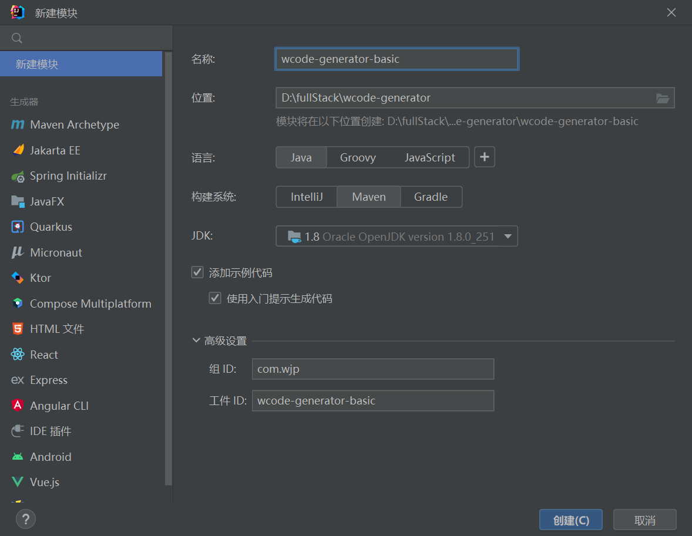

# 代码生成器共享平台源码

## 1. 代码生成

### 创建本地代码生成项目

1. 创建项目




2. 安装依赖

```xml
<dependencies>
    <!-- https://doc.hutool.cn/ -->
    <dependency>
        <groupId>cn.hutool</groupId>
        <artifactId>hutool-all</artifactId>
        <version>5.8.16</version>
    </dependency>
    <!-- https://mvnrepository.com/artifact/org.apache.commons/commons-collections4 -->
    <dependency>
        <groupId>org.apache.commons</groupId>
        <artifactId>commons-collections4</artifactId>
        <version>4.4</version>
    </dependency>
    <!-- https://projectlombok.org/ -->
    <dependency>
        <groupId>org.projectlombok</groupId>
        <artifactId>lombok</artifactId>
        <version>1.18.30</version>
        <scope>provided</scope>
    </dependency>
    <dependency>
        <groupId>junit</groupId>
        <artifactId>junit</artifactId>
        <version>4.13.2</version>
        <scope>test</scope>
    </dependency>
</dependencies>

```


#### 1. 实现流程

##### 实现步骤

1. 生成 `静态` 文件，通过 `Main` 方法运行
2. 生成 `动态` 文件，通过 `Main` 方法运行
3. `同时` 生成静态和动态文件，通过 `Main` 方法运行，得到完整代码生成
4. 开发命令行工具，接收用户的输入并生成完整代码
5. 将工具封装为 `jar包` 和 `脚本`，供用户使用


#### 2. 静态文件生成

使用的是 `Hutool` 工具类

```java
public class StaticGenerator {
    public static void main(String[] args) {
        // 生成最外层的项目根目录: D:\fullStack\wcode-generator
        String projectPath = System.getProperty("user.dir");

        // 输入路径: D:\fullStack\wcode-generator\wcode-generator-demo-projects\acm-template
        // File.separator: 文件分隔符，在不同系统中可能不同，比如在Windows系统中是"\"，在Linux系统中是"/"
        String inputPath = projectPath + File.separator + "wcode-generator-demo-projects" + File.separator + "acm-template";

        // 输出路径
        String outputPath = projectPath;

        // 复制
        copyFilesHuttol(inputPath, outputPath);
    }

    /**
     * 使用hutool复制文件
     * @param inputPath
     * @param outputPath
     */
    public static void copyFilesHuttol(String inputPath, String outputPath) {
        FileUtil.copy(inputPath, outputPath, true);
    }
}

```


#### 3. 动态文件生成思路

实现了静态文件生成（复制目录）后，我们思考下如何对 `某个` 基础文件 进行 `定制`，根据用户的输入参数动态生成文件

明确动态生成需求

对于 ACM示例模版项目，我们可以怎么定制生成呢?

让我们先明确几个动态生成的需求

1. 在代码开头增加作者 `@Author` 注释 (`增加`代码)
2. 修改程序输出的信息提示 (`替换`代码)
3. 将循环读取输入 改为 单次读取 (`可选`代码)

```java
package com.yupi.acm;

import java.util.Scanner;

/**
 * ACM 输入模板（多数之和）
 * @author yupi（1. 增加作者注释）
 */
public class MainTemplate {
    public static void main(String[] args) {
        Scanner scanner = new Scanner(System.in);

    // 2. 可选是否循环
//        while (scanner.hasNext()) {
            // 读取输入元素个数
            int n = scanner.nextInt();

            // 读取数组
            int[] arr = new int[n];
            for (int i = 0; i < n; i++) {
                arr[i] = scanner.nextInt();
            }

            // 处理问题逻辑，根据需要进行输出
            // 示例：计算数组元素的和
            int sum = 0;
            for (int num : arr) {
                sum += num;
            }

            // 3. 输出信息可以修改
            System.out.println("求和结果: " + sum);
//        }

        scanner.close();
    }
}


```


`动态生成的核心原理`

最经典的实现方式就是: 提前 基于基础文件 `"挖坑"` ，编写 `模版文件`，然后将用户输入的 `参数` “填坑”，替换到模版文件中，从而生成完整代码

举个例子，用户输入参数:

```java
author = yupi
```

模版文件代码:

```java
/**
 * ACM 输入模板（多数之和）
 * @author ${author}
 */
```

将参数注入到模版文件中:

```java
/**
 * ACM 输入模板（多数之和）
 * @author yupi
 */
```

不过推荐使用 `模版引擎` 来实现 `模版编写和动态内容生成`


#### 4. FreeMarker 模版引擎入门

官方文档: https://freemarker.apache.org/docs/index.html

中文文档: http://freemarker.foofun.cn/toc.html

FreeMarker 教程网: http://www.freemarker.net/#1

引入依赖【Maven项目】

```xml
<!-- https://freemarker.apache.org/index.html -->
<dependency>
    <groupId>org.freemarker</groupId>
    <artifactId>freemarker</artifactId>
    <version>2.3.32</version>
</dependency>

```

Springboot项目用下面这个

```xml
<dependency>
  <groupId>org.springframework.boot</groupId>
  <artifactId>spring-boot-starter-freemarker</artifactId>
</dependency>

```


示例代码:

```java

public class FreeMarkerTest {

    @Test
    public void test() throws IOException, TemplateException {
        // new 出 Configuration 对象，参数为 FreeMarker 版本号
        Configuration configuration = new Configuration(Configuration.VERSION_2_3_32);

        // 指定模板文件所在的路径
        configuration.setDirectoryForTemplateLoading(new File("src/main/resources/templates"));

        // // 设置模板文件使用的字符集
        configuration.setDefaultEncoding("utf-8");

        // 创建模板对象，加载指定模板
        // myweb.html.ftl: 要进行动态生成的文件
        Template template = configuration.getTemplate("myweb.html.ftl");


        // 创建数据模型
        Map<String, Object> dataModel = new HashMap<>();
        dataModel.put("currentYear",2024);
        List<Map<String, Object>> menuItems = new ArrayList<>();

        Map<String, Object> menuItem1 = new HashMap<>();
        menuItem1.put("url", "http://www.baidu.com");
        menuItem1.put("label", "百度");

        Map<String, Object> menuItem2 = new HashMap<>();
        menuItem2.put("url", "http://www.google.com");
        menuItem2.put("label", "谷歌");

        menuItems.add(menuItem1);
        menuItems.add(menuItem2);

        dataModel.put("menuItems", menuItems);


        // 输出文件
        Writer out = new FileWriter("myweb.html");

        // 调用模板对象的 process 方法，将数据模型和输出流传递给模板对象，生成 HTML 文件
        template.process(dataModel, out);

        // 生成文件后别忘了关闭哦
        out.close();
    }
}
```


#### 5. 动态文件生成实现

学习了 `FreeMarker` 模版引擎后，让我们进行实战

核心步骤: 

1. 定义数据模型
2. 编写动态模版
3. 组合生成
4. 完善优化


##### 1. 定义数据模型

```java
/**
 * 静态模版配置
 */
@Data
public class MainTemplateConfig {

    /**
     * 让我们先明确几个动态生成的需求
     *
     * 1. 在代码开头增加作者 `@Author` 注释 (`增加`代码)
     * 2. 修改程序输出的信息提示 (`替换`代码)
     * 3. 将循环读取输入 改为 单次读取 (`可选`代码)
     */

    /**
     * 作者名称
     */
    private String author = "wjp";

    /**
     * 输出信息
     */
    private String outputText = "sum = ";


    /**
     * 是否循环(开关)
     */
    private Boolean loop;

}

```


##### 2. 编写动态模版

`MainTemplate.java.ftl`

```java
package com.yupi.acm;

import java.util.Scanner;

/**
* ACM 输入模板（多数之和）
* @author ${author}
*/
public class MainTemplate {
    public static void main(String[] args) {
        Scanner scanner = new Scanner(System.in);

        <#if loop>
            while (scanner.hasNext()) {
        </#if>
                // 读取输入元素个数
                int n = scanner.nextInt();

                // 读取数组
                int[] arr = new int[n];
                for (int i = 0; i < n; i++) {
                    arr[i] = scanner.nextInt();
                }

                // 处理问题逻辑，根据需要进行输出
                // 示例：计算数组元素的和
                int sum = 0;
                for (int num : arr) {
                    sum += num;
                }

                System.out.println(" ${outputText}" + sum);
        <#if loop>
            }
        </#if>

        scanner.close();
    }
}

```


##### 3. 组合生成

`DynamicGenerator.java`


```java

public class DynamicGenerator {
    public static void main(String[] args) throws IOException, TemplateException {
        // new 出 Configuration 对象，参数为 FreeMarker 版本号
        Configuration configuration = new Configuration(Configuration.VERSION_2_3_32);

        // 这里是项目根目录: D:\fullStack\wcode-generator,而我们需要进入的是 wcode-generator-basic 这个项目里
        String projectPath = System.getProperty("user.dir") + File.separator + "wcode-generator-basic"+ File.separator;
        System.out.println(projectPath);
        // 最终的输出路径: D:\fullStack\wcode-generator\wcode-generator-basic\src\main\resources\templates
        File file = new File(projectPath, "src/main/resources/templates");
        System.out.println("file = " + file);
        // 指定模板文件所在的路径
        configuration.setDirectoryForTemplateLoading(file);

        // // 设置模板文件使用的字符集
        configuration.setDefaultEncoding("utf-8");

        // 设置数字格式化
        configuration.setNumberFormat("0.######");  // now it will print 1000000

        // 创建模板对象，加载指定模板
        Template template = configuration.getTemplate("MainTemplate.java.ftl");


        // 创建数据模型

        MainTemplateConfig mainTemplateConfig = new MainTemplateConfig();
//        mainTemplateConfig.setAuthor("wjp");
//        mainTemplateConfig.setOutputText("sum");
        mainTemplateConfig.setLoop(true);


        // 输出文件
        Writer out = new FileWriter("MainTemplate.java");

        // 调用模板对象的 process 方法，将数据模型和输出流传递给模板对象，生成 HTML 文件
        template.process(mainTemplateConfig, out);

        // 生成文件后别忘了关闭哦
        out.close();


    }
}

```


##### 4. 完善优化


```java

public class DynamicGenerator {
    public static void main(String[] args) throws IOException, TemplateException {

        // 这里是项目根目录: D:\fullStack\wcode-generator,而我们需要进入的是 wcode-generator-basic 这个项目里

        // 项目路径: D:\fullStack\wcode-generator\wcode-generator-basic
        String projectPath = System.getProperty("user.dir") + File.separator + "wcode-generator-basic";

        // 输入路径【模板文件路径】: D:\fullStack\wcode-generator\wcode-generator-basic\src/main/resources/templates/MainTemplate.java.ftl
        String inputPath = projectPath + File.separator + "src/main/resources/templates/MainTemplate.java.ftl";

        // 输出路径【模版生成文件路径】: D:\fullStack\wcode-generator\wcode-generator-basic\MainTemplate.java
        String outputPath = projectPath + File.separator + "MainTemplate.java";


        // 创建数据模型

        MainTemplateConfig mainTemplateConfig = new MainTemplateConfig();
//        mainTemplateConfig.setAuthor("wjp");
//        mainTemplateConfig.setOutputText("sum");
        mainTemplateConfig.setLoop(true);

        doGenerate(inputPath, outputPath, mainTemplateConfig);
    }

    public static void doGenerate(String inputPath, String outputPath, Object model) throws IOException, TemplateException {
        // new 出 Configuration 对象，参数为 FreeMarker 版本号
        Configuration configuration = new Configuration(Configuration.VERSION_2_3_32);
        // 获取实际文件的父目录
        File templateDir = new File(inputPath).getParentFile();
        System.out.println("templateDir = " + templateDir);
        // ✨指定模板文件所在的路径
        configuration.setDirectoryForTemplateLoading(templateDir);

        // 设置模板文件使用的字符集
        configuration.setDefaultEncoding("utf-8");

        // 设置数字格式化
        configuration.setNumberFormat("0.######");  // now it will print 1000000

        // 创建模板对象，加载指定模板
        String templateName = new File(inputPath).getName();
        // 从指定的模板目录加载一个模板文件
        // templateName: 要加载的模版名
        Template template = configuration.getTemplate(templateName);


        // 输出文件
        Writer out = new FileWriter(outputPath);

        // 调用模板对象的 process 方法，将数据模型和输出流传递给模板对象，生成 HTML 文件
        template.process(model, out);

        // 生成文件后别忘了关闭哦
        out.close();


    }
}

```


#### 6. 动静结合模板生成

```java
public class MainGenerator {
    public static void main(String[] args) throws TemplateException, IOException {
        // 1. 生成静态文件
        // 生成最外层的项目根目录: D:\fullStack\wcode-generator
        String projectPath = System.getProperty("user.dir");

        // 输入路径【静态模板文件路径】: D:\fullStack\wcode-generator\wcode-generator-demo-projects\acm-template
        // File.separator: 文件分隔符，在不同系统中可能不同，比如在Windows系统中是"\"，在Linux系统中是"/"
        String inputPath = projectPath + File.separator + "wcode-generator-demo-projects" + File.separator + "acm-template";

        // 输出路径【静态模版生成文件路径】
        String outputPath = projectPath;

        // 复制
        StaticGenerator.copyFilesHuttol(inputPath, outputPath);

        // 2. 生成动态文件
        // 这里是项目根目录: D:\fullStack\wcode-generator,而我们需要进入的是 wcode-generator-basic 这个项目里
        // 输入路径【动态模板文件路径】: D:\fullStack\wcode-generator\wcode-generator-basic\src/main/resources/templates/MainTemplate.java.ftl
        String dynamicIinputPath = projectPath + File.separator + "wcode-generator-basic" + File.separator + "src/main/resources/templates/MainTemplate.java.ftl";

        // 输出路径【动态模版生成文件路径】: D:\fullStack\wcode-generator\wcode-generator-basic\MainTemplate.java
        String dynamicOutputPath = projectPath + File.separator +"acm-template/src/com/yupi/acm/MainTemplate.java";


        // 创建数据模型

        MainTemplateConfig mainTemplateConfig = new MainTemplateConfig();
        mainTemplateConfig.setAuthor("wjp11");
        mainTemplateConfig.setOutputText("sum11");
        mainTemplateConfig.setLoop(true);

        DynamicGenerator.doGenerate(dynamicIinputPath, dynamicOutputPath, mainTemplateConfig);
    }
}

```


